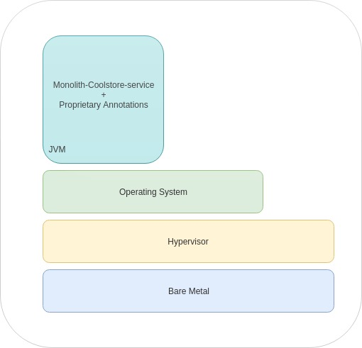

:toc2:
:numbered:
:scrollbar:

== Monolith CoolStore Lab

The use case for the labs in this course is a legacy on-line retail webshop application, called CoolStore Monolith. You will be modernising and migrating the legacy application using Red Hat Application Migrtion Toolkit (RHAMT).

.Goal
In this lab you will study the `monolith-coolstore` application source code and deploy it in EAP server running in your environment.

.Prerequisites
* Import of `monolith-coolstore` project code into JBoss Developer Studio
* Access to client environment VM which comes preloaded with following tools:
** `oc` CLI tool, version 3.9
** `git`
** java JDK 1.8
** vim
** rhamt 4.1.0.Final
** maven 3.5.+
** `curl`
** `jq`
** `openssl`
** postgresql 9.5

== Overview
=== Client VM
==== Clone Source Code
* To help you get started, the client vm comes preloaded with lab assets needed across various labs in the course.
* The lab assets may be found at :
+
[source,sh]
----
cd  ~/labs/
----
** The lab assets have been cloned through https://github.com/gpe-mw-training/app-modernization-migration-lab.git[git link]
* Review the contents of `~/labs` folder
+
[source,sh]
----
drwxrwxr-x 7 4096 Aug 24 15:29 modern-coolstore
drwxrwxr-x 6 4096 Jun 19 16:47 monolith-coolstore
-rw-rw-r-- 1   43 May 31 17:14 README.md
drwxrwxr-x 2 4096 Jul 27 14:40 rhamt
----

=== Application Business Layer
The business logic of application consists of following modules:

* `Catalog Service`: provides information about the products sold in the Coolstore web shop. This information includes name, description and price.
* `Inventory Service`: provides inventory information about the Coolstore products. Inventory information includes availability and location.
* `Cart Service`: manages the shopping carts of the users of the Coolstore application.
* `PriceCalculationService`: defines the total cart cost which is sum of cart item's value and shipping cost.
* `Proprietary Servlet Annotations`: the annotations provide a use case where in some fictional organisation has provided its own `servlet` annotations for dependency injection. Going forward the application wants to move away from these proprietary annotation to standard Java EE6 annotations.

=== Application Architecture

The application consists of multiple maven modules organised as:-

. `Monolith Coolstore Service`
** The REST API for the service, through `JAX-RS`
** The data access layer, using `JPA` and `CDI` to handle the interaction with the datastore.
** Persistence using `postgreSQL` database.

. `Proprietary Annotations`
* `RHAMT` will use these annotations to define a rule addon and reports on them. The annotations defined are:
*** `@ProprietaryServlet`: This is the equivalent of the Java EE 6 @WebServlet annotation
*** `@ProprietaryInitParam`: This is the equivalent of the Java EE 6 @WebInitParam annotation.

== Solution Development
=== Overview of the project pom.xml

. Utilizing the https://maven.apache.org/guides/mini/guide-multiple-modules.html[Maven Reactor] mechanism, the Maven projects have been aggregated.
** Review the parent `pom.xml` and take note of `modules` section

NOTE: The traditional applications usually comprised of multi-module maven projects as dependencies.

. For child project `monolith-coolstore-service` review the `pom.xml` and take note of the following sections:
** `dependencies` : cdi, jpa, swagger, custom-annotations.
** `plugin`: maven-war-plugin
** `dependencyManagement`: _bill-of-material_ (bom)
** Review the versions used for java compiler and `jboss-eap`.

=== Persistence Layer
. Review the `persistence.xml` to verify the name for `persistence unit`, `jndi-url` and init data seed file `coolstore.sql`.
. In package `com.redhat.coolstore.model` review the model classes `InventoryEntity` and `Product`. Also take note of other classes defined in same package i.e `ShoppingCart` & `ShoppingCartItem`.
* Reason the use for annotations `@Entity`, `@Table`, `@Id` and `@UniqueConstraint`.
. Check your understanding by answering following question:
* *Question*: How is java-database object mapping handled ?
* *Question*: What database schema is used ?

=== Service Layer
The service layer exposes the persistence methods to the REST layer.

. Review the different service layer classes: `CatalogService`, `InventoryService`, `ShoppingCartService`, `PriceCalculationService`.
. In package `com.redhat.coolstore.service.catalog` review the `getProducts` method in `CatalogService` class
.
. Reason the use of annotations `@PersistenceContext` and  `@Stateless`.
. Check your understanding by answering following question:
* *Question*: How is Shipping cost calculated ?
* *Question*: What is the relation between ShoppingCartService and CatalogService?

=== Rest Layer
. Review the different REST endpoints exposed by `monolith-coolstore-service` application.
. Review the base URI for the REST endpoints.
. Review the `jax-rs` and `CDI` annotations.
. Check your understanding by answering following question:
* *Question*: What are the different URL's defined for endpoints ?
* *Question*: How is `Swagger` integrated ?

=== Unit Tests
. Along with `JUnit`, `Arquillian` is used to manage the lifecycle of remote EAP container.
. Also, it bundles the test class with dependent classes and resources into a deployable archive.
* `Arquillian` uses `@Deployment` annotation  to create a deployment-unit. `Shrinwrap` is used for packaging the needed dependencies into an archive.
. Review the pom.xml to study following dependencies:
* `arquillian-junit-container`: is needed to test the EJB and JTA.
* `arquillian-protocol-servlet`:  protocol to communicate with the server application.
. Review the `arquillian.xml` to study the absolute path of container and servlet specification.
. Review the `pom.xml` to study the profile `jboss-managed` which start a new JBoss AS instance and execute the test, shutting it down when done.
. Review the use of `H2` embedded database.
. Study the test cases defined for different service layers using Mocks.
. Also study the test case defined for REST endpoint `CartEndpointTest`.
. Check your understanding by answering following question:
* *Question*: How is the packing of archive done. What are use of different file in `src/test/resources`
* *Question*: What is the use of annotations `@RunAsClient` & `@Deployment` ?
* *Question*: For mocks, where is the alternative class defined ?

==== Configure EAP for Unit tests

The unit tests require a local installation of https://access.redhat.com/documentation/en-us/red_hat_jboss_enterprise_application_platform/6.4/html/getting_started_guide/sect-download_and_install_jboss_eap_using_the_graphical_installation_program[JBoss EAP 6.4].

NOTE: The client VM comes doesnot comes with a preloaded with local copy of JBoss EAP 6.4 server. Thus you will be unable to run unit-tests, for people who have local confiuration available may run below steps:

To run unit-tests you will run the `jboss-eap` locally on client VM

. Configure the path in `arquillian.xml`
. Review file: monolith-coolstore-service/src/test/resources/arquillian.xml
+
[source,xml]
----
      <property name="jbossHome">/opt/eap</property>
----

NOTE: Ensure the path points to local location of your JBoss EAP installation directory.

==== Run Unit Tests

. To run the test cases use the profile `jboss-managed`:
+
[source,sh]
----
$ cd ~/labs/monolith-coolstore

$ mvn clean package -Pjboss-managed -DfailIfNoTests=false
----

. Verify that you have a successful build.

+
[source,sh]
----
mvn clean package -Pjboss-managed -DfailIfNoTests=false
[INFO] Scanning for projects...
[INFO] ------------------------------------------------------------------------
[INFO] Reactor Build Order:
[INFO]
[INFO] monolith-coolstore                                                 [pom]
[INFO] proprietary-annotations                                            [jar]
[INFO] monolith-coolstore-service                                         [war]
[INFO]
...
Tests run: 1, Failures: 0, Errors: 0, Skipped: 0, Time elapsed: 0.914 sec

Results :

Tests run: 14, Failures: 0, Errors: 0, Skipped: 0
...
[INFO] ------------------------------------------------------------------------
[INFO] Reactor Summary:
[INFO]
[INFO] monolith-coolstore 1.0-SNAPSHOT .................... SUCCESS [  0.170 s]
[INFO] proprietary-annotations ............................ SUCCESS [  2.161 s]
[INFO] monolith-coolstore-service 1.0-SNAPSHOT ............ SUCCESS [ 19.546 s]
[INFO] ------------------------------------------------------------------------
[INFO] BUILD SUCCESS
[INFO] ------------------------------------------------------------------------
[INFO] Total time: 22.158 s
[INFO] Finished at: 2018-06-14T15:16:36-04:00
[INFO] ------------------------------------------------------------------------
----

== Deployment of Application

=== DataBase Deployment
* You need `postgresql` running either locally or cloud.

NOTE: At present the `clientVM` doesnot has postgresql installed.

* Assuming you have access to `postgresql` on some environment, we define the instructions on setting up application when the database has properties as:
** Username: jboss
** Password: jboss
** database: monolith

=== Database Configuration
. In EAP server installation directory `standalone/configuration/standalone.xml` verify the `datasource` is defined, else create a `datasource`. Add below snippet in `subsystem datasources`:
+
[source,xml]
----
<datasource jndi-name="java:jboss/datasources/CoolstoreDS" pool-name="CoolstoreDS" enabled="true" use-java-context="true">
    <connection-url>jdbc:postgresql://127.0.0.1:5432/monolith</connection-url>
    <driver>postgresql</driver>
    <security>
        <user-name>jboss</user-name>
        <password>jboss</password>
    </security>
</datasource>

<driver name="postgresql" module="org.postgresql">
     <driver-class>org.postgresql.Driver</driver-class>
     <xa-datasource-class>org.postgresql.xa.PGXADataSource</xa-datasource-class>
 </driver>
----
* Here the `connection-url` refers to `postgresql` instance running through docker.
. Deploy the `postgresql` driver
* Create folders `/org/postgresql/main/`. These folder need to match the hierarchy package of the JDBC driver.
* Copy the JDBC driver into the 'main' directory you have created
* Create a "module.xml" file as below:
+
[source,xml]
----
<?xml version="1.0" encoding="UTF-8"?>
<module xmlns="urn:jboss:module:1.3" name="org.postgresql">
    <resources>
        <resource-root path="postgresql-42.2.2.jar"/>
    </resources>
    <dependencies>
        <module name="javax.api"/>
        <module name="javax.transaction.api"/>
    </dependencies>
</module>
----
. Restart the server
+
[source,sh]
----
$ cd <EAP_INSTALL_DIR>
$ sh bin/standalone.sh
----

NOTE: For the client vm, there are limited resources, thus don't run it on clientvm. The instructor will showcase on his system.

=== Application Deployment
. Copy the `deployments/ROOT.war` to `EAP_INSTALL_DIR/standalone/deployments/`
. To avoid `virtual-server` from complaining, In `standalone.xml` change the `enable-welcome-root` property to `false`.
+
[source,xml]
----
<virtual-server name="default-host" enable-welcome-root="false">
----
. Check the server logs to verify the successfull deployment:
+
[source,text]
----
Processing weld deployment ROOT.war
09:59:16,634 INFO  [org.jboss.as.ejb3.deployment.processors.EjbJndiBindingsDeploymentUnitProcessor] (MSC service thread 1-7) JNDI bindings for session bean named PriceCalculationService in deployment unit deployment "ROOT.war" are as follows:

 java:global/ROOT/PriceCalculationService!com.redhat.coolstore.service.shipping.PriceCalculationService
 java:app/ROOT/PriceCalculationService!com.redhat.coolstore.service.shipping.PriceCalculationService
 java:module/PriceCalculationService!com.redhat.coolstore.service.shipping.PriceCalculationService
 java:global/ROOT/PriceCalculationService
 java:app/ROOT/PriceCalculationService
 java:module/PriceCalculationService

09:59:16,634 INFO  [org.jboss.as.ejb3.deployment.processors.EjbJndiBindingsDeploymentUnitProcessor] (MSC service thread 1-7) JNDI bindings for session bean named CatalogService in deployment unit deployment "ROOT.war" are as follows:

 java:global/ROOT/CatalogService!com.redhat.coolstore.service.catalog.CatalogService
 java:app/ROOT/CatalogService!com.redhat.coolstore.service.catalog.CatalogService
 java:module/CatalogService!com.redhat.coolstore.service.catalog.CatalogService
 java:global/ROOT/CatalogService
 java:app/ROOT/CatalogService
 java:module/CatalogService

09:59:16,634 INFO  [org.jboss.as.ejb3.deployment.processors.EjbJndiBindingsDeploymentUnitProcessor] (MSC service thread 1-7) JNDI bindings for session bean named ShoppingCartService in deployment unit deployment "ROOT.war" are as follows:

 java:global/ROOT/ShoppingCartService!com.redhat.coolstore.service.cart.ShoppingCartService
 java:app/ROOT/ShoppingCartService!com.redhat.coolstore.service.cart.ShoppingCartService
 java:module/ShoppingCartService!com.redhat.coolstore.service.cart.ShoppingCartService
 java:global/ROOT/ShoppingCartService
 java:app/ROOT/ShoppingCartService
 java:module/ShoppingCartService

09:59:16,802 INFO  [org.jboss.weld.deployer] (MSC service thread 1-5) JBAS016005: Starting Services for CDI deployment: ROOT.war
09:59:16,862 INFO  [org.jboss.weld.Version] (MSC service thread 1-5) WELD-000900 1.1.28 (redhat)
09:59:16,955 INFO  [org.jboss.weld.deployer] (MSC service thread 1-3) JBAS016008: Starting weld service for deployment ROOT.war
09:59:16,964 INFO  [org.jboss.as.jpa] (ServerService Thread Pool -- 50) JBAS011402: Starting Persistence Unit Service 'ROOT.war#coolstore'
09:59:17,133 INFO  [org.hibernate.annotations.common.Version] (ServerService Thread Pool -- 50) HCANN000001: Hibernate Commons Annotations {4.0.2.Final-redhat-1}
09:59:17,139 INFO  [org.hibernate.Version] (ServerService Thread Pool -- 50) HHH000412: Hibernate Core {4.2.18.Final-redhat-2}
09:59:17,141 INFO  [org.hibernate.cfg.Environment] (ServerService Thread Pool -- 50) HHH000206: hibernate.properties not found
09:59:17,143 INFO  [org.hibernate.cfg.Environment] (ServerService Thread Pool -- 50) HHH000021: Bytecode provider name : javassist
09:59:17,163 INFO  [org.hibernate.ejb.Ejb3Configuration] (ServerService Thread Pool -- 50) HHH000204: Processing PersistenceUnitInfo [
 name: coolstore
 ...]
09:59:17,264 INFO  [org.hibernate.service.jdbc.connections.internal.ConnectionProviderInitiator] (ServerService Thread Pool -- 50) HHH000130: Instantiating explicit connection provider: org.hibernate.ejb.connection.InjectedDataSourceConnectionProvider
09:59:17,491 INFO  [org.hibernate.dialect.Dialect] (ServerService Thread Pool -- 50) HHH000400: Using dialect: org.hibernate.dialect.PostgreSQLDialect
09:59:17,501 INFO  [org.hibernate.engine.jdbc.internal.LobCreatorBuilder] (ServerService Thread Pool -- 50) HHH000424: Disabling contextual LOB creation as createClob() method threw error : java.lang.reflect.InvocationTargetException
09:59:17,606 INFO  [org.hibernate.engine.transaction.internal.TransactionFactoryInitiator] (ServerService Thread Pool -- 50) HHH000268: Transaction strategy: org.hibernate.engine.transaction.internal.jta.CMTTransactionFactory
09:59:17,610 INFO  [org.hibernate.hql.internal.ast.ASTQueryTranslatorFactory] (ServerService Thread Pool -- 50) HHH000397: Using ASTQueryTranslatorFactory
09:59:17,886 INFO  [org.hibernate.validator.internal.util.Version] (ServerService Thread Pool -- 50) HV000001: Hibernate Validator 4.3.2.Final-redhat-2
09:59:18,193 INFO  [org.hibernate.tool.hbm2ddl.SchemaExport] (ServerService Thread Pool -- 50) HHH000227: Running hbm2ddl schema export
09:59:18,197 INFO  [stdout] (ServerService Thread Pool -- 50) Hibernate: drop table if exists PRODUCT_CATALOG cascade
09:59:18,199 INFO  [stdout] (ServerService Thread Pool -- 50) Hibernate: drop table if exists PRODUCT_INVENTORY cascade
09:59:18,199 INFO  [stdout] (ServerService Thread Pool -- 50) Hibernate: create table PRODUCT_CATALOG (itemId varchar(255) not null, description varchar(255), name varchar(255), price float8 not null, primary key (itemId))
09:59:18,219 INFO  [stdout] (ServerService Thread Pool -- 50) Hibernate: create table PRODUCT_INVENTORY (itemId varchar(255) not null, link varchar(255), location varchar(255), quantity int4 not null, primary key (itemId))
09:59:18,273 INFO  [org.hibernate.tool.hbm2ddl.SchemaExport] (ServerService Thread Pool -- 50) HHH000230: Schema export complete
09:59:18,593 INFO  [org.jboss.web] (ServerService Thread Pool -- 58) JBAS018210: Register web context:
09:59:18,960 INFO  [org.jboss.as.server] (ServerService Thread Pool -- 28) JBAS015859: Deployed "ROOT.war" (runtime-name : "ROOT.war")
----

== Testing the Application
. Get the URL of the application
+
[source,sh]
----
$ export COOLSTORE_MONOLITH_URL=http://<IP>:8080
----
. Get the `Swagger` documentation:
+
[source,sh]
----
$ curl -X GET "$COOLSTORE_MONOLITH_URL/rest/swagger.json"
----
+
.Sample Output
[source,text]
----
{
  "swagger" : "2.0",
  "info" : {
    "description" : "Operations that can be invoked in the coolstore monolith",
    "version" : "1.0.0",
    "title" : "Monolith Coolstore REST API",
    "contact" : {
      "name" : "developer@redhat.com"
    },
    "license" : {
      "name" : "Apache 2.0",
      "url" : "http://www.apache.org/licenses/LICENSE-2.0.html"
    }
  },
  "basePath" : "/rest",
  "schemes" : [ "http" ],
  "paths" : {
    "/cart/checkout/{cartId}" : {
      "post" : {

contd....
----

. Get the inventory for a product:
+
[source,sh]
----
$ curl -X GET "$COOLSTORE_MONOLITH_URL/rest/inventory/444435"
----

. Create items in the cart:
+
[source,sh]
----
$ curl -XPOST "$COOLSTORE_MONOLITH_URL/rest/cart/222/444436/100"

$ curl -XPOST "$COOLSTORE_MONOLITH_URL/rest/cart/222/444435/101"

// Get the cart items
$ curl -XGET "$COOLSTORE_MONOLITH_URL/rest/cart/222"
----

. Create items in the catalog:
+
[source,sh]
----
$ curl -XPOST -H "Content-Type: application/json" -d '{"itemId":"322","name":"curl","description":"Red Fedora Official Red Hat Fedora","price":34.99}' "$COOLSTORE_MONOLITH_URL/rest/catalog"

// Get the catalog items
$ curl -XGET "$COOLSTORE_MONOLITH_URL/rest/catalog/products"
----
