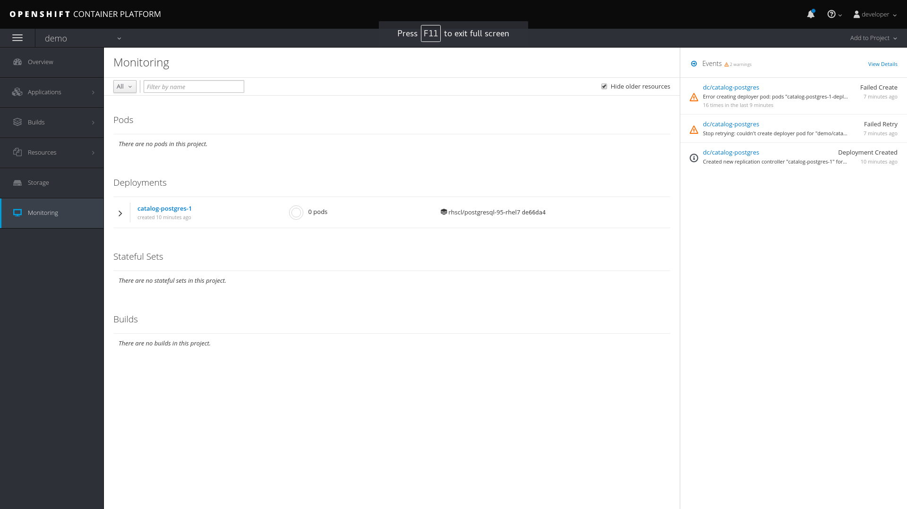
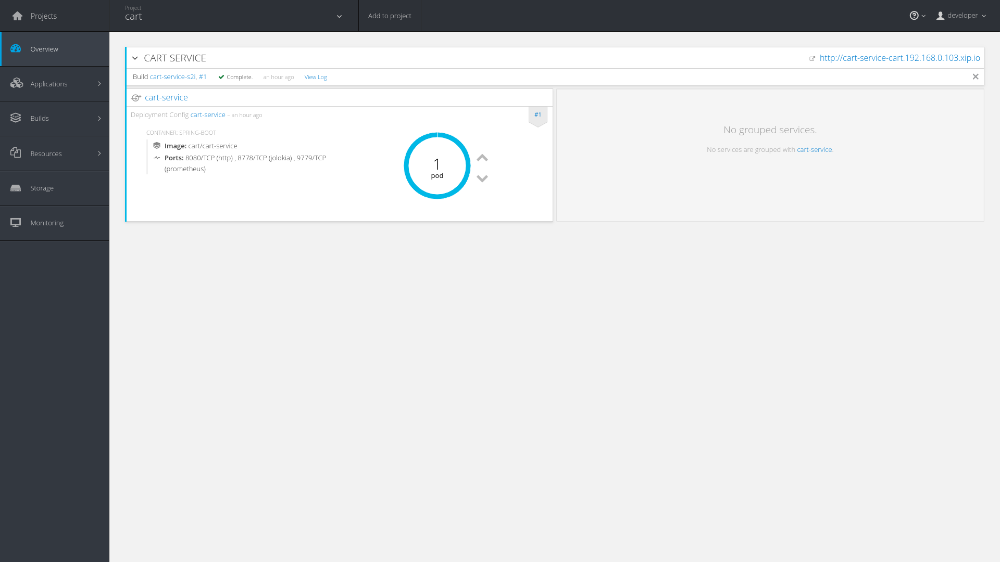

:toc2:
:numbered:
:scrollbar:

== Brownfield Migration Lab: Environment Setup

The lab environment consists of two parts:

* `Client VM`: provides the tooling needed to run the different sections of the lab like `mvn`,`rhamt`,`oc client`, `git` etc
* `OCP cluster`: you use shared ocp cluster to run your projects.

=== Access the environment
. The environment can be accessed by creating a user through GuidGrabber.
. Begin by going to http://bit.ly/rhte-guidgrabber
+

. From this page select the proper *Lab Code* for the current lab.
* Lab Code = *A1003*

. Enter the *Activation Key* provided by the lab proctor.
* The Activation Key : *brown*

. Click *Next*.

. The resulting page will display your lab's user number and other useful information about your lab environment.
+

. From the image shown above the credentials to access the:
* Client VM:
** username:lab-user
** password: r3dh4t1!

* Openshift Cluster:
** username: user25 , where `25` is user lab number generated on the page
** password: r3dh4t1!
** server-url: https://master.f4b9.rhte.opentlc.com, where `f4b9` is the unique ID for this shared environment

. The lab instructions can be accessed at the http://www00.opentlc.com/rhte/rhte_lab_02_brownfield_migration/LabInstructionsFiles/01_rhte_brownfield_migration_Lab.html[URL^]

. When you are completely done with your lab environment, please click *Reset Workstation* so that you can move on to the next lab.  If you fail to do this, you will be locked into the GUID from the previous lab.
+
[NOTE]
Clicking *Reset Workstation* will not stop or delete the lab environment.

=== Tools used in the lab
** `oc` CLI tool, version 3.9
** `git`
** java JDK 1.8
** vim
** rhamt 4.1.0.Final
** maven 3.5.+
** `curl`
** `jq`
** postgresql 9.5

NOTE: Given the fact you have above tools installed on your local machine, you should be able to execute the lab instructions.

=== SSH to Client VM
. Set the shell variable LAB_USER_NUM
+
[source,sh]
----
$ export LAB_USER_NUM=<lab number from from last lab>
----
. SSH into the clientVM
+
[source,sh]
----
ssh lab-user@clientvm$LAB_USER_NUM.f4b9.rhte.opentlc.com
----

=== Clone Source Code
* To help you get started, please take `git clone` of lab assets
+
[source,sh]
----
$ git clone https://github.com/gpe-mw-training/app-modernization-migration-lab.git ~/labs
----

* The lab assets will be found at :
+
[source,sh]
----
cd  ~/labs/
----
* Review the contents of `~/labs` folder
+
[source,sh]
----
drwxrwxr-x 7 4096 Aug 24 15:29 modern-coolstore
drwxrwxr-x 6 4096 Jun 19 16:47 monolith-coolstore
-rw-rw-r-- 1   43 May 31 17:14 README.md
drwxrwxr-x 2 4096 Jul 27 14:40 rhamt
----
. Again set the shell variable `LAB_USER_NUM`, this time at `clientVM`
+
[source,sh]
----
$ export LAB_USER_NUM=<lab number from from last lab>
----

=== Access Openshift Container Platform
. The ocp cluster can be accessed by running the command
+
[source,sh]
----
$ oc login https://master.f4b9.rhte.opentlc.com/ -uuser$LAB_USER_NUM -pr3dh4t1!
----
* the lab comes with a pre-created openshift project `rhte-mw-bfield-migration-constraints-user$LAB_USER_NUM`

WARNING: This is a special openshift project with constrined resources and will be used for <<Openshift Resources,Openshift Resources Section>>

==== OCP Web Console
. Open the https://master.f4b9.rhte.opentlc.com/[URL^] in your browser.
. Authenticate using credentials used in above section.

== Monolith Overview

=== Application Business Layer
The business logic of application consists of following modules:

* `Catalog Service`: provides information about the products sold in the Coolstore web shop. This information includes name, description and price.
* `Inventory Service`: provides inventory information about the Coolstore products. Inventory information includes availability and location.
* `Cart Service`: manages the shopping carts of the users of the Coolstore application.
* `PriceCalculationService`: defines the total cart cost which is sum of cart item's value and shipping cost.
* `Proprietary Servlet Annotations`: the annotations provide a use case where in some fictional organisation has provided its own `servlet` annotations for dependency injection. Going forward the application wants to move away from these proprietary annotation to standard Java EE6 annotations.

=== Application Architecture

The application consists of multiple maven modules organised as:-

. `Monolith Coolstore Service`
** The REST API for the service, through `JAX-RS`
** The data access layer, using `JPA` and `CDI` to handle the interaction with the datastore.
** Persistence using `postgreSQL` database.

. `Proprietary Annotations`
* `RHAMT` will use these annotations to define a rule addon and reports on them. The annotations defined are:
*** `@ProprietaryServlet`: This is the equivalent of the Java EE 6 @WebServlet annotation
*** `@ProprietaryInitParam`: This is the equivalent of the Java EE 6 @WebInitParam annotation.

image::images/monolith-app.jpg[]

=== Solution Development
==== Overview of the project pom.xml

. Utilizing the https://maven.apache.org/guides/mini/guide-multiple-modules.html[Maven Reactor] mechanism, the Maven projects have been aggregated.
** Review the parent `pom.xml` and take note of `modules` section

NOTE: The traditional applications are usually comprised of a multi-module maven projects as dependencies.

. For child project `monolith-coolstore-service` review the `pom.xml` and take note of the following sections:
** `dependencies` : cdi, jpa, swagger, custom-annotations.
** `plugin`: maven-war-plugin
** `dependencyManagement`: _bill-of-material_ (bom)
** Review the versions used for java compiler and `jboss-eap`.

==== Persistence Layer
. Review the `persistence.xml` to verify the name for `persistence unit`, `jndi-url` and init data seed file `coolstore.sql`.
. In package `com.redhat.coolstore.model` review the model classes `InventoryEntity` and `Product`. Also take note of other classes defined in same package i.e `ShoppingCart` & `ShoppingCartItem`.
* Reason the use for annotations `@Entity`, `@Table`, `@Id` and `@UniqueConstraint`.
. Check your understanding by answering following question:
* *Question*: How is java-database object mapping handled ?
* *Question*: What database schema is used ?

==== Service Layer
The service layer exposes the persistence methods to the REST layer.

. Review the different service layer classes: `CatalogService`, `InventoryService`, `ShoppingCartService`, `PriceCalculationService`.
. In package `com.redhat.coolstore.service.catalog` review the `getProducts` method in `CatalogService` class
.
. Reason the use of annotations `@PersistenceContext` and  `@Stateless`.
. Check your understanding by answering following question:
* *Question*: How is Shipping cost calculated ?
* *Question*: What is the relation between ShoppingCartService and CatalogService?

==== Rest Layer
. Review the different REST endpoints exposed by `monolith-coolstore-service` application.
. Review the base URI for the REST endpoints.
. Review the `jax-rs` and `CDI` annotations.
. Check your understanding by answering following question:
* *Question*: What are the different URL's defined for endpoints ?
* *Question*: How is `Swagger` integrated ?

==== Unit Tests
. Along with `JUnit`, `Arquillian` is used to manage the lifecycle of remote EAP container.
. Also, it bundles the test class with dependent classes and resources into a deployable archive.
* `Arquillian` uses `@Deployment` annotation  to create a deployment-unit. `Shrinwrap` is used for packaging the needed dependencies into an archive.
. Review the pom.xml to study following dependencies:
* `arquillian-junit-container`: is needed to test the EJB and JTA.
* `arquillian-protocol-servlet`:  protocol to communicate with the server application.
. Review the `arquillian.xml` to study the absolute path of container and servlet specification.
. Review the `pom.xml` to study the profile `jboss-managed` which start a new JBoss AS instance and execute the test, shutting it down when done.
. Review the use of `H2` embedded database.
. Study the test cases defined for different service layers using Mocks.
. Also study the test case defined for REST endpoint `CartEndpointTest`.
. Check your understanding by answering following question:
* *Question*: How is the packing of archive done. What are use of different file in `src/test/resources`
* *Question*: What is the use of annotations `@RunAsClient` & `@Deployment` ?
* *Question*: For mocks, where is the alternative class defined ?

==== Run Unit Tests
NOTE: To run unit tests you will need local EAP installation. Due to limited resources on the client VM we proceed without running them.
For participants who are interested to know more on unit-tests please check the instructions in <<Configure Monolith EAP for Unit tests,Configure Monolith EAP for Unit tests>>

=== Build Application
. We do maven build
+
[source,sh]
----
$ cd ~/labs/monolith-coolstore

$ mvn clean package -DskipTests
----
. Check the log messages to ensure a `Build Success`

=== Deployment of Application
NOTE: The client VM is not shipped with `postgresql` and `EAP` server. Thus for monolith we do not deploy the application in the lab.
But for interested participants `How-to` instruction are given in <<Monolith Application Deployment,Monolith Application Deployment>>

== Lift & Shift: Monolith
In this section you will deploy the `monolith-coolstore` application on Openshift.

=== Deployment on Openshift

Without making any changes to the source code, we will get the application up and running on Openshift

The deployment of the application will be a binary source build using `postgresql` and `jboss-eap64-openshift` images.

==== Deployment of PostgreSQL on Openshift.
. From client VM, login to openshift cluster
+
[source,sh]
----
$ oc login https://master.f4b9.rhte.opentlc.com -uuser$LAB_USER_NUM -pr3dh4t1!
----
. Create a openshift project for the deployment of monolith-coolstore.
+
[source,sh]
----
$ oc new-project user$LAB_USER_NUM-monolith-coolstore
----
+
NOTE: Be sure to replace the "." character in your OPENTLC username with the "-" character—​for example, johndoe1-redhat-com instead of johndoe1-redhat.com. OpenShift project names must be unique within an OpenShift cluster, so this ensures that your project names begin with a unique prefix.

. Openshift comes with `out-of-box` support for `PostgreSQL`. By using this image and defining the environment variables create a database `monolith` having user credentials `jboss:jboss`
+
[source,sh]
----
$ oc new-app postgresql -e POSTGRESQL_USER=jboss -e POSTGRESQL_PASSWORD=jboss -e POSTGRESQL_DATABASE=monolith --name=coolstore-postgresql
----
. Verify the pod is up running and check the database is created.
+
[source,sh]
----
$ oc get pods

// login to pod
$ oc rsh  <podname>

// connect to DB
sh-4.2$ psql

//verify the database is created
postgres=# \l
                                 List of databases
   Name    |  Owner   | Encoding |  Collate   |   Ctype    |   Access privileges
-----------+----------+----------+------------+------------+-----------------------
 monolith  | jboss    | UTF8     | en_US.utf8 | en_US.utf8 |
 postgres  | postgres | UTF8     | en_US.utf8 | en_US.utf8 |
 template0 | postgres | UTF8     | en_US.utf8 | en_US.utf8 | =c/postgres          +
           |          |          |            |            | postgres=CTc/postgres
 template1 | postgres | UTF8     | en_US.utf8 | en_US.utf8 | =c/postgres          +
           |          |          |            |            | postgres=CTc/postgres

----

. Exit the postgres command-line and the pod

+
[source,sh]
----
// exit postgres command line
postgres=# \q

// exit the pod
sh-4.2$ exit
----

==== Deployment of Application
. You use Binary build for application deployment.
. Verify the presence of `jboss-eap64-openshift` in namespace `openshift`
+
[source,sh]
----
$ oc get is -n openshift | grep eap64
----

. Initiate the binary build and verify the resource objects `buildconfigs` and `imagstreams` have been created.
+
[source,sh]
----
$ oc new-build --binary=true --name=coolstore -i=jboss-eap64-openshift:1.7
----

. Use the maven-build `openshift` profile to create the application artifacts `ROOT.war` in `deployments` directory.
+
[source,sh]
----
$ cd ~/labs/monolith-coolstore/
$ mvn clean package -DskipTests
----
. The above command will create java war file at `~/lab/deployments`
+
----
$ ls -l deployments
-rw-rw-r-- 1 7597839 Jan 19 18:50 ROOT.war
----

. Now, start the build to stream the `war` file created in last step to openshift environment.
+
[source,sh]
----
$ oc start-build coolstore --from-file=deployments/ROOT.war --follow
----
+
.Sample Output
----
Uploading file "deployments/ROOT.war" as binary input for the build ...

build "coolstore-1" started
Receiving source from STDIN as file ROOT.war
Copying all war artifacts from /tmp/src directory into /opt/eap/standalone/deployments for later deployment...
'/tmp/src/ROOT.war' -> '/opt/eap/standalone/deployments/ROOT.war'
Copying all ear artifacts from /tmp/src directory into /opt/eap/standalone/deployments for later deployment...
Copying all rar artifacts from /tmp/src directory into /opt/eap/standalone/deployments for later deployment...
Copying all jar artifacts from /tmp/src directory into /opt/eap/standalone/deployments for later deployment...
Copying all war artifacts from /tmp/src/deployments directory into /opt/eap/standalone/deployments for later deployment...
Copying all ear artifacts from /tmp/src/deployments directory into /opt/eap/standalone/deployments for later deployment...
Copying all rar artifacts from /tmp/src/deployments directory into /opt/eap/standalone/deployments for later deployment...
Copying all jar artifacts from /tmp/src/deployments directory into /opt/eap/standalone/deployments for later deployment...
Pushing image 172.30.1.1:5000/mono/coolstore:latest ...
Pushed 6/7 layers, 88% complete
Pushed 7/7 layers, 100% complete
Push successful
----

. Create an application using the `war` file.
+
[source,sh]
----
$ oc new-app coolstore
----

. At this point you will notice the deployment fails, as you haven't defined the `datasource` and the `jdbc` driver for the database `postgresql`. Check the `pod` logs to ascertain the failure:
+
[source,sh]
----
$ oc logs -f coolstore-2-8b8zj
----
+
.Sample Output
----
ERROR [org.controller.management-operation] (Controller Boot Thread) JBAS014612: Operation ("deploy") failed - address: ([("deployment" => "ROOT.war")]) - failure description: {"JBAS014771: Services with missing/unavailable dependencies" => ["jboss.persistenceunit.\"ROOT.war#coolstore\" is missing [jboss.naming.context.java.jboss.datasources.CoolstoreDS]"]}

07:45:31,340 ERROR [org.jboss.as] (Controller Boot Thread) JBAS015875: JBoss EAP 6.4.18.GA (AS 7.5.18.Final-redhat-1) started (with errors) in 8902ms - Started 302 of 431 services (37 services failed or missing dependencies, 129 services are lazy, passive or on-demand)
07:45:31,561 INFO  [org.jboss.as.server.deployment] (MSC service thread 1-1) JBAS015877: Stopped deployment ROOT.war (runtime-name: ROOT.war) in 23ms
07:45:31,618 INFO  [org.jboss.as.server] (DeploymentScanner-threads - 2) JBAS015858: Undeployed "ROOT.war" (runtime-name: "ROOT.war")
07:45:31,622 INFO  [org.jboss.as.controller] (DeploymentScanner-threads - 2) JBAS014774: Service status report
JBAS014775:    New missing/unsatisfied dependencies:
      service jboss.deployment.unit."ROOT.war".WeldBootstrapService (missing) dependents: [service jboss.deployment.unit."ROOT.war".component."com.redhat.coolstore.service.cart.PromoService".WeldInstantiator, service jboss.deployment.unit."ROOT.war".WeldStartService, service jboss.deployment.unit."ROOT.war".component."com.sun.faces.config.ConfigureListener".WeldInstantiator, service jboss.web.deployment.default-host./ROOT, JBAS014799: ... and 15 more ]

----

=== Application Configuration

. `jboss-eap64-openshift` image comes with out-of-box support to define the postgresql and mysql datasources.
** The datasource can be automatically created by defining the following environment variables in the deploymentconfig:
*** `DB_SERVICE_PREFIX_MAPPING` : refers to comma-separated list of <name>-<database_type>=<PREFIX> triplets,
where `name` is used as the `pool-name` in the data source, `database_type` determines what database driver to use,
and `PREFIX` is the prefix used in the names of environment variables, which are used to configure the data source. For each triplet defined a seperate datasource will be created in the config.
*** `DB_JNDI`: Defines the JNDI name for the datasource and has to be the same value as used in `persistence.xml`
*** `DB_USERNAME`: `jboss`
*** `DB_PASSWORD`: `jboss`

+
[source,sh]
----
$ oc set env dc/coolstore DB_SERVICE_PREFIX_MAPPING=coolstore-postgresql=DB DB_JNDI=java:jboss/datasources/CoolstoreDS DB_USERNAME=jboss DB_PASSWORD=jboss DB_DATABASE=monolith
----
* The above command will trigger a new deployment, reason out why ?
. Check the application logs to verify the successful operation.
+
[source,sh]
----
$ oc logs -f $(oc get pods | grep coolstore-2 | awk {'print $1'})
----
. For the applictaion to be accessible outside, define the `route`.
+
[source,sh]
----
oc expose svc coolstore
----

=== Testing the Application
. Get the URL of the application
+
[source,sh]
----
$ export OC_COOLSTORE_MONOLITH_URL=http://$(oc get route coolstore  -o template --template='{{.spec.host}}')
----
. Get the `Swagger` documentation:
+
[source,sh]
----
$ curl -X GET "$OC_COOLSTORE_MONOLITH_URL/rest/swagger.json"
----
+
.Sample Output
----
{
  "swagger" : "2.0",
  "info" : {
    "description" : "Operations that can be invoked in the coolstore monolith",
    "version" : "1.0.0",
    "title" : "Monolith Coolstore REST API",
    "contact" : {
      "name" : "developer@redhat.com"
    },
    "license" : {
      "name" : "Apache 2.0",
      "url" : "http://www.apache.org/licenses/LICENSE-2.0.html"
    }
  },
  "basePath" : "/rest",
  "schemes" : [ "http" ],
  "paths" : {
    "/cart/checkout/{cartId}" : {
      "post" : {

contd....
----

. Get the inventory for a product:
+
[source,sh]
----
$ curl -X GET "$OC_COOLSTORE_MONOLITH_URL/rest/inventory/444435"
----

. Create items in the cart:
+
[source,sh]
----
$ curl -XPOST "$OC_COOLSTORE_MONOLITH_URL/rest/cart/222/444436/100"

$ curl -XPOST "$OC_COOLSTORE_MONOLITH_URL/rest/cart/222/444435/101"

// Get the cart items
$ curl -XGET "$OC_COOLSTORE_MONOLITH_URL/rest/cart/222"
----

. Create items in the catalog:
+
[source,sh]
----
$ curl -XPOST -H "Content-Type: application/json" -d '{"itemId":"322","name":"curl","description":"Red Fedora Official Red Hat Fedora","price":34.99}' "$OC_COOLSTORE_MONOLITH_URL/rest/catalog"

// Get the catalog items
$ curl -XGET "$OC_COOLSTORE_MONOLITH_URL/rest/catalog/products"
----

== Using RHAMT
In this section, using RHAMT `4.1.0.Final` remove proprietary annotations and get an overview on efforts required to carry out the migration from EAP6 to EAP7.

=== Proprietary Annotations
The annotations provide a use case where in some fictional organisation has provided its own `servlet` annotations for dependency injection.

==== Review Definition of Proprietary Annotations

. In maven project `proprietary-annotations`:
* Review the `ProprietaryServlet` annotation defined in package `com.example.proprietary.customAnnotation`.  It provides an equivalent of the Java EE 6 `@WebServlet`
* Also, review the annotation `ProprietaryInitParam` which showcases the equivalent of the Java EE 6 `@WebInitParam`
** Check the use of `ProprietaryInitParam` in `ProprietaryServlet`.

NOTE: The above annotations do not alter any runtime behaviour of the application. They have been created with an intent to showcase the concept.

==== Review Usage of Proprietary Annotations
. In maven project `monolith-coolstore-service`:
* Review the use of `@ProprietaryServlet` and `@ProprietaryInitParam` in classes `CartResource` and `CatalogResource` defined in package `com.redhat.coolstore.rest`.

=== Develop RHAMT XML Rule
In the lab we use custom rule for monolith-coolstore migration. The rule is provided as part of lab assets.

. Review the rules file `~/labs/rhamt/proprietary-servlet-annotations.windup.xml`.

* As we are migrating the coolstore-monolith from `EAP6` to `EAP7`, the same need to be reflected in the `sourceTechnology` & `targetTechnology` tags in the xml rule file.

* You define two rules, `proprietary-servlet-annotations-01000` & `proprietary-servlet-annotations-02000`, each with a `uniqueID` to discover the annotations:
** `ProprietaryServlet`
** `ProprietaryInitParam`

* The rule changes must be categorised as `mandatory`.
* The rule uses the link:++http://docs.oracle.com/javaee/6/api/javax/servlet/annotation/package-summary.html++[link] to provide inline hints in migration.
* For each rule review the `efforts` required for migration as `1` and `2`.
. Please click on the below URL to view the `rhamt` reports.

+
NOTE: For the labs, the output from running the above rule is provided through http://rhamt-httpd-server.apps.f4b9.rhte.opentlc.com[URL^]

* The recommended memory for `rhamt-cli` is 8GB
* The reports are rendered through `httpd` pod.
. For interested participants, the instructions on rhamt rules installation, running the `rhamt-cli` and viewing the reports are provided in the <<RHAMT Rules,RHAMT Rules>>

=== Review the Reports
. Open the in the http://rhamt-httpd-server.apps.f4b9.rhte.opentlc.com[URL^] browser
. The main landing page specifies the number of `mandatory` issues, `4` in our case.
. Verify the rules executed, On landing page click `Rule providers execution overview` and search for the rule created `proprietary-servlet-annotations-01000` & `proprietary-servlet-annotations-02000`
+

. Also starting version `4.1.0.Final` new reports named as `Technology Reports` are shipped. (As shown in pic above)
* Click on the `Technologies` link at top of the page
* This report provides an aggregate listing of the technologies used, grouped by function, for the analyzed applications. It shows how the technologies are distributed, and is typically reviewed after analyzing a large number of applications to group the applications and identify patterns. It also shows the size, number of libraries, and story point totals of each application.
+

. Go back, Click the `ROOT.war`, the `Dashboard` gives an overview of the `mandatory`, `optional`, `cloud-mandatory` etc. incidents with their story points.
+
image::images/dashboard.png[]

. From the top-menu, Open the `Application Details` page to check the `Source Report` which described the java package and java class specific incident details.
* In the lab use case, click `com.redhat.coolstore.rest.CartResource` to study the specific location of incidents and hints offered.
+

=== Migrate the Application

. On basis of above reports, in `monolith-coolstore-service` remove the proprietary annotations  from

* `com.redhat.coolstore.rest.CartResource`
* `com.redhat.coolstore.rest.CatalogResource`
+
NOTE: Since we had dummy annotations, their removal will not impact the runtime behavior but for a real-worl scenario we need to make changes as per the hints from the rhamt report.

. Open the file: `monolith-coolstore/monolith-coolstore-service/pom.xml`

. Delete the following lines from the file
+
[source,xml]
----
		<dependency>
			<groupId>com.proprietary</groupId>
			<artifactId>proprietary-annotations</artifactId>
			<version>1.0-SNAPSHOT</version>
		</dependency>
----

. Open the file: `monolith-coolstore/pom.xml`

. Remove the following lines from the file
+
[source,xml]
----
<module>proprietary-annotations</module>
----
. Comment out the `Proprietary Annotations` references in file `CartResource` & `CatalogResource`.
. Rebuild the application
+
[source,sh]
----
$ cd ~/labs/monolith-coolstore
$ mvn clean package -DskipTests
----
. Again run the `rhamt-cli` tool to check if the changes have been made.

. View the reports in browser by opening the  http://post-migration-httpd-server.apps.f4b9.rhte.opentlc.com/[URL^]

.. On the landing page, confirm that the project ROOT.war has *0 story points*.
+

.. Click the ROOT.war application. Confirm that there are 0 mandatory incidents.
+

== Openshift Resources
In this section, you troubleshoot the deployment of a PostgreSQL application in an OpenShift environment that defines cluster quota and limit range objects.

The lab defines a `ClusterResourceQuota` (also called `ClusterQuota`) object defined at the user level:

* The resources used in each project created by a user are aggregated and this aggregation is used to limit resources across user projects.
* A cluster quota applies at the multi-project level.
* See the OpenShift documentation for details on setting link:https://docs.openshift.com/container-platform/3.9/admin_guide/multiproject_quota.html["Multi-Project Quotas^"].

The lab also defines a `LimitRange` object, which limits per-namespace compute resource constraints at the pod, container, image, and image stream level. It limits the resources that a pod, container, image and image stream can consume.

* All requests to create and modify resources are evaluated against the `LimitRange` object.
* If a request exceeds the value specified in the `LimitRange` object, the resource is rejected.
* In cases where the `LimitRange` object specifies default values and the requests do not explicitly specify resource limits, the default values are applied.
* Defining a `ClusterQuota` object requires defining a `LimitRange` object.
* See the OpenShift documentation for details on link:https://docs.openshift.com/container-platform/3.9/admin_guide/limits.html[Limit Ranges^].

Cluster quota and limit ranges are useful to set application-specific compute resources for decomposing the `monolith-coolstore` application.

=== Examine Cluster Quota

This lab environment provides an out-of-the-box OpenShift project. This project has a `LimitRange` object set with constrained values that cause the deployment to fail. In this section, you examine the cluster quota.

. List the lab's projects:
+
[source,sh]
----
$ oc projects
----
* Expect to see a project named `rhte-mw-bfield-migration-constraints-user$LAB_USER_NUM`, where "$GUID" is the unique identifier you received in the provisioning email for the labs.

. Select the `rhte-mw-bfield-migration-constraints-$LAB_USER_NUM` project:
+
[source,sh]
----
$ oc project $(oc projects | grep rhte-mw-bfield-migration-constraints)
----

. Examine the cluster quota defined for the environment:
+
[source,sh]
----
$ oc describe AppliedClusterResourceQuota
----
+
.Sample Output
----
Resource    Used  Hard
--------    ----  ----
configmaps    0 15
limits.cpu    1 10
limits.memory   3Gi 12Gi
persistentvolumeclaims  0 10
pods      2 15
requests.cpu    100m  5
requests.memory   512Mi 4Gi
requests.storage  0 50Gi
secrets     17  100
services    2 20
----

=== Create Application

. Create a new PostgreSQL application using the `~/labs/modern-coolstore/etc/postgresql-ephemeral-template.json` template:
+
[source,sh]
----
$ cd ~/labs/modern-coolstore/etc

$ oc process -f  postgresql-ephemeral-template.json \
                    -pPOSTGRESQL_USER=jboss \
                    -pPOSTGRESQL_PASSWORD=jboss \
                    -pPOSTGRESQL_DATABASE=catalogdb \
                    -pDATABASE_SERVICE_NAME=catalog-postgresql \
                         | oc create -f -
----
+
.Sample Output
----
secret "catalog-postgresql" created
service "catalog-postgresql" created
deploymentconfig "catalog-postgresql" created
----

. Examine the template parameters--specifically the value of `MEMORY_LIMIT`.

. Examine the resource limits in the deployment configuration:
+
[source,sh]
----
$ oc get dc/catalog-postgresql  -o jsonpath='{ .spec.template.spec.containers[0].resources }'
----
+
.Sample Output
----
map[limits:map[memory:400Mi]]
----

. List the pods and note that pod creation failed because a `LimitRange` object was not defined:
+
[source,sh]
----
$ oc get pods
----
+
.Sample Output
----
NAME                          READY     STATUS    RESTARTS   AGE
catalog-postgresql-1-deploy   1/1       Running   0          1m
----
* A successful deployment would show two pods--one for deployment and one for the application.

=== Debug Deployment Failure

. Review the OpenShift-generated events:
+
[source,sh]
----
$ oc get events -w
----
+
.Sample Output
----
2018-05-01 11:08:00 +0530 IST   2018-05-01 11:07:57 +0530 IST   10        catalog-postgresql-1   ReplicationController             Warning   FailedCreate   replication-controller   Error creating: pods "catalog-postgresql-1-" is forbidden: [maximum memory usage per Container is 350Mi, but limit is 400Mi., maximum memory usage per Pod is 350Mi, but limit is 419430400.]
----
* The log message indicates that the `catalog-=postgresql-1` container's `limit.memory` is greater than the one defined in the `LimitRange` object.

. In the *Events* section of the *Monitoring* page, review the same events that you saw using the command line:
+

. Click *View Details* to see details of the errors:
+
image:images/events-details.png[]

=== Review Limit Range Object

. Review the `LimitRange` object defined for the project:
+
[source,sh]
----
$ oc get limits rhte-mw-bfield-migration-constraints-user$LAB_USER_NUM-core-resource-limits -o yaml
----
+
.Sample Output
[source,yaml]
----
...
spec:
  limits:
  - default:
      cpu: "1"
      memory: 100Mi
    defaultRequest:
      cpu: 100m
      memory: 50Mi
    max:
      memory: 350Mi
    min:
      memory: 4Mi
    type: Container
  - max:
      cpu: "5"
      memory: 350Mi
    min:
      cpu: 50m
      memory: 6Mi
    type: Pod
----

. Because the `limits.memory` value in the deployment configuration is greater than the one defined in the limit range object, adjust the `resources.limits.memory` deployment configuration to `350Mi`:
+
[source,sh]
----
$ oc set resources dc/catalog-postgresql --limits memory=350Mi
----
* This command triggers a new deployment.

. Examine the event logs and pod status to make sure that the deployment succeeds:
+
[source,sh]
----
$ oc get pods
----
+
.Sample Output
----
catalog-postgresql-2-76d6m    1/1       Running   0          28s
----

. Determine the resource quota used so far:
+
[source,sh]
----
$ oc describe AppliedClusterResourceQuota
----
+
.Sample Output
----
Resource		Used	Hard
--------		----	----
configmaps		0	15
limits.cpu		1	10
limits.memory		350Mi	12Gi
persistentvolumeclaims	0	10
pods			1	15
requests.cpu		100m	5
requests.memory		350Mi	4Gi
requests.storage	0	50Gi
...
----

. Test your understanding of resource quotas by determining the values for `limits.cpu`, `requests.cpu`, and `requests.memory`.

== Decomposition into MSA
The `monolith-coolstore` application is a good use case for refactoring. It contains three business layers that can be refactored into three domains:

* Inventory service
* Catalog service
* Cart service

In this lab, you refactor the `monolith-coolstore` application into individual microservices, using three different OpenShift runtimes:

* EAP 7.1
* Wildfly Swarm
* Spring Boot
+
NOTE: The Red Hat OpenShift Application Runtimes product showcases these runtimes.

=== Verify Application Deployment on OpenShift

In the environment setup lab, you used an OpenShift binary build for deployment. In this lab, you explore other OpenShift deployment techniques. You use an S2I build in the inventory service and the `fabric8-maven-plugin` plug-in to create Docker images and OpenShift/Kubernetes resources.

The base images used `jboss-eap71-openshift` for the inventory service and `redhat-openjdk18-openshift` for the `fabric8-maven-plugin` plug-in.

. Verify that the images are present in the `openshift` namespace:
+
[source,sh]
----
$ oc get is -n openshift
----
+
.Sample Output
----
redhat-openjdk18-openshift            docker-registry.default.svc:5000/openshift/redhat-openjdk18-openshift
...
jboss-eap71-openshift                 docker-registry.default.svc:5000/openshift/jboss-eap71-openshift
----

=== Set Up Gogs

link:https://gogs.io/[Gogs^] is a self-hosted Git service similar to GitHub or GitLab. Gogs is required for the S2I build of the inventory service.

. Review the persistent template this lab uses to set up Gogs on OpenShift:
+
[source,sh]
----
cat ~/labs/modern-coolstore/etc/gogs-persistent-template.yaml
----
+
****
*Questions*:

* What versions are used for the database and Docker images?
* What configuration properties are defined?
* What template parameters are defined?
* What limits and resources are defined?
****

+
NOTE: The lab environment comes pre-provisoned with a `gogs` server. Gogs support multi-tenancy thus instead having each user come up with his own `Gogs` server, the user may use existing gogs server.

. For interested participants, the instructions to setup `gogs` are given in <<Gogs Setup,Gogs Setup>>

=== Gogs User Registration

. Open the http://amm-gogs-rhte-migration.apps.f4b9.rhte.opentlc.com[GOGS_URL] in the browser.
. Register a new user in the Gogs application by supplying in the valid details. Click the `Register` on top right of page.
. Log in to the Gogs application with the registered user and create a new repository named `rhte-brownfield-app-migration` by clicking on to the `+` sign on `My Repositories` section.
+
image::images/gogs-create-repo.png[]

=== Application Decomposition to Create Inventory Service Lab

In this section, you decompose the `monolith-coolstore` application and create the `inventory-service` application. This service exposes the inventory information through a REST API.

You use JBoss EAP 7.1 to deploy the `inventory-service` WAR artifact.

As in the `monolith-coolstore` application, persistence is provided through a PostgreSQL database.

The `inventory-service` application consists of a single Maven project and is orchestrated into three different layers:

* Persistence layer
* Service layer
* REST layer

The lab assets include an `etc/eap71-postgresql-persistent-s2i.json` OpenShift template, which provides dependencies for JBoss EAP 7.1 and PostgreSQL.

=== Review Source Code and PostgreSQL S2I Template

. Review the `inventory-service` code.
+
****
*Questions*:

* What are the names of the datasource and persistence unit used?
* What annotations are used to make a model class a JPA entity?
* How are persistent methods exposed to REST APIs?
* What is the REST endpoint exposed by the service?
* What Maven dependencies are used for persistence, CDI, and JAX-RS?
****

. Review the `eap71-postgresql-persistent-s2i.json` template present in the lab assets:
+
[source,sh]
----
cat ~/labs/modern-coolstore/etc/eap71-postgresql-persistent-s2i.json
----
+
****
*Questions*:

* What version of PostgreSQL is used?
* What parameters are defined?
* Is a PVC defined?
* What other OpenShift objects are defined?
****

=== Review API Documentation with Swagger

Because you are completing a migration from preexisting code in this lab environment, you follow a _bottom-up_ approach for the Swagger implementation. A _top-down_ approach is more suitable for initial code implementation.

Documentation helps consumers of the service know which services are available, what the signatures are, and the expected input. Swagger helps automate this documentation process, and manual documentation is not required.

. Review the `pom.xml` file to study the `swagger-jaxrs`, `swagger-ui`, and `javaee-web-api` Swagger dependencies.
. Review `~/labs/modern-coolstore/inventory-service/src/main/java/com/redhat/coolstore/inventory/rest/SwaggerListener.java` to study the configuration and initialization for Swagger.
* `BeanConfig` is used to define various properties for Swagger.
. Review `~/labs/modern-coolstore/inventory-service/src/main/java/com/redhat/coolstore/inventory/RestApplication.java` to study the setup for Swagger.

=== Add Inventory Service Project to Gogs

. In the `inventory-service` directory, add a new Git remote, referencing the URL of the Git repository created in a previous lab:
+
[source,sh]
----
$ export GOGS_USER=<user registered in gogs>
$ cd ~/labs/

$ git remote add gogs http://amm-gogs-rhte-migration.apps.f4b9.rhte.opentlc.com/$GOGS_USER/rhte-brownfield-app-migration.git
----

. Push the code to your Gogs repository:
+
[source,sh]
----
$ git push gogs master
----
* Use your Gogs registered user credentials for git push.

=== Deploy Inventory Service on OpenShift

. Create a new project for the `inventory-service` application on OpenShift:
+
[source,sh]
----
$ oc new-project user$LAB_USER_NUM-modern-inventory-service
----

. Review the `ClusterQuota` and `LimitRange` objects.

. For the application deployment, you use the `~/labs/modern-coolstore/etc/eap71-postgresql-persistent-s2i.json` template. The template provides OpenShift descriptors for PostgreSQL and JBoss EAP.

. Review the template parameters that provide customized configuration and define the following database and application template parameters:

* Database parameters:
+
[source,sh]
----
$ export DB_JNDI=java:jboss/datasources/InventoryDS
$ export DB_DATABASE=inventorydb
$ export DB_USERNAME=jboss
$ export DB_PASSWORD=jboss
----

* Application parameters:
+
[source,sh]
----
$ export APPLICATION_NAME=inventory-service
$ export SOURCE_REPOSITORY_REF=master
$ export CONTEXT_DIR=modern-coolstore/inventory-service
$ export SOURCE_REPOSITORY=http://gogs.rhte-migration.svc.cluster.local:3000/$GOGS_USER/rhte-brownfield-app-migration.git
----
+
NOTE: For inter-pod DNS resolution, you use the OpenShift nomenclature for the service URL (`<service>.<pod_namespace>.svc.cluster.local:port`).

. Create OpenShift resources using the `eap71-postgresql-persistent-s2i.json` template:
+
[source,sh]
----
$ cd ~/labs/modern-coolstore/inventory-service/

$ oc process -f ../etc/eap71-postgresql-persistent-s2i.json -pAPPLICATION_NAME=$APPLICATION_NAME \
 -pSOURCE_REPOSITORY_URL=$SOURCE_REPOSITORY -pSOURCE_REPOSITORY_REF=$SOURCE_REPOSITORY_REF \
 -pCONTEXT_DIR=$CONTEXT_DIR -pDB_USERNAME=$DB_USERNAME -pDB_PASSWORD=$DB_PASSWORD \
 -pDB_JNDI=$DB_JNDI -pDB_DATABASE=$DB_DATABASE | oc create -f -
----

. Confirm that the command creates a PostgreSQL pod and a builder pod for the `inventory-service`:
+
[source,sh]
----
$ oc get pods
----
+
.Sample Output
----
NAME                                   READY     STATUS      RESTARTS   AGE
inventory-service-1-build              0/1       Completed   0          8m
inventory-service-postgresql-1-tclg7   1/1       Running     0          8m
----

. Verify that the database is created and already populated with seed data.
* To verify the seed data, refer to the <<Deployment on Openshift,Deployment of PostgreSQL on Openshift>>.

. The build takes sometime, examine the build logs to determine whether the application built successfully:
+
[source,sh]
----
$ oc  logs -f inventory-service-1-build
----
+
.Sample Output
----
[INFO] Downloading: https://repo1.maven.org/maven2/org/apache/maven/shared/maven-filtering/1.0-beta-2/maven-filtering-1.0-beta-2.jar
[INFO] Downloaded: https://repo1.maven.org/maven2/xpp3/xpp3_min/1.1.4c/xpp3_min-1.1.4c.jar (25 KB at 34.2 KB/sec)
[INFO] Downloaded: https://repo1.maven.org/maven2/org/apache/maven/maven-archiver/2.4.1/maven-archiver-2.4.1.jar (20 KB at 24.3 KB/sec)
[INFO] Downloaded: https://repo1.maven.org/maven2/com/thoughtworks/xstream/xstream/1.3.1/xstream-1.3.1.jar (422 KB at 421.3 KB/sec)
[INFO] Downloaded: https://repo1.maven.org/maven2/org/codehaus/plexus/plexus-archiver/1.2/plexus-archiver-1.2.jar (178 KB at 153.6 KB/sec)
[INFO] Downloaded: https://repo1.maven.org/maven2/org/apache/maven/shared/maven-filtering/1.0-beta-2/maven-filtering-1.0-beta-2.jar (33 KB at 25.3 KB/sec)
[INFO] Packaging webapp
[INFO] Assembling webapp [inventory-service] in [/tmp/src/target/inventory-service-1.0.0-SNAPSHOT]
[INFO] Processing war project
[INFO] Webapp assembled in [54 msecs]
[INFO] Building war: /tmp/src/deployments/ROOT.war
[INFO] ------------------------------------------------------------------------
[INFO] BUILD SUCCESS
[INFO] ------------------------------------------------------------------------
[INFO] Total time: 05:34 min
[INFO] Finished at: 2018-02-27T13:16:22+00:00
[INFO] Final Memory: 21M/108M
[INFO] ------------------------------------------------------------------------
Copying all war artifacts from /tmp/src/target directory into /opt/eap/standalone/deployments for later deployment...
Copying all ear artifacts from /tmp/src/target directory into /opt/eap/standalone/deployments for later deployment...
Copying all rar artifacts from /tmp/src/target directory into /opt/eap/standalone/deployments for later deployment...
Copying all jar artifacts from /tmp/src/target directory into /opt/eap/standalone/deployments for later deployment...
Copying all war artifacts from /tmp/src/deployments directory into /opt/eap/standalone/deployments for later deployment...
'/tmp/src/deployments/ROOT.war' -> '/opt/eap/standalone/deployments/ROOT.war'
Copying all ear artifacts from /tmp/src/deployments directory into /opt/eap/standalone/deployments for later deployment...
Copying all rar artifacts from /tmp/src/deployments directory into /opt/eap/standalone/deployments for later deployment...
Copying all jar artifacts from /tmp/src/deployments directory into /opt/eap/standalone/deployments for later deployment...
Pushing image 172.30.1.1:5000/inventory-service/inventory-service:latest ...
Pushed 0/7 layers, 2% complete
Pushed 1/7 layers, 20% complete
Pushed 2/7 layers, 39% complete
Pushed 3/7 layers, 52% complete
Pushed 4/7 layers, 75% complete
Pushed 5/7 layers, 93% complete
Pushed 6/7 layers, 95% complete
Pushed 7/7 layers, 100% complete
Push successful

----
* The application may take a while to build, as it needs to download the Maven dependencies over the Internet.

. After the build completes, verify that the `inventory-service` pod is created.

. Review the application pod logs to make sure that the datasource and application have deployed successfully:
+
[source,sh]
----
$ oc logs -f inventory-service-1-gwh3s
----
+
.Sample Output
----
13:16:51,140 INFO  [org.jboss.as.connector.subsystems.datasources] (MSC service thread 1-7) WFLYJCA0098: Bound non-transactional data source: java:jboss/datasources/InventoryDSObjectStore
13:16:51,509 INFO  [org.jboss.as.ejb3] (MSC service thread 1-1) WFLYEJB0493: EJB subsystem suspension complete
13:16:51,525 INFO  [org.jboss.as.connector.subsystems.datasources] (MSC service thread 1-5) WFLYJCA0001: Bound data source [java:jboss/datasources/InventoryDS]
----
+
----
13:17:00,962 INFO  [org.wildfly.extension.undertow] (ServerService Thread Pool -- 69) WFLYUT0021: Registered web context: '/' for server 'default-server'
13:17:00,977 INFO  [org.jboss.as.server] (ServerService Thread Pool -- 39) WFLYSRV0010: Deployed "ROOT.war" (runtime-name : "ROOT.war")
13:17:00,979 INFO  [org.jboss.as.server] (ServerService Thread Pool -- 39) WFLYSRV0010: Deployed "activemq-rar.rar" (runtime-name : "activemq-rar.rar")
13:17:01,051 INFO  [org.jboss.as.server] (Controller Boot Thread) WFLYSRV0212: Resuming server
13:17:01,054 INFO  [org.jboss.as] (Controller Boot Thread) WFLYSRV0060: Http management interface listening on http://127.0.0.1:9990/management
13:17:01,054 INFO  [org.jboss.as] (Controller Boot Thread) WFLYSRV0054: Admin console is not enabled
13:17:01,055 INFO  [org.jboss.as] (Controller Boot Thread) WFLYSRV0025: JBoss EAP 7.1.0.GA (WildFly Core 3.0.10.Final-redhat-1) started in 14137ms - Started 571 of 860 services (488 services are lazy, passive or on-demand)

----

==== Use OpenShift Quota and Limits Resources

. Review the resources defined in the deployment configuration for the `postgresql` application:
+
[source,sh]
----
$ oc get dc inventory-service-postgresql  -o jsonpath='{ .spec.template.spec.containers[0].resources }'
----
+
.Sample Output
----
Output: map[]
----

. Review the resources defined in the deployment configuration for the `inventory-service` application:
+
[source,sh]
----
$ oc get dc inventory-service  -o jsonpath='{ .spec.template.spec.containers[0].resources }'
----
+
.Sample Output
----
Output: map[limits:map[memory:1Gi]]
----

. Review the cluster quota used.
+
****
*Question*:

* How are values of `limits.cpu`, `requests.memory`, and `limits.memory` calculated?
****

=== Test Inventory Service

. Determine the URL of the application and set an environment variable with this route:
+
[source,sh]
----
$ export MODERN_INVENTORY_URL=http://$(oc get route inventory-service  -o template --template='{{.spec.host}}')
----

. Retrieve the API documentation:
+
[source,sh]
----
$ curl -X GET "$MODERN_INVENTORY_URL/api/swagger.json" | jq
----

. Retrieve the inventory for a product:
+
[source,sh]
----
$ curl -X GET "$MODERN_INVENTORY_URL/api/inventory/444435"
----

=== Catalog Service

In this section, you decompose the `monolith-coolstore` application using Wildfly Swarm to create the `catalog-service` application.

The `catalog-service` application consists of a single Maven project that, like the `inventory-service` application, uses a REST API implemented using JAX-RS and JPA to expose its data access layer. The `catalog-service` service serves products and prices for retail products and is responsible for adding products to and retrieving product data from the catalog database. Wildfly Swarm is used as the runtime for the application. A PostgreSQL database is used for persistence.

.Prerequisites
* Knowledge of Wildfly-Swarm

=== Review Catalog Service Code

. Review the source code for the `catalog-service` application:
+
****
*Questions*:

* What Maven dependencies and versions are used for persistence, CDI, and JAX-RS?
* What are the names of the datasource and persistence unit used?
* How is the JDBC driver injected into the code?
* What are the REST endpoints exposed by the service?
* What health checks are defined for OpenShift?
* What testing framework is used?
* What database is used for testing, and where is the configuration defined?
****

=== Build and Package Catalog Service Application

WildFly Swarm applications are typically packaged and deployed as self-executing JAR files.

The executable WildFly Swarm JARs are automatically generated by the `wildfly-swarm-plugin` Maven plug-in.

. Review the project's POM file--specifically, the configuration of the WildFly Swarm Maven plug-in.
* The WildFly Swarm plug-in configuration repackages the WAR that is built by the Maven WAR goal during the _package_ phase of the Maven life cycle.
* The original WAR file is renamed to `<war file name>.war.original`.
* The self-executing JAR is named `<war file name>-swarm.jar`.
. From the command line, build the application with Maven:
+
[source,sh]
----
$ cd ~/labs/modern-coolstore/catalog-service/
$ mvn clean package
----

. Verify that a fat JAR is built in the target directory by checking the size of the built JARs:
+
[source,sh]
----
$ ls target/catalog-service*
----
+
.Sample Output
----
-rw-rw-r-- 1   2081902 Feb 28 13:29 catalog-service-1.0.0-SNAPSHOT.war
-rw-rw-r-- 1 106933844 Feb 28 13:29 catalog-service-1.0.0-SNAPSHOT-swarm.jar
-rw-rw-r-- 1  19542274 Feb 28 13:28 catalog-service-1.0.0-SNAPSHOT.war.original
----

=== Review Catalog API Documentation with Swagger

Swagger automatically builds elegant and interactive API documentation for consumers of the API. This is achieved by having the service API return a YAML or JSON document that contains a detailed description of the API.

. Review the Swagger fraction dependencies in the `pom.xml` file:
+
[source,xml]
----
<dependency>
           <groupId>org.wildfly.swarm</groupId>
           <artifactId>swagger</artifactId>
</dependency>
----

. Review the `src/main/resources/META-INF/swarm.swagger.conf` configuration file.
* The file describes the API information as a whole.

. Review `src/main/java/com/redhat/coolstore/catalog/rest/CatalogResource.java` for annotations that define more specific API-relevant information:
* `@API`: Marks the class as a Swagger resource.
* `@ApiOperation`: Describes the operation or typically an HTTP method against specific path.
* `@ApiParam`: Adds additional metadata for operation parameters.

=== Catalog Service Unit Tests
. Review the unit test cases defined
. Execute the test-cases
+
[source,sh]
----
$ mvn clean test
----
NOTE: In unit test logs you will see some warnings as shown below. These are Harmless error messages and can be ignored
+
[source,sh]
----
Failed downloading org/glassfish/javax.el-api/3.0.1.b08-redhat-1/javax.el-api-3.0.1.b08-redhat-1.pom from https://repository.jboss.org/nexus/content/groups/public/. Reason:
org.eclipse.aether.transfer.ArtifactNotFoundException: Could not find artifact org.glassfish:javax.el-api:pom:3.0.1.b08-redhat-1 in jboss-public-repository-group (https://repository.jboss.org/nexus/content/groups/public/)
Failed downloading org/glassfish/javax.el-api/3.0.1.b08-redhat-1/javax.el-api-3.0.1.b08-redhat-1.pom from http://repo.gradle.org/gradle/libs-releases-local/. Reason:
org.eclipse.aether.transfer.ArtifactNotFoundException: Could not find artifact org.glassfish:javax.el-api:pom:3.0.1.b08-redhat-1 in gradle (http://repo.gradle.org/gradle/libs-releases-local)
Failed downloading org/glassfish/javax.el-api/3.0.1.b08-redhat-1/javax.el-api-3.0.1.b08-redhat-1.pom from http://maven.repository.redhat.com/ga/. Reason:
org.eclipse.aether.transfer.ArtifactNotFoundException: Could not find artifact org.glassfish:javax.el-api:pom:3.0.1.b08-redhat-1 in redhat-ga-repository (http://maven.repository.redhat.com/ga/)
Failed downloading org/glassfish/javax.el-api/3.0.1.b08-redhat-1/javax.el-api-3.0.1.b08-redhat-1.pom from http://maven.repository.redhat.com/earlyaccess/all/. Reason:
org.eclipse.aether.transfer.ArtifactNotFoundException: Could not find artifact org.glassfish:javax.el-api:pom:3.0.1.b08-redhat-1 in jboss-earlyaccess-repository (http://maven.repository.redhat.com/earlyaccess/all/)

...
----
* The details of error messages can be found at https://access.redhat.com/documentation/en-us/red_hat_openshift_application_runtimes/1/html/red_hat_openshift_application_runtimes_release_notes/rn-runtime-components-wf-swarm#harmless_error_message_in_application_log_missing_literal_org_glassfish_javax_el_api_3_0_1_b08_redhat_1_literal[link^]

=== Deploy Catalog Service on OpenShift

==== Review Health Checks

The `liveness` and `readiness` probes are defined using the Wildfly Swarm `monitor` fraction, which exposes a number of REST endpoints providing runtime status of the node, as well as access to the health check API. The health check API allows development of custom health check methods and exposes them as REST endpoints.

. Review the `HealthCheckResource` class in the `com.redhat.coolstore.catalog.rest` package.
* The `@Health` annotations register the method to the Wildfly Swarm health check API and are included in the `/health` endpoint.
* The `check` method returns a `HealthStatus` instance, which signifies the server state as `UP`.
* The health check API transforms the `HealthStatus` into a JSON payload:
+
[source,json]
----
{
  "id":"server-state",
  "result":"UP"
}
----

==== Create Project and Review Resource Limits and Quotas

. In OpenShift, create a new project for the `catalog-service`:
+
[source,sh]
----
$ oc new-project user$LAB_USER_NUM-modern-catalog-service
----

. Review the `clusterquota` and `limitrange` objects.

==== Deploy PostgreSQL to OpenShift

. Deploy PostgreSQL using the `postgresql` image from the OpenShift namespace:
+
[source,sh]
----
oc new-app postgresql-persistent -e POSTGRESQL_USER=jboss -e POSTGRESQL_PASSWORD=jboss -e POSTGRESQL_DATABASE=catalogdb  -pDATABASE_SERVICE_NAME=catalog-postgresql
----

==== Create Configuration Map

To externalize the application configuration, you use the Wildfly Swarm _project stages_ approach. That is, you define a profile-specific YAML configuration.

. Review `~/labs/modern-coolstore/catalog-service/etc/project-defaults.yml` to study the database connection properties.

. Create the OpenShift configuration map using the `project-defaults.yml` template:
+
[source,sh]
----
$ cd ~/labs/modern-coolstore/catalog-service

$ oc create configmap app-config --from-file=etc/project-defaults.yml
----

==== Deploy with Fabric8 Maven Plug-in

In this section, you use the `fabric8-maven-plugin` plug-in to perform a binary source build.

* The plug-in uses `redhat-openjdk18-openshift:1.2` as the base image.
* The plug-in can be configured with an external configuration in the form of YAML resource descriptor fragments, which are located in the `src/main/fabric8` directory.

// required for correct indentation

. Review the `deployment.yml` and `route.yml` files.
+
****
*Questions*:

* For health checks, what endpoints are defined and what are their properties?
* Which system resources (CPU and memory) are defined for the application?
* How is the configuration made available inside the container?
****

. Deploy the application to OpenShift:
+
[source,sh]
----
$ mvn clean fabric8:deploy -Popenshift  -DskipTests
----

. Follow the output of `fabric8-maven-plugin` to check the status of application deployment:
+
.`fabric8:build` Sample Output
----
[INFO] --- fabric8-maven-plugin:3.5.28:build (default) @ catalog-service ---
[INFO] F8: Using OpenShift build with strategy S2I
[INFO] F8: Running generator wildfly-swarm
[INFO] F8: wildfly-swarm: Using ImageStreamTag 'redhat-openjdk18-openshift:1.2' as builder image
[INFO] Copying files to /home/jasingh/projects/gpe-mw-training/appmod-modern-migration/app-modernization-migration-lab/modern-coolstore/catalog-service/target/docker/catalog-service/latest/build/maven
[INFO] Building tar: /home/jasingh/projects/gpe-mw-training/appmod-modern-migration/app-modernization-migration-lab/modern-coolstore/catalog-service/target/docker/catalog-service/latest/tmp/docker-build.tar
[INFO] F8: [catalog-service:latest] "wildfly-swarm": Created docker source tar /home/jasingh/projects/gpe-mw-training/appmod-modern-migration/app-modernization-migration-lab/modern-coolstore/catalog-service/target/docker/catalog-service/latest/tmp/docker-build.tar
[INFO] F8: Using BuildServiceConfig catalog-service-s2i for Source strategy
[INFO] F8: Adding to ImageStream catalog-service
[INFO] F8: Starting Build catalog-service-s2i
[INFO] F8: Waiting for build catalog-service-s2i-1 to complete...
[INFO] F8: Build catalog-service-s2i-1 Complete
----
+
.`fabric8:deploy` Sample Output
----
[INFO] --- fabric8-maven-plugin:3.5.28:deploy (default-cli) @ catalog-service ---
[INFO] F8: Using OpenShift at https://192.168.0.106:8443/ in namespace catalog with manifest /home/jasingh/projects/gpe-mw-training/appmod-modern-migration/app-modernization-migration-lab/modern-coolstore/catalog-service/target/classes/META-INF/fabric8/openshift.yml
[INFO] OpenShift platform detected
[INFO] Using project: catalog
[INFO] Creating a Service from openshift.yml namespace catalog name catalog-service
[INFO] Created Service: target/fabric8/applyJson/catalog/service-catalog-service.json
[INFO] Using project: catalog
[INFO] Creating a DeploymentConfig from openshift.yml namespace catalog name catalog-service
[INFO] Created DeploymentConfig: target/fabric8/applyJson/catalog/deploymentconfig-catalog-service.json
[INFO] Creating Route catalog:catalog-service host: null
[INFO] F8: HINT: Use the command `oc get pods -w` to watch your pods start up
----

. Determine the status of the deployment:
+
[source,sh]
----
$ oc get pods
----
+
.Sample Output
----
catalog-postgresql-1-454hr    1/1       Running     0          20m
catalog-service-1-qfjcq       1/1       Running     0          9m
----

. Examine the application logs to make sure that the application started successfully:
+
[source,sh]
----
$ oc logs -f catalog-service-1-qfjcq
----
+
.Sample Output
----
2018-02-28 12:03:07,470 INFO  [org.hibernate.envers.boot.internal.EnversServiceImpl] (ServerService Thread Pool -- 12) Envers integration enabled? : true
2018-02-28 12:03:08,598 INFO  [org.hibernate.tool.hbm2ddl.SchemaExport] (ServerService Thread Pool -- 12) HHH000227: Running hbm2ddl schema export
2018-02-28 12:03:08,603 INFO  [stdout] (ServerService Thread Pool -- 12) Hibernate: drop table if exists PRODUCT_CATALOG cascade
2018-02-28 12:03:08,605 INFO  [stdout] (ServerService Thread Pool -- 12) Hibernate: create table PRODUCT_CATALOG (itemId varchar(255) not null, description varchar(255), name varchar(255), price float8 not null, primary key (itemId))
2018-02-28 12:03:08,625 INFO  [org.hibernate.tool.hbm2ddl.SchemaExport] (ServerService Thread Pool -- 12) HHH000476: Executing import script 'init-catalog.sql'
2018-02-28 12:03:08,652 INFO  [org.hibernate.tool.hbm2ddl.SchemaExport] (ServerService Thread Pool -- 12) HHH000230: Schema export complete
2018-02-28 12:03:11,165 INFO  [org.jboss.resteasy.resteasy_jaxrs.i18n] (ServerService Thread Pool -- 14) RESTEASY002225: Deploying javax.ws.rs.core.Application: class org.wildfly.swarm.generated.WildFlySwarmDefaultJAXRSApplication
2018-02-28 12:03:11,283 INFO  [org.wildfly.extension.undertow] (ServerService Thread Pool -- 14) WFLYUT0021: Registered web context: /
2018-02-28 12:03:11,449 INFO  [org.jboss.as.server] (main) WFLYSRV0010: Deployed "catalog-service-1.0.0-SNAPSHOT.war" (runtime-name : "catalog-service-1.0.0-SNAPSHOT.war")
2018-02-28 12:03:11,570 INFO  [org.wildfly.swarm] (main) WFSWARM99999: WildFly Swarm is Ready
----

==== Examine Quotas and Limits for OpenShift Resources

. Review the resources defined for the PostgreSQL application's deployment configuration:
+
[source,sh]
----
$  oc get dc catalog-postgresql  -o jsonpath='{ .spec.template.spec.containers[0].resources }'
----
+
.Sample Output
----
map[limits:map[memory:512Mi]]
----

. Review the resources defined for the catalog service's deployment configuration:
+
[source,sh]
----
$ oc get dc catalog-service  -o jsonpath='{ .spec.template.spec.containers[0].resources }'
----
+
.Sample Output
----
map[limits:map[cpu:1 memory:1Gi] requests:map[memory:500Mi cpu:100m]
----

. Review the cluster quota and determine the values for:
* `limits.cpu`
* `limits.memory`
* `requests.cpu`
* `requests.memory`

=== Test Catalog Service Application

. Determine the URL of the application and set an environment variable with its value:
+
[source,sh]
----
$ export MODERN_CATALOG_URL=http://$(oc get route catalog-service  -o template --template='{{.spec.host}}')
----

. Invoke the health check endpoint:
+
[source,sh]
----
$ curl -X GET "$MODERN_CATALOG_URL/health"
----
+
.Sample Output
[source,json]
----
{"checks": [
{"id":"server-state","result":"UP"}],
"outcome": "UP"
}
----

. Retrieve the Swagger description:
+
[source,sh]
----
$ curl -X GET "$MODERN_CATALOG_URL/swagger.json" | jq
----
+
.Sample Output
[source,json]
----
{
  "swagger": "2.0",
  "info": {
    "description": "The API for catalog service",
    "version": "1.0.0",
    "title": "Catalog Service REST API"
  },
  "basePath": "/catalog",
  "tags": [
    {
      "name": "The catalog service"
    }
  ],
  "paths": {
    "/catalog/products": {
      "get": {
        "tags": [
          "The catalog service"
        ],
        "summary": "Retrieve all catalog items",
        "description": "",
        "operationId": "listAll",
        "consumes": [
          "application/json"
        ],
        "produces": [
          "application/json"
        ],
        "parameters": [],
        "responses": {
          "200": {
            "description": "successful operation",
            "schema": {
              "type": "array",
              "items": {
                "$ref": "#/definitions/Product"
              }
            }
          }
        }
      }
    },
  ...
}
----

. Retrieve the catalog items:
+
[source,sh]
----
$ curl -X GET "$MODERN_CATALOG_URL/catalog/products" | jq
----
+
.Sample Output
[source,json]
----
{
    "itemId": "329299",
    "name": "Redhat",
    "description": "Red Fedora Official Red Hat Fedora",
    "price": 34.99
  },
  {
    "itemId": "329199",
    "name": "catalog",
    "description": "Forge Laptop Sticker JBoss Community Forge Project Sticker",
    "price": 8.5
  },
  {
    "itemId": "165613",
    "name": "catalog",
    "description": "Solid Performance Polo Moir.",
    "price": 17.8
  },
  {
    "itemId": "444456",
    "name": "catalog",
    "description": "Red Fedora Official Red Hat Fedora",
    "price": 34.99
  },
  {
    "itemId": "444435",
    "name": "catalog",
    "description": "Tokyo Official Red Hat Fedora",
    "price": 34.99
  },
  {
    "itemId": "444436",
    "name": "catalog",
    "description": "India Official Red Hat Fedora",
    "price": 34.99
  }
----

. Add a catalog item:
+
[source,sh]
----
$ curl -XPOST -H "Content-Type: application/json" -d '{"itemId":"322","name":"curl","description":"Red Fedora Official Red Hat Fedora","price":34.99}' "$MODERN_CATALOG_URL/catalog/product"
----

=== Cart Service
In this section, you decompose the `monolith-coolstore` application using Spring Boot to create the `cart-service` application.

The cart service manages a shopping cart for each customer. It supports the addition and removal of items to the cart, cart checkout, and the calculation of shipping costs and cart totals. The cart service depends on the catalog service, from which it obtains product information such as prices, names, and item descriptions.

The cart microservice consists of a single Maven project, which is internally composed of a number of service objects:

* `PriceCalculationService` contains logic to calculate the shipping costs and total value of the shopping cart.
* `CatalogService` is responsible for calling the catalog service to obtain product data.
* `ShoppingCartService` is responsible for managing the shopping carts.

=== Review Cart Service Code

. Review the cart service code.
+
****
*Questions*:

* What versions are used for Spring Boot?
* What are the dependencies for JAX-RS, and where are the configuration properties defined?
* How is the fat JAR created?
* What is the application starting point?
* Which model classes are used?
* How is the catalog service configured?
* How is the cart total calculated?
* What are the rules used to calculate shipping costs?
* What REST endpoints are defined?
* What framework/dependencies are used for unit tests?
****

. Review the implementation of the in-container and out-container unit tests.

=== Build Cart Service Swagger API Documentation

As in previous labs, you use a _bottom-up_ approach for API documentation.

In this lab, you use the CXF `Swagger2Feature` to generate Swagger 2 documents.

. In the `pom.xml` file, review the dependencies for Swagger--in particular, the `cxf-rt-rs-service-description-swagger` dependency.
. Review `src/main/java/com/redhat/coolstore/cart/swagger/SwaggerConfig.java` to study the Swagger configuration.
* `Swagger2Feature` is used to wrap Swagger’s `BeanConfig` in a CXF feature via a Spring Bean to dynamically generate the Swagger definition.
* `Feature` is used to customize a server, client, or bus, normally to add capabilities to these components.
. Review `src/main/java/com/redhat/coolstore/cart/model/ShoppingCart.java` to study the model annotations used for documentation.
* `@APIxxxx` annotations are Swagger-specific. For more information on annotations, refer to the link:http://docs.swagger.io/swagger-core/v1.5.0/apidocs/io/swagger/annotations/package-summary.html[Swagger documentation^].

=== Build and Package Cart Service Application

The Spring Boot Maven plug-in is used to package the application as a self-contained executable fat JAR.

. In the `pom.xml` file, review the plug-in configuration.

. Build the application with Maven from the command line:
+
[source,sh]
----
$ cd ~/labs/modern-coolstore/cart-service/
$ mvn clean package
----

. Verify that a fat JAR and an original JAR are present in the target directory of the project:
+
[source,sh]
----
$ ls -l target/cart-service*
----
+
.Sample Output
----
-rw-rw-r-- 1 25224532 Mar  1 15:44 cart-service-1.0.0-SNAPSHOT.jar
-rw-rw-r-- 1    14966 Mar  1 15:44 cart-service-1.0.0-SNAPSHOT.jar.original
----

=== Deploy Cart Service on OpenShift

==== Review Health Checks
Spring Boot comes with a Spring Actuator module, which helps monitor and manage an application. The actuator module exposes a number of HTTP endpoints for health metrics.

. In the `pom.xml` file, review the `org.springframework.boot:spring-boot-actuator` dependency.

. In `com.redhat.coolstore.cart.rest`, review the `HealthCheckEndpoint` class.

. Verify the presence of the `HealthEndpoint` class from Spring Actuator and the annotations used to expose the `getHealth` method.

==== Create Project and Review Resource Limits and Quotas

. Create a new OpenShift `cart-service` project:
+
[source,sh]
----
$ export CART_PRJ=user$LAB_USER_NUM-modern-cart-service
$ oc new-project $CART_PRJ
----

. Review the `ClusterQuota` and `LimitRange` objects.

==== Review Configuration Map Settings

In this section, you use the Spring Cloud Kubernetes project to externalize the application's configuration. This project provides support for OpenShift configuration maps by including an `ConfigMapPropertySource` definition.

`ConfigMapPropertySource` searches for a Kubernetes `ConfigMap` whose name is the same as the name of your Spring application, as defined by the `spring.application.name` property. For the cart service project, this name is `cart-service`.

. In the `pom.xml` file, verify the presence of the `org.springframework.cloud:spring-cloud-starter-kubernetes-config` dependency.

. In `~/lab/modern-coolstore/cart-service/src/main/resources/application.properties`, verify the presence of the `spring.application.name=cart-service` property.

==== Enable View Access and Create Configuration Map

Spring Cloud Kubernetes calls the Kubernetes API to retrieve the `ConfigMap` with the application configuration. This requires `view` access. In this section, you enable this access.

. Add the `view` role to the default service account:
+
[source,sh]
----
$ oc policy add-role-to-user view -n $CART_PRJ -z default
----

. Create the `ConfigMap` with the cart service's application configuration:
+
[source,sh]
----
$ cd ~/labs/modern-coolstore/cart-service

$ oc create configmap cart-service \
   --from-literal=catalog.service.url=<catalog service url>
----
* Use the internal service routing URL (link:http://catalog-service.catalog-service.svc.cluster.local:8080[http://catalog-service.user$LAB_USER_NUM-modern-catalog-service.svc.cluster.local:8080^]).

==== Deploy with Fabric8 Maven Plug-in

. Use the `fabric8-maven-plugin` plug-in for the binary source build, as in the previous lab.

. Use the `redhat-openjdk18-openshift:1.2` base image.

. Configure the plug-in by defining YAML-based resource descriptors as defined in `src/main/fabric8`.

. In `~/labs/modern-coolstore/cart-service/src/main/fabric8/deployment.yml`, review the `liveness` and `readiness` probes and the `resource` limits.
+
****
*Questions*:

* What endpoints are defined for health checks?
* What are the values for CPU and memory resources?
****

. Deploy the application to OpenShift:
+
[source,sh]
----
$ mvn clean fabric8:deploy -Popenshift -DskipTests -Dfabric8.namespace=$CART_PRJ
----

. As in previous lab, review the `fabric8` output to determine whether build and deployment succeeded.

. Verify the same in the OpenShift web console:
+

. Examine the log of the application pod to make sure that the application started up correctly:
+
[source,sh]
----
$ oc logs -f cart-service-1-dw7lf
----
+
.Sample Output
----
2018-03-05 07:15:21.314  INFO 1 --- [           main] trationDelegate$BeanPostProcessorChecker : Bean 'configurationPropertiesRebinderAutoConfiguration' of type [org.springframework.cloud.autoconfigure.ConfigurationPropertiesRebinderAutoConfiguration$$EnhancerBySpringCGLIB$$f6f4d8d4] is not eligible for getting processed by all BeanPostProcessors (for example: not eligible for auto-proxying)
  .   ____          _            __ _ _
 /\\ / ___'_ __ _ _(_)_ __  __ _ \ \ \ \
( ( )\___ | '_ | '_| | '_ \/ _` | \ \ \ \
 \\/  ___)| |_)| | | | | || (_| |  ) ) ) )
  '  |____| .__|_| |_|_| |_\__, | / / / /
 =========|_|==============|___/=/_/_/_/
 :: Spring Boot ::        (v1.5.8.RELEASE)
2018-03-05 07:15:23.869  INFO 1 --- [           main] b.c.PropertySourceBootstrapConfiguration : Located property source: ConfigMapPropertySource {name='configmap.cart-service.cart'}
2018-03-05 07:15:23.874  INFO 1 --- [           main] b.c.PropertySourceBootstrapConfiguration : Located property source: SecretsPropertySource {name='secrets.cart-service.cart'}
2018-03-05 07:15:23.953  INFO 1 --- [           main] c.r.c.cart.CartServiceApplication        : The following profiles are active: kubernetes
2018-03-05 07:15:24.008  INFO 1 --- [           main] ationConfigEmbeddedWebApplicationContext : Refreshing org.springframework.boot.context.embedded.AnnotationConfigEmbeddedWebApplicationContext@63021689: startup date [Mon Mar 05 07:15:24 UTC 2018]; parent: org.springframework.context.annotation.AnnotationConfigApplicationContext@1761e840
2018-03-05 07:15:26.516  INFO 1 --- [           main] o.s.b.f.xml.XmlBeanDefinitionReader      : Loading XML bean definitions from class path resource [META-INF/cxf/cxf.xml]
2018-03-05 07:15:29.001  INFO 1 --- [           main] o.s.cloud.context.scope.GenericScope     : BeanFactory id=240877ce-cd06-3229-b130-12fabb716679
2018-03-05 07:15:30.318  INFO 1 --- [           main] trationDelegate$BeanPostProcessorChecker : Bean 'org.springframework.cloud.autoconfigure.ConfigurationPropertiesRebinderAutoConfiguration' of type [org.springframework.cloud.autoconfigure.ConfigurationPropertiesRebinderAutoConfiguration$$EnhancerBySpringCGLIB$$f6f4d8d4] is not eligible for getting processed by all BeanPostProcessors (for example: not eligible for auto-proxying)
2018-03-05 07:15:31.825  INFO 1 --- [           main] s.b.c.e.t.TomcatEmbeddedServletContainer : Tomcat initialized with port(s): 8080 (http)
2018-03-05 07:15:31.938  INFO 1 --- [           main] o.apache.catalina.core.StandardService   : Starting service [Tomcat]
2018-03-05 07:15:32.004  INFO 1 --- [           main] org.apache.catalina.core.StandardEngine  : Starting Servlet Engine: Apache Tomcat/8.5.23
2018-03-05 07:15:32.639  INFO 1 --- [ost-startStop-1] o.a.c.c.C.[Tomcat].[localhost].[/]       : Initializing Spring embedded WebApplicationContext
2018-03-05 07:15:32.639  INFO 1 --- [ost-startStop-1] o.s.web.context.ContextLoader            : Root WebApplicationContext: initialization completed in 8631 ms
2018-03-05 07:15:33.269  INFO 1 --- [ost-startStop-1] o.s.b.w.servlet.ServletRegistrationBean  : Mapping servlet: 'CXFServlet' to [/*]
2018-03-05 07:15:33.302  INFO 1 --- [ost-startStop-1] o.s.b.w.servlet.FilterRegistrationBean   : Mapping filter: 'characterEncodingFilter' to: [/*]
2018-03-05 07:15:35.749  INFO 1 --- [           main] org.apache.cxf.endpoint.ServerImpl       : Setting the server's publish address to be /
2018-03-05 07:15:37.751  INFO 1 --- [           main] o.s.j.e.a.AnnotationMBeanExporter        : Registering beans for JMX exposure on startup
2018-03-05 07:15:37.902  INFO 1 --- [           main] o.s.j.e.a.AnnotationMBeanExporter        : Bean with name 'configurationPropertiesRebinder' has been autodetected for JMX exposure
2018-03-05 07:15:37.907  INFO 1 --- [           main] o.s.j.e.a.AnnotationMBeanExporter        : Bean with name 'refreshEndpoint' has been autodetected for JMX exposure
2018-03-05 07:15:37.912  INFO 1 --- [           main] o.s.j.e.a.AnnotationMBeanExporter        : Bean with name 'restartEndpoint' has been autodetected for JMX exposure
2018-03-05 07:15:37.916  INFO 1 --- [           main] o.s.j.e.a.AnnotationMBeanExporter        : Bean with name 'environmentManager' has been autodetected for JMX exposure
2018-03-05 07:15:37.919  INFO 1 --- [           main] o.s.j.e.a.AnnotationMBeanExporter        : Bean with name 'refreshScope' has been autodetected for JMX exposure
2018-03-05 07:15:37.925  INFO 1 --- [           main] o.s.j.e.a.AnnotationMBeanExporter        : Located managed bean 'environmentManager': registering with JMX server as MBean [org.springframework.cloud.context.environment:name=environmentManager,type=EnvironmentManager]
2018-03-05 07:15:37.947  INFO 1 --- [           main] o.s.j.e.a.AnnotationMBeanExporter        : Located managed bean 'restartEndpoint': registering with JMX server as MBean [org.springframework.cloud.context.restart:name=restartEndpoint,type=RestartEndpoint]
2018-03-05 07:15:38.012  INFO 1 --- [           main] o.s.j.e.a.AnnotationMBeanExporter        : Located managed bean 'refreshScope': registering with JMX server as MBean [org.springframework.cloud.context.scope.refresh:name=refreshScope,type=RefreshScope]
2018-03-05 07:15:38.031  INFO 1 --- [           main] o.s.j.e.a.AnnotationMBeanExporter        : Located managed bean 'configurationPropertiesRebinder': registering with JMX server as MBean [org.springframework.cloud.context.properties:name=configurationPropertiesRebinder,context=63021689,type=ConfigurationPropertiesRebinder]
2018-03-05 07:15:38.045  INFO 1 --- [           main] o.s.j.e.a.AnnotationMBeanExporter        : Located managed bean 'refreshEndpoint': registering with JMX server as MBean [org.springframework.cloud.endpoint:name=refreshEndpoint,type=RefreshEndpoint]
2018-03-05 07:15:38.811  INFO 1 --- [           main] o.s.c.support.DefaultLifecycleProcessor  : Starting beans in phase 0
2018-03-05 07:15:39.053  INFO 1 --- [           main] s.b.c.e.t.TomcatEmbeddedServletContainer : Tomcat started on port(s): 8080 (http)
2018-03-05 07:15:39.101  INFO 1 --- [           main] c.r.c.cart.CartServiceApplication        : Started CartServiceApplication in 29.091 seconds (JVM running for 34.354)
----

==== Review OpenShift Quotas and Limits on Resources

. Review the resources defined for the project's deployment configuration:
+
[source,sh]
----
$  oc get dc cart-service -o jsonpath='{ .spec.template.spec.containers[0].resources }'
----
+
.Sample Output
----
map[limits:map[cpu:1 memory:1Gi] requests:map[cpu:200m memory:200Mi]]
----

. Review the cluster quota and determine the values for:

* `limits.cpu`
* `limits.memory`
* `requests.cpu`
* `requests.memory`

=== Test Cart Service

. Determine the URL of the application and set an environment variable with the value of the URL:
+
[source,sh]
----
$ export CART_URL=http://$(oc get route cart-service -n $CART_PRJ -o template --template='{{.spec.host}}')
----

. Retrieve the Swagger documentation:
+
[source,sh]
----
$ curl -X GET "$CART_URL/swagger.json"
----
+
.Sample Output
[source,json]
----
"paths": {
  "/cart/{cartId}": {
    "get": {
      "tags": [
        "Cart Service"
      ],
      "summary": "Gets a shoppingcart for cartid",
      "description": "",
      "operationId": "getCart",
      "consumes": [
        "application/json"
      ],
      "produces": [
        "application/json"
      ],
      "parameters": [
        {
          "name": "cartId",
          "in": "path",
          "description": "ShoppingCart cartID",
          "required": true,
          "type": "string"
        }
      ],
      "responses": {
        "200": {
          "description": "shoppingcart found",
          "schema": {
            "$ref": "#/definitions/ShoppingCart"
          }
        },
        "404": {
          "description": "shoppingcart not found"
        }
      }
    }
  },
----

. Invoke the health check endpoint:
+
[source,sh]
----
$ curl -X GET "$CART_URL/health"
----
+
.Sample Output
[source,json]
----
{
  "status": "UP",
  "diskSpace": {
    "status": "UP",
    "total": 105554829312,
    "free": 22889988096,
    "threshold": 10485760
  },
  "refreshScope": {
    "status": "UP"
  },
  "kubernetes": {
    "status": "UP",
    "inside": true,
    "namespace": "cart",
    "podName": "cart-service-1-0dwrs",
    "podIp": "172.17.0.6",
    "serviceAccount": "default",
    "nodeName": "192.168.0.103",
    "hostIp": "192.168.0.103"
  }
}
----

. Retrieve the shopping cart:
+
[source,sh]
----
$ curl -X GET "$CART_URL/cart/mycart"
----
+
.Sample Output
[source,json]
----
{
  "cartItemTotal": 0,
  "shippingTotal": 0,
  "cartTotal": 0,
  "cartId": "mycart",
  "shoppingCartItemList": []
}
----

. Add an item to the cart:
+
[source,sh]
----
$ curl -X POST "$CART_URL/cart/mycart/444436/4"
----
+
.Sample Output
[source,json]
----
{
  "cartItemTotal": 139.96,
  "shippingTotal": 0,
  "cartTotal": 139.96,
  "cartId": "mycart",
  "shoppingCartItemList": [
    {
      "price": 34.99,
      "quantity": 4,
      "product": {
        "itemId": "444436",
        "name": "catalog",
        "description": "India Official Red Hat Fedora",
        "price": 34.99
      }
    }
  ]
}
----

. Remove an item from the cart:
+
[source,sh]
----
$ curl -X DELETE "$CART_URL/cart/mycart/165614/1"
----
+
.Sample Output
[source,json]
----
{
  "cartItemTotal": 104.97,
  "shippingTotal": 0,
  "cartTotal": 104.97,
  "cartId": "mycart",
  "shoppingCartItemList": [
    {
      "price": 34.99,
      "quantity": 3,
      "product": {
        "itemId": "444436",
        "name": "catalog",
        "description": "India Official Red Hat Fedora",
        "price": 34.99
      }
    }
  ]
}
----

. Perform a checkout of the cart:
+
[source,sh]
----
$ curl -X POST "$CART_URL/cart/checkout/mycart"
----
+
.Sample Output
[source,json]
----
{
  "cartItemTotal": 0,
  "shippingTotal": 0,
  "cartTotal": 0,
  "cartId": "mycart",
  "shoppingCartItemList": []
}
----

== Appendix
=== Configure Monolith EAP for Unit tests

The unit tests require a local installation of https://access.redhat.com/documentation/en-us/red_hat_jboss_enterprise_application_platform/6.4/html/getting_started_guide/sect-download_and_install_jboss_eap_using_the_graphical_installation_program[JBoss EAP 6.4].

NOTE: The client VM comes doesnot comes with a preloaded with local copy of JBoss EAP 6.4 server. Thus you will be unable to run unit-tests, for people who have local confiuration available may run below steps:

To run unit-tests you will run the `jboss-eap` locally on client VM

. Configure the path in `arquillian.xml`
. Review file: monolith-coolstore-service/src/test/resources/arquillian.xml
+
[source,xml]
----
      <property name="jbossHome">/opt/eap</property>
----

NOTE: Ensure the path points to local location of your JBoss EAP installation directory.

==== Run Unit Tests

. To run the test cases use the profile `jboss-managed`:
+
[source,sh]
----
$ cd ~/labs/monolith-coolstore

$ mvn clean package -Pjboss-managed -DfailIfNoTests=false
----

. Verify that you have a successful build.

+
[source,sh]
----
mvn clean package -Pjboss-managed -DfailIfNoTests=false
[INFO] Scanning for projects...
[INFO] ------------------------------------------------------------------------
[INFO] Reactor Build Order:
[INFO]
[INFO] monolith-coolstore                                                 [pom]
[INFO] proprietary-annotations                                            [jar]
[INFO] monolith-coolstore-service                                         [war]
[INFO]
...
Tests run: 1, Failures: 0, Errors: 0, Skipped: 0, Time elapsed: 0.914 sec

Results :

Tests run: 14, Failures: 0, Errors: 0, Skipped: 0
...
[INFO] ------------------------------------------------------------------------
[INFO] Reactor Summary:
[INFO]
[INFO] monolith-coolstore 1.0-SNAPSHOT .................... SUCCESS [  0.170 s]
[INFO] proprietary-annotations ............................ SUCCESS [  2.161 s]
[INFO] monolith-coolstore-service 1.0-SNAPSHOT ............ SUCCESS [ 19.546 s]
[INFO] ------------------------------------------------------------------------
[INFO] BUILD SUCCESS
[INFO] ------------------------------------------------------------------------
[INFO] Total time: 22.158 s
[INFO] Finished at: 2018-06-14T15:16:36-04:00
[INFO] ------------------------------------------------------------------------
----

=== Monolith Application Deployment
==== DataBase Deployment

* You need `postgresql` running either locally or cloud.

* Assuming you have access to `postgresql` on some environment, we define the instructions on setting up application with following database properties:
** Username: jboss
** Password: jboss
** database: monolith

==== Database Configuration
. In EAP server installation directory `standalone/configuration/standalone.xml` verify the `datasource` is defined, else create a `datasource`. Add below snippet in `subsystem datasources`:
+
[source,xml]
----
<datasource jndi-name="java:jboss/datasources/CoolstoreDS" pool-name="CoolstoreDS" enabled="true" use-java-context="true">
    <connection-url>jdbc:postgresql://127.0.0.1:5432/monolith</connection-url>
    <driver>postgresql</driver>
    <security>
        <user-name>jboss</user-name>
        <password>jboss</password>
    </security>
</datasource>

<driver name="postgresql" module="org.postgresql">
     <driver-class>org.postgresql.Driver</driver-class>
     <xa-datasource-class>org.postgresql.xa.PGXADataSource</xa-datasource-class>
 </driver>
----
* Here the `connection-url` refers to `postgresql` instance running through docker.
. Deploy the `postgresql` driver
* Create folders `/org/postgresql/main/`. These folder need to match the hierarchy package of the JDBC driver.
* Copy the JDBC driver into the 'main' directory you have created
* Create a "module.xml" file as below:
+
[source,xml]
----
<?xml version="1.0" encoding="UTF-8"?>
<module xmlns="urn:jboss:module:1.3" name="org.postgresql">
    <resources>
        <resource-root path="postgresql-42.2.2.jar"/>
    </resources>
    <dependencies>
        <module name="javax.api"/>
        <module name="javax.transaction.api"/>
    </dependencies>
</module>
----
. Restart the server
+
[source,sh]
----
$ cd <EAP_INSTALL_DIR>
$ sh bin/standalone.sh
----

NOTE: For the client vm, there are limited resources, thus don't run it on clientvm. The instructor will showcase on his system.

==== Application Deployment
. Copy the `deployments/ROOT.war` to `EAP_INSTALL_DIR/standalone/deployments/`
. To avoid `virtual-server` from complaining, In `standalone.xml` change the `enable-welcome-root` property to `false`.
+
[source,xml]
----
<virtual-server name="default-host" enable-welcome-root="false">
----
. Check the server logs to verify the successfull deployment:
+
----
Processing weld deployment ROOT.war
09:59:16,634 INFO  [org.jboss.as.ejb3.deployment.processors.EjbJndiBindingsDeploymentUnitProcessor] (MSC service thread 1-7) JNDI bindings for session bean named PriceCalculationService in deployment unit deployment "ROOT.war" are as follows:

 java:global/ROOT/PriceCalculationService!com.redhat.coolstore.service.shipping.PriceCalculationService
 java:app/ROOT/PriceCalculationService!com.redhat.coolstore.service.shipping.PriceCalculationService
 java:module/PriceCalculationService!com.redhat.coolstore.service.shipping.PriceCalculationService
 java:global/ROOT/PriceCalculationService
 java:app/ROOT/PriceCalculationService
 java:module/PriceCalculationService

09:59:16,634 INFO  [org.jboss.as.ejb3.deployment.processors.EjbJndiBindingsDeploymentUnitProcessor] (MSC service thread 1-7) JNDI bindings for session bean named CatalogService in deployment unit deployment "ROOT.war" are as follows:

 java:global/ROOT/CatalogService!com.redhat.coolstore.service.catalog.CatalogService
 java:app/ROOT/CatalogService!com.redhat.coolstore.service.catalog.CatalogService
 java:module/CatalogService!com.redhat.coolstore.service.catalog.CatalogService
 java:global/ROOT/CatalogService
 java:app/ROOT/CatalogService
 java:module/CatalogService

09:59:16,634 INFO  [org.jboss.as.ejb3.deployment.processors.EjbJndiBindingsDeploymentUnitProcessor] (MSC service thread 1-7) JNDI bindings for session bean named ShoppingCartService in deployment unit deployment "ROOT.war" are as follows:

 java:global/ROOT/ShoppingCartService!com.redhat.coolstore.service.cart.ShoppingCartService
 java:app/ROOT/ShoppingCartService!com.redhat.coolstore.service.cart.ShoppingCartService
 java:module/ShoppingCartService!com.redhat.coolstore.service.cart.ShoppingCartService
 java:global/ROOT/ShoppingCartService
 java:app/ROOT/ShoppingCartService
 java:module/ShoppingCartService

09:59:16,802 INFO  [org.jboss.weld.deployer] (MSC service thread 1-5) JBAS016005: Starting Services for CDI deployment: ROOT.war
09:59:16,862 INFO  [org.jboss.weld.Version] (MSC service thread 1-5) WELD-000900 1.1.28 (redhat)
09:59:16,955 INFO  [org.jboss.weld.deployer] (MSC service thread 1-3) JBAS016008: Starting weld service for deployment ROOT.war
09:59:16,964 INFO  [org.jboss.as.jpa] (ServerService Thread Pool -- 50) JBAS011402: Starting Persistence Unit Service 'ROOT.war#coolstore'
09:59:17,133 INFO  [org.hibernate.annotations.common.Version] (ServerService Thread Pool -- 50) HCANN000001: Hibernate Commons Annotations {4.0.2.Final-redhat-1}
09:59:17,139 INFO  [org.hibernate.Version] (ServerService Thread Pool -- 50) HHH000412: Hibernate Core {4.2.18.Final-redhat-2}
09:59:17,141 INFO  [org.hibernate.cfg.Environment] (ServerService Thread Pool -- 50) HHH000206: hibernate.properties not found
09:59:17,143 INFO  [org.hibernate.cfg.Environment] (ServerService Thread Pool -- 50) HHH000021: Bytecode provider name : javassist
09:59:17,163 INFO  [org.hibernate.ejb.Ejb3Configuration] (ServerService Thread Pool -- 50) HHH000204: Processing PersistenceUnitInfo [
 name: coolstore
 ...]
09:59:17,264 INFO  [org.hibernate.service.jdbc.connections.internal.ConnectionProviderInitiator] (ServerService Thread Pool -- 50) HHH000130: Instantiating explicit connection provider: org.hibernate.ejb.connection.InjectedDataSourceConnectionProvider
09:59:17,491 INFO  [org.hibernate.dialect.Dialect] (ServerService Thread Pool -- 50) HHH000400: Using dialect: org.hibernate.dialect.PostgreSQLDialect
09:59:17,501 INFO  [org.hibernate.engine.jdbc.internal.LobCreatorBuilder] (ServerService Thread Pool -- 50) HHH000424: Disabling contextual LOB creation as createClob() method threw error : java.lang.reflect.InvocationTargetException
09:59:17,606 INFO  [org.hibernate.engine.transaction.internal.TransactionFactoryInitiator] (ServerService Thread Pool -- 50) HHH000268: Transaction strategy: org.hibernate.engine.transaction.internal.jta.CMTTransactionFactory
09:59:17,610 INFO  [org.hibernate.hql.internal.ast.ASTQueryTranslatorFactory] (ServerService Thread Pool -- 50) HHH000397: Using ASTQueryTranslatorFactory
09:59:17,886 INFO  [org.hibernate.validator.internal.util.Version] (ServerService Thread Pool -- 50) HV000001: Hibernate Validator 4.3.2.Final-redhat-2
09:59:18,193 INFO  [org.hibernate.tool.hbm2ddl.SchemaExport] (ServerService Thread Pool -- 50) HHH000227: Running hbm2ddl schema export
09:59:18,197 INFO  [stdout] (ServerService Thread Pool -- 50) Hibernate: drop table if exists PRODUCT_CATALOG cascade
09:59:18,199 INFO  [stdout] (ServerService Thread Pool -- 50) Hibernate: drop table if exists PRODUCT_INVENTORY cascade
09:59:18,199 INFO  [stdout] (ServerService Thread Pool -- 50) Hibernate: create table PRODUCT_CATALOG (itemId varchar(255) not null, description varchar(255), name varchar(255), price float8 not null, primary key (itemId))
09:59:18,219 INFO  [stdout] (ServerService Thread Pool -- 50) Hibernate: create table PRODUCT_INVENTORY (itemId varchar(255) not null, link varchar(255), location varchar(255), quantity int4 not null, primary key (itemId))
09:59:18,273 INFO  [org.hibernate.tool.hbm2ddl.SchemaExport] (ServerService Thread Pool -- 50) HHH000230: Schema export complete
09:59:18,593 INFO  [org.jboss.web] (ServerService Thread Pool -- 58) JBAS018210: Register web context:
09:59:18,960 INFO  [org.jboss.as.server] (ServerService Thread Pool -- 28) JBAS015859: Deployed "ROOT.war" (runtime-name : "ROOT.war")
----

==== Testing the Application
. Get the URL of the application
+
[source,sh]
----
$ export COOLSTORE_MONOLITH_URL=http://<IP>:8080
----
. Get the `Swagger` documentation:
+
[source,sh]
----
$ curl -X GET "$COOLSTORE_MONOLITH_URL/rest/swagger.json"
----
+
.Sample Output
----
{
  "swagger" : "2.0",
  "info" : {
    "description" : "Operations that can be invoked in the coolstore monolith",
    "version" : "1.0.0",
    "title" : "Monolith Coolstore REST API",
    "contact" : {
      "name" : "developer@redhat.com"
    },
    "license" : {
      "name" : "Apache 2.0",
      "url" : "http://www.apache.org/licenses/LICENSE-2.0.html"
    }
  },
  "basePath" : "/rest",
  "schemes" : [ "http" ],
  "paths" : {
    "/cart/checkout/{cartId}" : {
      "post" : {

contd....
----

. Get the inventory for a product:
+
[source,sh]
----
$ curl -X GET "$COOLSTORE_MONOLITH_URL/rest/inventory/444435"
----

. Create items in the cart:
+
[source,sh]
----
$ curl -XPOST "$COOLSTORE_MONOLITH_URL/rest/cart/222/444436/100"

$ curl -XPOST "$COOLSTORE_MONOLITH_URL/rest/cart/222/444435/101"

// Get the cart items
$ curl -XGET "$COOLSTORE_MONOLITH_URL/rest/cart/222"
----

. Create items in the catalog:
+
[source,sh]
----
$ curl -XPOST -H "Content-Type: application/json" -d '{"itemId":"322","name":"curl","description":"Red Fedora Official Red Hat Fedora","price":34.99}' "$COOLSTORE_MONOLITH_URL/rest/catalog"

// Get the catalog items
$ curl -XGET "$COOLSTORE_MONOLITH_URL/rest/catalog/products"
----

=== RHAMT Rules

. Download the `RHAMT` cli tool link:++https://developers.redhat.com/products/rhamt/download/++[here^]
. unzip the downloaded file in user home directory
+
[source,sh]
----
$ unzip migrationtoolkit-rhamt-cli-4.0.1-offline.zip -d ~/rhamt
----

==== Install the Rule
. The `RHAMT` rule can be installed by copying the rule into either of below paths:
* `${user.home}/.rhamt/rules/`
* using the `--userRulesDirectory` flag at the `RHAMT` command line
* Copy to `~/rhamt/rhamt-cli-4.0.1.Final/rules/`
. In the lab, we install the rule by copying it to `~/rhamt/rhamt-cli-4.0.1.Final/rules/`
+
[source,sh]
----
$ cp ~/labs/rhamt/proprietary-servlet-annotations.windup.xml ~/rhamt/rhamt-cli-4.0.1.Final/rules/
----

==== Testing the Rule
. Set up a soft link to the RHAMT CLI tool
+
[source,sh]
----
$ cd ~

# set up a link for ~/rhamt-cli
$ ln -sT ~/rhamt-cli/rhamt-cli-4.0.1.Final/bin/rhamt-cli ~/rhamt-cli
----
+
NOTE: On a Mac, you will need drop the `T` flag. Use this `ln -s ~/rhamt-cli/rhamt-cli-4.0.1.Final/bin/rhamt-cli ~/rhamt-cli`
+
. To test the rule created run the following command:

+
[source,sh]
----
$ ./rhamt-cli --input labs/monolith-coolstore/deployments/ROOT.war --output rhamt-report-monolith-coolstore  --target eap:7   --target cloud-readiness --packages com.redhat.coolstore
----
WARNING: The tool needs minimum 4GB RAM. The client VM might not have enough resources to support the above command run.
* The command uses the following flags:
* `input`: path to the `coolstore-monolith` artifact war file created before i.e. `deployments/ROOT.war`
* `output`: path to report information generated by `RHAMT`
* `target`: specifies the technology to migrate to. In our case `eap7`
* `cloud-readiness`: identifies areas of an application that may prevent it from running in a healthy way in a cloud environment.
* `packages`: list of packages to be evaluated, for lab use-case we use `com.redhat.coolstore`

. In the logs check the rules directory used:
+
[source,sh]
----
> Red Hat Application Migration Toolkit (RHAMT) CLI, version 4.0.1.Final.
Input Application:labs/monolith-coolstore/deployments/ROOT.war
Output Path:rhamt-report-monolith-coolstore

Using user rules dir: /home/johndoe/rhamt/rhamt-cli-4.0.1.Final/rules
Using user rules dir: /home/johndoe/.rhamt/rules
...
----

. Verify the logs to find the path for reports creation
+
[source,sh]
----
Report created: /home/johndoe/rhamt-report-monolith-coolstore /index.html
              Access it at this URL: file:///home/johndoe/rhamt-report-monolith-coolstore/index.html
----

=== Gogs Setup
. Create an OpenShift project for Gogs, using your OPENTLC username for "$USER" as a prefix in the name:
+
[source,sh]
----
export GOGS_PROJECT=$USER-gogs
$ oc new-project $GOGS_PROJECT
----

. Change to the `modern-coolstore` directory and create a new application called `amm-gogs` by using the `gogs-persistent-template.yaml` template:
+
[source,sh]
----
$ cd ~/labs/modern-coolstore/

$ oc new-app -f etc/gogs-persistent-template.yaml -p APPLICATION_NAME=amm-gogs --param=HOSTNAME=amm-gogs-$GOGS_PROJECT.apps.f4b9.rhte.opentlc.com
----

. Review the OpenShift resource objects created:
+
[source,sh]
----
$ oc get pods
----
+
.Sample Output
----
NAME                          READY     STATUS    RESTARTS   AGE
amm-gogs-1-2psgt              1/1       Running   0          6m
amm-gogs-postgresql-1-psswj   1/1       Running   0          6m
----
* Two pods are created--the first for the PostgreSQL database and the second for the Gogs application.

. Display the route for the application and then open it in your browser:
+
[source,sh]
----
$ oc get routes
----
