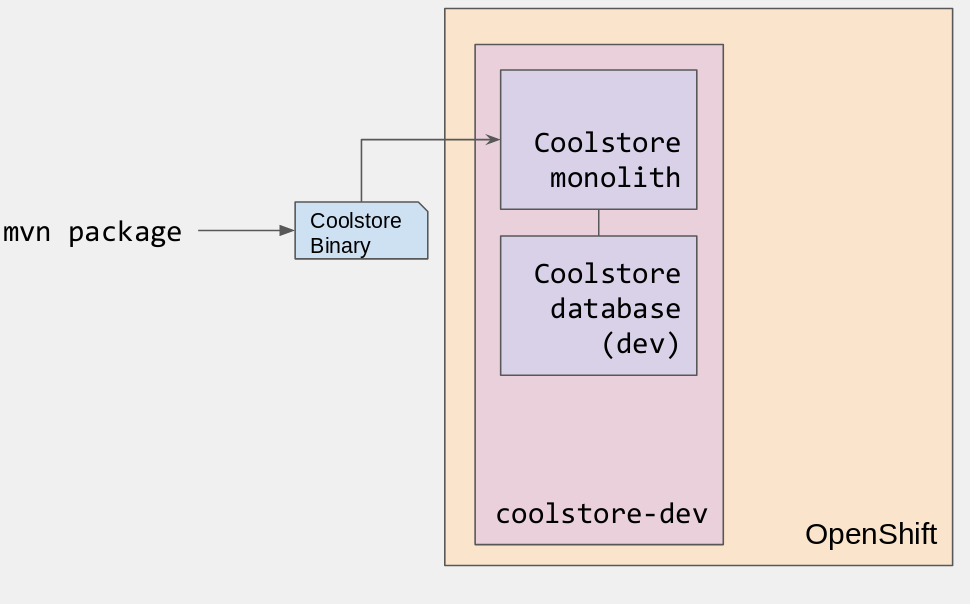

:toc2:
:numbered:
:scrollbar:

== Lift and Shift: Deploy Monolith CoolStore on Openshift

.Goal
In this lab you will deploy the `monolith-coolstore` application on Openshift.

.Prerequisites
* Access to an OpenShift environment with the required projects set up
* Access to client VM

== Deployment on Openshift

You use the source code from last module as it is to get the application up and running on Openshift

The deployment of the application will be a binary source build using `postgresql` and `jboss-eap64-openshift` images.

=== Login to Client VM
* TODO

=== Deployment of PostgreSQL on Openshift.
. The client VM comes with support for `oc-cli` `3.9`.
. Create a openshift project for the deployment of monolith-coolstore.
+
[source,sh]
----
$ oc new-project $USER-monolith-coolstore
----
* substitue $USER for your OPENTLC username.

NOTE: Be sure to replace the "." character in your OPENTLC username with the "-" character—​for example, johndoe1-redhat-com instead of johndoe1-redhat.com. OpenShift project names must be unique within an OpenShift cluster, so this ensures that your project names begin with a unique prefix.

. Openshift comes with `out-of-box` support for `PostgreSQL`. By using this image and defining the environment variables create a database `monolith` having user credentials `jboss:jboss`
+
[source,sh]
----
$ oc new-app postgresql -e POSTGRESQL_USER=jboss -e POSTGRESQL_PASSWORD=jboss -e POSTGRESQL_DATABASE=monolith --name=coolstore-postgresql
----
. Verify the pod is up running and check the database is created.
+
[source,sh]
----
$ oc get pods

// login to pod
$ oc rsh  <podname>

// connect to DB
sh-4.2$ psql

//verify the database is created
postgres=# \l
                                 List of databases
   Name    |  Owner   | Encoding |  Collate   |   Ctype    |   Access privileges
-----------+----------+----------+------------+------------+-----------------------
 monolith  | jboss    | UTF8     | en_US.utf8 | en_US.utf8 |
 postgres  | postgres | UTF8     | en_US.utf8 | en_US.utf8 |
 template0 | postgres | UTF8     | en_US.utf8 | en_US.utf8 | =c/postgres          +
           |          |          |            |            | postgres=CTc/postgres
 template1 | postgres | UTF8     | en_US.utf8 | en_US.utf8 | =c/postgres          +
           |          |          |            |            | postgres=CTc/postgres

----

. Exit the postgres command-line and the pod

+
[source,sh]
----
// exit postgres command line
postgres=# \q

// exit the pod
sh-4.2$ exit
----

=== Deployment of Application
. You use Binary build for application deployment.
. Verify the presence of `jboss-eap64-openshift` in namespace `openshift`
+
[source,sh]
----
$ oc get is -n openshift | grep eap64
----

. Initiate the binary build and verify the resource objects `buildconfigs` and `imagstreams` have been created.
+
[source,sh]
----
$ oc new-build --binary=true --name=coolstore -i=jboss-eap64-openshift:1.7
----

. Use the maven-build `openshift` profile to create the application artifacts `ROOT.war` in `deployments` directory.
+
[source,sh]
----
$ cd ~/labs/monolith-coolstore/
$ mvn clean package -DskipTests
----
. The above command will create java war file at `~/lab/deployments`
+
[source,text]
----
$ ls -l deployments
-rw-rw-r-- 1 7597839 Jan 19 18:50 ROOT.war
----

. Now, start the build to stream the `war` file created in last step to openshift environment.
+
[source,sh]
----
$ oc start-build coolstore --from-file=deployments/ROOT.war --follow
----
+
.Sample Output
[source,text]
----
Uploading file "deployments/ROOT.war" as binary input for the build ...

build "coolstore-1" started
Receiving source from STDIN as file ROOT.war
Copying all war artifacts from /tmp/src directory into /opt/eap/standalone/deployments for later deployment...
'/tmp/src/ROOT.war' -> '/opt/eap/standalone/deployments/ROOT.war'
Copying all ear artifacts from /tmp/src directory into /opt/eap/standalone/deployments for later deployment...
Copying all rar artifacts from /tmp/src directory into /opt/eap/standalone/deployments for later deployment...
Copying all jar artifacts from /tmp/src directory into /opt/eap/standalone/deployments for later deployment...
Copying all war artifacts from /tmp/src/deployments directory into /opt/eap/standalone/deployments for later deployment...
Copying all ear artifacts from /tmp/src/deployments directory into /opt/eap/standalone/deployments for later deployment...
Copying all rar artifacts from /tmp/src/deployments directory into /opt/eap/standalone/deployments for later deployment...
Copying all jar artifacts from /tmp/src/deployments directory into /opt/eap/standalone/deployments for later deployment...
Pushing image 172.30.1.1:5000/mono/coolstore:latest ...
Pushed 6/7 layers, 88% complete
Pushed 7/7 layers, 100% complete
Push successful
----

. Create an application using the `war` file.
+
[source,sh]
----
$ oc new-app coolstore
----

. At this point you will notice the deployment fails, as you haven't defined the `datasource` and the `jdbc` driver for the database `postgresql`. Check the `pod` logs to ascertain the failure:
+
[source,sh]
----
$ oc logs -f coolstore-2-8b8zj
----
+
.Sample Output
----
ERROR [org.controller.management-operation] (Controller Boot Thread) JBAS014612: Operation ("deploy") failed - address: ([("deployment" => "ROOT.war")]) - failure description: {"JBAS014771: Services with missing/unavailable dependencies" => ["jboss.persistenceunit.\"ROOT.war#coolstore\" is missing [jboss.naming.context.java.jboss.datasources.CoolstoreDS]"]}

07:45:31,340 ERROR [org.jboss.as] (Controller Boot Thread) JBAS015875: JBoss EAP 6.4.18.GA (AS 7.5.18.Final-redhat-1) started (with errors) in 8902ms - Started 302 of 431 services (37 services failed or missing dependencies, 129 services are lazy, passive or on-demand)
07:45:31,561 INFO  [org.jboss.as.server.deployment] (MSC service thread 1-1) JBAS015877: Stopped deployment ROOT.war (runtime-name: ROOT.war) in 23ms
07:45:31,618 INFO  [org.jboss.as.server] (DeploymentScanner-threads - 2) JBAS015858: Undeployed "ROOT.war" (runtime-name: "ROOT.war")
07:45:31,622 INFO  [org.jboss.as.controller] (DeploymentScanner-threads - 2) JBAS014774: Service status report
JBAS014775:    New missing/unsatisfied dependencies:
      service jboss.deployment.unit."ROOT.war".WeldBootstrapService (missing) dependents: [service jboss.deployment.unit."ROOT.war".component."com.redhat.coolstore.service.cart.PromoService".WeldInstantiator, service jboss.deployment.unit."ROOT.war".WeldStartService, service jboss.deployment.unit."ROOT.war".component."com.sun.faces.config.ConfigureListener".WeldInstantiator, service jboss.web.deployment.default-host./ROOT, JBAS014799: ... and 15 more ]

----

=== Configuration

. `jboss-eap64-openshift` image comes with out-of-box support to define the postgresql and mysql datasources.
** The datasource can be automatically created by defining the following environment variables in the deploymentconfig:
*** `DB_SERVICE_PREFIX_MAPPING` : refers to comma-separated list of <name>-<database_type>=<PREFIX> triplets,
where `name` is used as the `pool-name` in the data source, `database_type` determines what database driver to use,
and `PREFIX` is the prefix used in the names of environment variables, which are used to configure the data source. For each triplet defined a seperate datasource will be created in the config.
*** `DB_JNDI`: Defines the JNDI name for the datasource and has to be the same value as used in `persistence.xml`
*** `DB_USERNAME`: `jboss`
*** `DB_PASSWORD`: `jboss`

+
[source,sh]
----
$ oc set env dc/coolstore DB_SERVICE_PREFIX_MAPPING=coolstore-postgresql=DB DB_JNDI=java:jboss/datasources/CoolstoreDS DB_USERNAME=jboss DB_PASSWORD=jboss DB_DATABASE=monolith
----
* The above command will trigger a new deployment, reason out why ?
. Check the application logs to verify the successful operation.
+
[source,sh]
----
$ oc logs -f $(oc get pods | grep coolstore-2 | awk {'print $1'})
----
. For the applictaion to be accessible outside, define the `route`.
+
[source,sh]
----
oc expose svc coolstore
----

== Testing the Application
. Get the URL of the application
+
[source,sh]
----
$ export OC_COOLSTORE_MONOLITH_URL=http://$(oc get route coolstore  -o template --template='{{.spec.host}}')
----
. Get the `Swagger` documentation:
+
[source,sh]
----
$ curl -X GET "$OC_COOLSTORE_MONOLITH_URL/rest/swagger.json"
----
+
.Sample Output
[source,text]
----
{
  "swagger" : "2.0",
  "info" : {
    "description" : "Operations that can be invoked in the coolstore monolith",
    "version" : "1.0.0",
    "title" : "Monolith Coolstore REST API",
    "contact" : {
      "name" : "developer@redhat.com"
    },
    "license" : {
      "name" : "Apache 2.0",
      "url" : "http://www.apache.org/licenses/LICENSE-2.0.html"
    }
  },
  "basePath" : "/rest",
  "schemes" : [ "http" ],
  "paths" : {
    "/cart/checkout/{cartId}" : {
      "post" : {

contd....
----

. Get the inventory for a product:
+
[source,sh]
----
$ curl -X GET "$OC_COOLSTORE_MONOLITH_URL/rest/inventory/444435"
----

. Create items in the cart:
+
[source,sh]
----
$ curl -XPOST "$OC_COOLSTORE_MONOLITH_URL/rest/cart/222/444436/100"

$ curl -XPOST "$OC_COOLSTORE_MONOLITH_URL/rest/cart/222/444435/101"

// Get the cart items
$ curl -XGET "$OC_COOLSTORE_MONOLITH_URL/rest/cart/222"
----

. Create items in the catalog:
+
[source,sh]
----
$ curl -XPOST -H "Content-Type: application/json" -d '{"itemId":"322","name":"curl","description":"Red Fedora Official Red Hat Fedora","price":34.99}' "$OC_COOLSTORE_MONOLITH_URL/rest/catalog"

// Get the catalog items
$ curl -XGET "$OC_COOLSTORE_MONOLITH_URL/rest/catalog/products"
----
