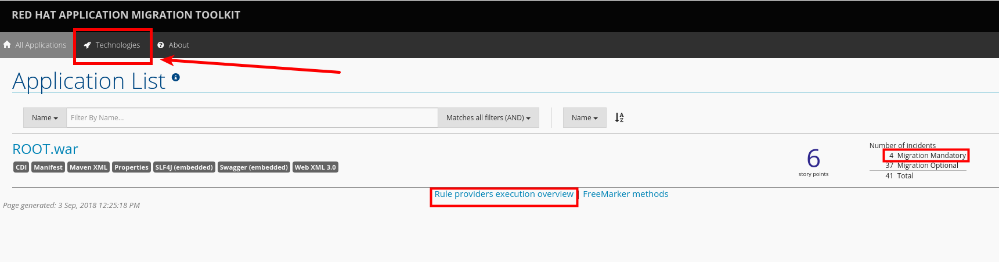
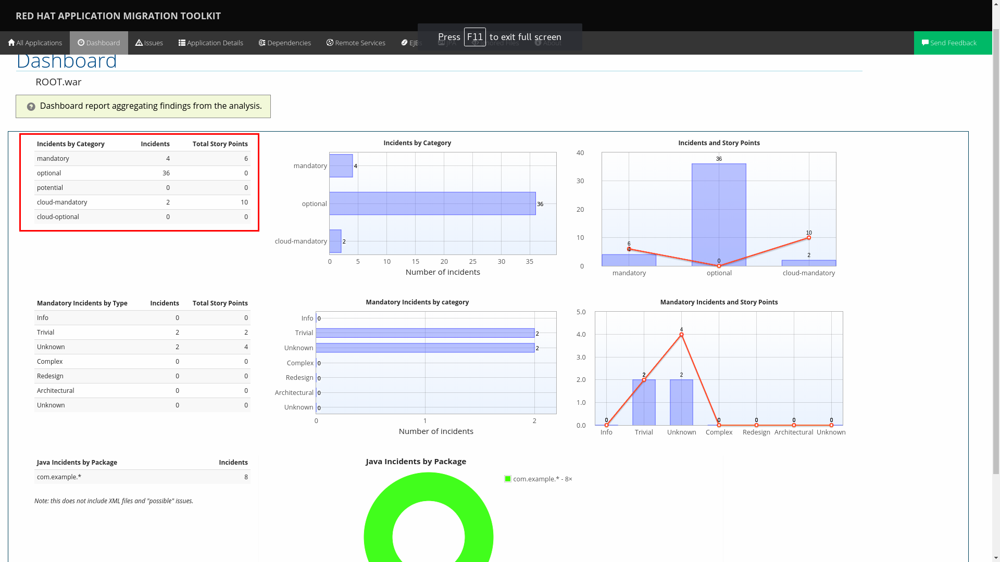
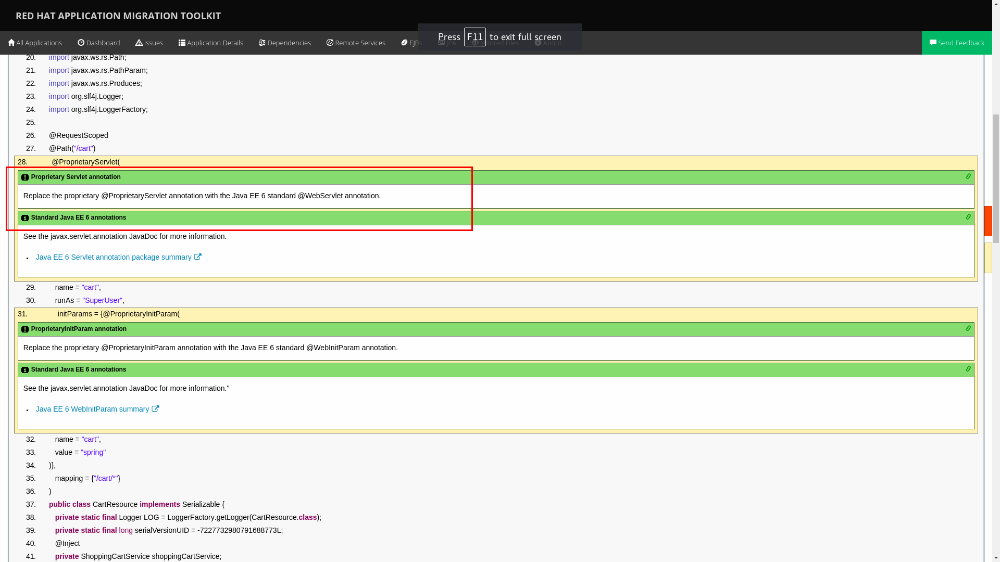
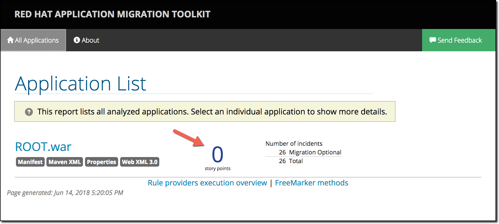
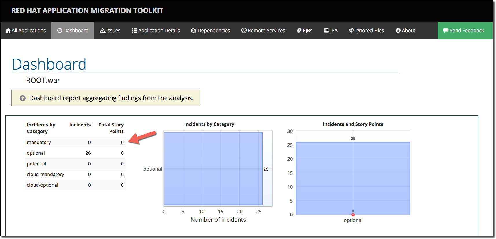

:toc2:
:numbered:
:noaudio:
:scrollbar:

== Red Hat Application Migration Toolkit
In this lab you will use `rhamt cli` and `web console` to define `xml` based rules, analyse and remove the `proprietary annotations` used in `monolith-coolstore-service` application.

.Goal
Using RHAMT remove proprietary annotations and get an overview on efforts required to carry out the migration from EAP6 to EAP7.

.Prerequisites
* Access to open broadband internet connection
* Access to internet browser.

== Proprietary Annotations
The annotations provide a use case where in some fictional organisation has provided its own `servlet` annotations for dependency injection.

=== Review Definition of Proprietary Annotations

. In maven project `proprietary-annotations`:
* Review the `ProprietaryServlet` annotation defined in package `com.example.proprietary.customAnnotation`.  It provides an equivalent of the Java EE 6 `@WebServlet`
* Also, review the annotation `ProprietaryInitParam` which showcases the equivalent of the Java EE 6 `@WebInitParam`
** Check the use of `ProprietaryInitParam` in `ProprietaryServlet`.

NOTE: The above annotations do not alter any runtime behaviour of the application. They have been created with an intent to showcase the concept.

=== Review Usage of Proprietary Annotations
. In maven project `monolith-coolstore-service`:
* Review the use of `@ProprietaryServlet` and `@ProprietaryInitParam` in classes `CartResource` and `CatalogResource` defined in package `com.redhat.coolstore.rest`.

== Develop RHAMT XML Rule
Though `RHAMT` is shipped with many out-of-box predefined rules for common migrations, here since we have created our own annotations we need to develop custom rules to discover the usage of the proprietary annotations.

We follow the `xml` rules approach to define our own rules.

. Download the `RHAMT` cli tool link:++https://developers.redhat.com/products/rhamt/download/++[here^]
. unzip the downloaded file in user home directory
+
[source,sh]
----
$ unzip migrationtoolkit-rhamt-cli-4.0.1-offline.zip -d ~/rhamt
----

. Review the file `~/labs/rhamt/proprietary-servlet-annotations.windup.xml`.

* As we are migrating the coolstore-monolith from `EAP6` to `EAP7`, the same need to be reflected in the `sourceTechnology` & `targetTechnology` tags in the xml rule file.

* You define two rules, `proprietary-servlet-annotations-01000` & `proprietary-servlet-annotations-02000`, each with a `uniqueID` to discover the annotations:
** `ProprietaryServlet`
** `ProprietaryInitParam`

* The rule changes must be categorised as `mandatory`.
* The rule uses the link:++http://docs.oracle.com/javaee/6/api/javax/servlet/annotation/package-summary.html++[link] to provide inline hints in migration.
* For each rule review the `efforts` required for migration as `1` and `2`.

=== Install the Rule
. The `RHAMT` rule can be installed by copying the rule into either of below paths:
* `${user.home}/.rhamt/rules/`
* using the `--userRulesDirectory` flag at the `RHAMT` command line
* Copy to `~/rhamt/rhamt-cli-4.0.1.Final/rules/`
. In the lab, we install the rule by copying it to `~/rhamt/rhamt-cli-4.0.1.Final/rules/`
+
[source,sh]
----
$ cp ~/labs/rhamt/proprietary-servlet-annotations.windup.xml ~/rhamt/rhamt-cli-4.0.1.Final/rules/
----

=== Testing the Rule
. Set up a soft link to the RHAMT CLI tool
+
[source,sh]
----
$ cd ~

// set up a link for ~/rhamt-cli
$ ln -sT ~/rhamt-cli/rhamt-cli-4.0.1.Final/bin/rhamt-cli ~/rhamt-cli
----
+
NOTE: On a Mac, you will need drop the `T` flag. Use this `ln -s ~/rhamt-cli/rhamt-cli-4.0.1.Final/bin/rhamt-cli ~/rhamt-cli`
+
. To test the rule created run the following command:

+
[source,sh]
----
$ ./rhamt-cli --input labs/monolith-coolstore/deployments/ROOT.war --output rhamt-report-monolith-coolstore  --target eap:7   --target cloud-readiness --packages com.redhat.coolstore
----

* The command uses the following flags:
* `input`: path to the `coolstore-monolith` artifact war file created before i.e. `deployments/ROOT.war`
* `output`: path to report information generated by `RHAMT`
* `target`: specifies the technology to migrate to. In our case `eap7`
* `cloud-readiness`: identifies areas of an application that may prevent it from running in a healthy way in a cloud environment.
* `packages`: list of packages to be evaluated, for lab use-case we use `com.redhat.coolstore`

. In the logs check the rules directory used:
+
[source,text]
----
> Red Hat Application Migration Toolkit (RHAMT) CLI, version 4.0.1.Final.
Input Application:labs/monolith-coolstore/deployments/ROOT.war
Output Path:rhamt-report-monolith-coolstore

Using user rules dir: /home/johndoe/rhamt/rhamt-cli-4.0.1.Final/rules
Using user rules dir: /home/johndoe/.rhamt/rules
...
----

. Verify the logs to find the path for reports creation
----
Report created: /home/johndoe/rhamt-report-monolith-coolstore /index.html
              Access it at this URL: file:///home/johndoe/rhamt-report-monolith-coolstore/index.html
----

== Review the Reports
. Open the above URL in the browser.
. The main landing page specifies the number of `mandatory` issues, `4` in our case.
. Verify the rules executed, On landing page click `Rule providers execution overview` and search for the rule created `proprietary-servlet-annotations-01000` & `proprietary-servlet-annotations-02000`
+

. Go back, Click the `ROOT.war`, the `Dashboard` gives an overview of the `mandatory`, `optional`, `cloud-mandatory` etc. incidents with their story points.
+

. From the top-menu, Open the `Application Details` page to check the `Source Report` which described the java package and java class specific incident details.
* In the lab use case, click `com.redhat.coolstore.rest.CartResource` to study the specific location of incidents and hints offered.
+

== Migrate the Application

. On basis of above reports, in `monolith-coolstore-service` remove the proprietary annotations  from

* `com.redhat.coolstore.rest.CartResource`
* `com.redhat.coolstore.rest.CatalogResource`
+
NOTE: Since we had dummy annotations, their removal will not impact the runtime behavior but for a real-worl scenario we need to make changes as per the hints from the rhamt report.

. Open the file: `monolith-coolstore/monolith-coolstore-service/pom.xml`

. Delete the following lines from the file
+
[source,xml]
----
		<dependency>
			<groupId>com.proprietary</groupId>
			<artifactId>proprietary-annotations</artifactId>
			<version>1.0-SNAPSHOT</version>
		</dependency>
----

. Open the file: `monolith-coolstore/pom.xml`

. Remove the following lines fromm the file
+
[source,xml]
----
<module>proprietary-annotations</module>
----

. Rebuild the application
+
[source,sh]
----
$ cd ~/labs/monolith-coolstore
$ mvn clean package -DskipTests
----
. Again run the `rhamt-cli` tool to check if the changes have been made.
* Follow the steps defined in <<Testing the Rule>>

. Open the reports in browser to verify the claim.

.. On the landing page, confirm that the project ROOT.war has *0 story points*.
+

.. Click the ROOT.war application. Confirm that there are 0 mandatory incidents.
+

Congratulations! You have completed the RHAMT lab.
