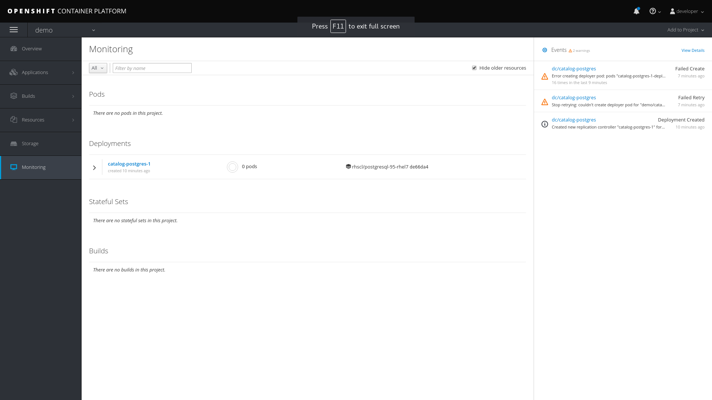
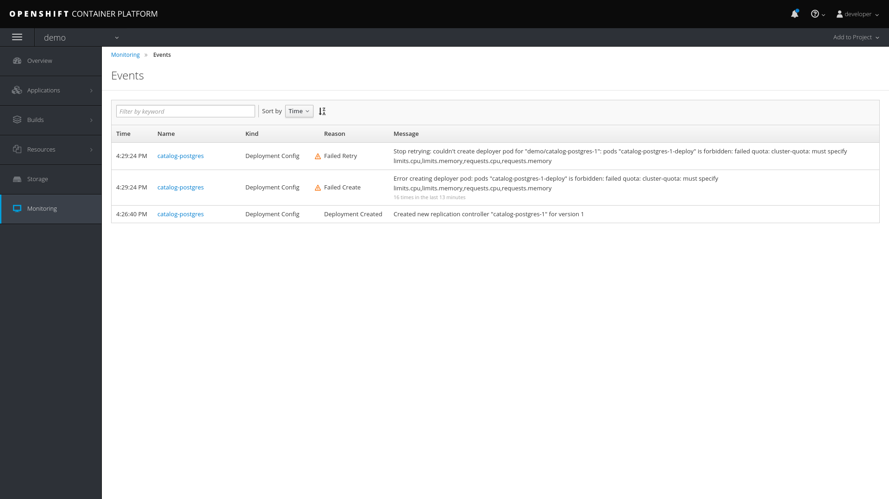

:scrollbar:
:data-uri:
:toc2:
:linkattrs:

== OpenShift Cluster Resources Lab

In this lab, you troubleshoot the deployment of a PostgreSQL application in an OpenShift environment that defines cluster quota and limit range objects.

This lab defines a `ClusterResourceQuota` (also called `ClusterQuota`) object defined at the user level:

* The resources used in each project created by a user are aggregated and this aggregation is used to limit resources across user projects.
* A cluster quota applies at the multi-project level.
* See the OpenShift documentation for details on setting link:https://docs.openshift.com/container-platform/3.9/admin_guide/multiproject_quota.html["Multi-Project Quotas^"].

The lab also defines a `LimitRange` object, which limits per-namespace compute resource constraints at the pod, container, image, and image stream level. It limits the resources that a pod, container, image and image stream can consume.

* All requests to create and modify resources are evaluated against the `LimitRange` object.
* If a request exceeds the value specified in the `LimitRange` object, the resource is rejected.
* In cases where the `LimitRange` object specifies default values and the requests do not explicitly specify resource limits, the default values are applied.
* Defining a `ClusterQuota` object requires defining a `LimitRange` object.
* See the OpenShift documentation for details on link:https://docs.openshift.com/container-platform/3.9/admin_guide/limits.html[Limit Ranges^].

Cluster quota and limit ranges are useful to set application-specific compute resources for decomposing the `monolith-coolstore` application.

.Goal
* Troubleshoot deployment of a PostgreSQL application

.Prerequisites
* Access to an OpenShift environment with the required projects set up

:numbered:

== Examine Cluster Quota

This lab environment provides an out-of-the-box OpenShift project. This project has a `LimitRange` object set with constrained values that cause the deployment to fail. In this section, you examine the cluster quota.

. List the lab's projects:
+
[source,sh]
----
$ oc projects
----
* Expect to see a project named `appmod-migration-constraints-$GUID`, where "$GUID" is the unique identifier you received in the provisioning email for the labs.

. Select the `appmod-migration-constraints-$GUID` project:
+
[source,sh]
----
$ oc project $(oc projects | grep appmod-migration-constraints)
----

. Examine the cluster quota defined for the environment:
+
[source,sh]
----
$ oc describe AppliedClusterResourceQuota
----
+
.Sample Output
[source,text]
----
Resource    Used  Hard
--------    ----  ----
configmaps    0 5
limits.cpu    1 10
limits.memory   3Gi 12Gi
persistentvolumeclaims  0 10
pods      2 15
requests.cpu    100m  5
requests.memory   512Mi 4Gi
requests.storage  0 50Gi
secrets     17  20
services    2 10
----

== Create Application

. Create a new PostgreSQL application using the `~/labs/modern-coolstore/etc/postgresql-ephemeral-template.json` template:
+
[source,sh]
----
$ cd ~/labs/modern-coolstore/etc

$ oc process -f  postgresql-ephemeral-template.json \
                    -pPOSTGRESQL_USER=jboss \
                    -pPOSTGRESQL_PASSWORD=jboss \
                    -pPOSTGRESQL_DATABASE=catalogdb \
                    -pDATABASE_SERVICE_NAME=catalog-postgresql \
                         | oc create -f -
----
+
.Sample Output
[source,text]
----
secret "catalog-postgresql" created
service "catalog-postgresql" created
deploymentconfig "catalog-postgresql" created
----

. Examine the template parameters--specifically the value of `MEMORY_LIMIT`.

. Examine the resource limits in the deployment configuration:
+
[source,sh]
----
$ oc get dc/catalog-postgresql  -o jsonpath='{ .spec.template.spec.containers[0].resources }'
----
+
.Sample Output
[source,text]
----
map[limits:map[memory:400Mi]]
----

. List the pods and note that pod creation failed because a `LimitRange` object was not defined:
+
[source,sh]
----
$ oc get pods
----
+
.Sample Output
[source,text]
----
NAME                          READY     STATUS    RESTARTS   AGE
catalog-postgresql-1-deploy   1/1       Running   0          1m
----
* A successful deployment would show two pods--one for deployment and one for the application.

== Debug Deployment Failure

. Review the OpenShift-generated events:
+
[source,sh]
----
$ oc get events -w
----
+
.Sample Output
[source,text]
----
2018-05-01 11:08:00 +0530 IST   2018-05-01 11:07:57 +0530 IST   10        catalog-postgresql-1   ReplicationController             Warning   FailedCreate   replication-controller   Error creating: pods "catalog-postgresql-1-" is forbidden: [maximum memory usage per Container is 350Mi, but limit is 400Mi., maximum memory usage per Pod is 350Mi, but limit is 419430400.]
----
* The log message indicates that the `catalog-=postgresql-1` container's `limit.memory` is greater than the one defined in the `LimitRange` object.

. In the *Events* section of the *Monitoring* page, review the same events that you saw using the command line:
+

. Click *View Details* to see details of the errors:
+

== Review Limit Range Object

. Review the `LimitRange` object defined for the project:
+
[source,sh]
----
$ oc get limits appmod-migration-constraints-$GUID-core-resource-limits -o yaml
----
+
.Sample Output
[source,yaml]
----
...
spec:
  limits:
  - default:
      cpu: "1"
      memory: 100Mi
    defaultRequest:
      cpu: 100m
      memory: 50Mi
    max:
      memory: 350Mi
    min:
      memory: 4Mi
    type: Container
  - max:
      cpu: "5"
      memory: 350Mi
    min:
      cpu: 50m
      memory: 6Mi
    type: Pod
----

. Because the `limits.memory` value in the deployment configuration is greater than the one defined in the limit range object, adjust the `resources.limits.memory` deployment configuration to `350Mi`:
+
[source,sh]
----
$ oc set resources dc/catalog-postgresql --limits memory=350Mi
----
* This command triggers a new deployment.

. Examine the event logs and pod status to make sure that the deployment succeeds:
+
[source,sh]
----
$ oc get pods
----
+
.Sample Output
[source,text]
----
catalog-postgresql-2-76d6m    1/1       Running   0          28s
----

. Determine the resource quota used so far:
+
[source,sh]
----
$ oc describe AppliedClusterResourceQuota
----
+
.Sample Output
[source,text]
----
Resource		Used	Hard
--------		----	----
configmaps		0	5
limits.cpu		1	10
limits.memory		350Mi	12Gi
persistentvolumeclaims	0	10
pods			1	15
requests.cpu		100m	5
requests.memory		350Mi	4Gi
requests.storage	0	50Gi
...
----

. Test your understanding of resource quotas by determining the values for `limits.cpu`, `requests.cpu`, and `requests.memory`.
