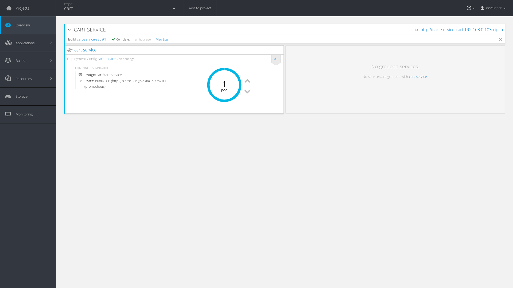

:scrollbar:
:data-uri:
:toc2:
:linkattrs:

== Application Decomposition to Create Cart Service Lab

In this lab, you decompose the `monolith-coolstore` application using Spring Boot to create the `cart-service` application.

The cart service manages a shopping cart for each customer. It supports the addition and removal of items to the cart, cart checkout, and the calculation of shipping costs and cart totals. The cart service depends on the catalog service, from which it obtains product information such as prices, names, and item descriptions.

The cart microservice consists of a single Maven project, which is internally composed of a number of service objects:

* `PriceCalculationService` contains logic to calculate the shipping costs and total value of the shopping cart.
* `CatalogService` is responsible for calling the catalog service to obtain product data.
* `ShoppingCartService` is responsible for managing the shopping carts.

.Goal
Decompose the `monolith-coolstore` application using Spring Boot to create the `cart-service` application

.Prerequisites
* Import of `modern-coolstore/cart-service` project code into JBoss Developer Studio
* Access to an OpenShift environment with the required projects set up
+
NOTE: Refer to instructions in the previous labs to complete either of these prerequisites.

:numbered:

== Review Cart Service Code

. Review the cart service code.
+
****
*Questions*:

* What versions are used for Spring Boot?
* What are the dependencies for JAX-RS, and where are the configuration properties defined?
* How is the fat JAR created?
* What is the application starting point?
* Which model classes are used?
* How is the catalog service configured?
* How is the cart total calculated?
* What are the rules used to calculate shipping costs?
* What REST endpoints are defined?
* What framework/dependencies are used for unit tests?
****

. Review the implementation of the in-container and out-container unit tests.

== Build Swagger API Documentation

As in previous labs, you use a _bottom-up_ approach for API documentation.

In this lab, you use the CXF `Swagger2Feature` to generate Swagger 2 documents.

. In the `pom.xml` file, review the dependencies for Swagger--in particular, the `cxf-rt-rs-service-description-swagger` dependency.
. Review `src/main/java/com/redhat/coolstore/cart/swagger/SwaggerConfig.java` to study the Swagger configuration.
* `Swagger2Feature` is used to wrap Swagger’s `BeanConfig` in a CXF feature via a Spring Bean to dynamically generate the Swagger definition.
* `Feature` is used to customize a server, client, or bus, normally to add capabilities to these components.
. Review `src/main/java/com/redhat/coolstore/cart/model/ShoppingCart.java` to study the model annotations used for documentation.
* `@APIxxxx` annotations are Swagger-specific. For more information on annotations, refer to the link:http://docs.swagger.io/swagger-core/v1.5.0/apidocs/io/swagger/annotations/package-summary.html[Swagger documentation^].

== Build and Package Application

The Spring Boot Maven plug-in is used to package the application as a self-contained executable fat JAR.

. In the `pom.xml` file, review the plug-in configuration.

. Build the application with Maven from the command line:
+
[source,sh]
----
$ cd ~/labs/modern-coolstore/cart-service/
$ mvn clean package
----

. Verify that a fat JAR and an original JAR are present in the target directory of the project:
+
[source,sh]
----
$ ls -l target/cart-service*
----
+
.Sample Output
[source,text]
----
-rw-rw-r-- 1 25224532 Mar  1 15:44 cart-service-1.0.0-SNAPSHOT.jar
-rw-rw-r-- 1    14966 Mar  1 15:44 cart-service-1.0.0-SNAPSHOT.jar.original
----

== Deploy on OpenShift

=== Review Health Checks
Spring Boot comes with a Spring Actuator module, which helps monitor and manage an application. The actuator module exposes a number of HTTP endpoints for health metrics.

. In the `pom.xml` file, review the `org.springframework.boot:spring-boot-actuator` dependency.

. In `com.redhat.coolstore.cart.rest`, review the `HealthCheckEndpoint` class.

. Verify the presence of the `HealthEndpoint` class from Spring Actuator and the annotations used to expose the `getHealth` method.

=== Create Project and Review Resource Limits and Quotas

. Create a new OpenShift `cart-service` project:
+
[source,sh]
----
$ export CART_PRJ= $USER-modern-cart-service
$ oc new-project $CART_PRJ
----

. Review the `ClusterQuota` and `LimitRange` objects.

=== Review Configuration Map Settings

In this section, you use the Spring Cloud Kubernetes project to externalize the application's configuration. This project provides support for OpenShift configuration maps by including an `ConfigMapPropertySource` definition.

`ConfigMapPropertySource` searches for a Kubernetes `ConfigMap` whose name is the same as the name of your Spring application, as defined by the `spring.application.name` property. For the cart service project, this name is `cart-service`.

. In the `pom.xml` file, verify the presence of the `org.springframework.cloud:spring-cloud-starter-kubernetes-config` dependency.

. In `~/lab/modern-coolstore/cart-service/src/main/resources/application.properties`, verify the presence of the `spring.application.name=cart-service` property.

=== Enable View Access and Create Configuration Map

Spring Cloud Kubernetes calls the Kubernetes API to retrieve the `ConfigMap` with the application configuration. This requires `view` access. In this section, you enable this access.

. Add the `view` role to the default service account:
+
[source,sh]
----
$ oc policy add-role-to-user view -n $CART_PRJ -z default
----

. Create the `ConfigMap` with the cart service's application configuration:
+
[source,sh]
----
$ cd ~/labs/modern-coolstore/cart-service

$ oc create configmap cart-service \
   --from-literal=catalog.service.url=<catalog service url>
----
* Use the internal service routing URL (link:http://catalog-service.catalog-service.svc.cluster.local:8080[http://catalog-service.catalog-service.svc.cluster.local:8080^]).

=== Deploy with Fabric8 Maven Plug-in

. Use the `fabric8-maven-plugin` plug-in for the binary source build, as in the previous lab.

. Use the `redhat-openjdk18-openshift:1.2` base image.

. Configure the plug-in by defining YAML-based resource descriptors as defined in `src/main/fabric8`.

. In `~/labs/modern-coolstore/cart-service/src/main/fabric8/deployment.yml`, review the `liveness` and `readiness` probes and the `resource` limits.
+
****
*Questions*:

* What endpoints are defined for health checks?
* What are the values for CPU and memory resources?
****

. Deploy the application to OpenShift:
+
[source,sh]
----
$ mvn clean fabric8:deploy -Popenshift -DskipTests -Dfabric8.namespace=$CART_PRJ
----

. As in previous lab, review the `fabric8` output to determine whether build and deployment succeeded.

. Verify the same in the OpenShift web console:
+

. Examine the log of the application pod to make sure that the application started up correctly:
+
[source,sh]
----
$ oc logs -f cart-service-1-dw7lf
----
+
.Sample Output
[source,text]
----
2018-03-05 07:15:21.314  INFO 1 --- [           main] trationDelegate$BeanPostProcessorChecker : Bean 'configurationPropertiesRebinderAutoConfiguration' of type [org.springframework.cloud.autoconfigure.ConfigurationPropertiesRebinderAutoConfiguration$$EnhancerBySpringCGLIB$$f6f4d8d4] is not eligible for getting processed by all BeanPostProcessors (for example: not eligible for auto-proxying)
  .   ____          _            __ _ _
 /\\ / ___'_ __ _ _(_)_ __  __ _ \ \ \ \
( ( )\___ | '_ | '_| | '_ \/ _` | \ \ \ \
 \\/  ___)| |_)| | | | | || (_| |  ) ) ) )
  '  |____| .__|_| |_|_| |_\__, | / / / /
 =========|_|==============|___/=/_/_/_/
 :: Spring Boot ::        (v1.5.8.RELEASE)
2018-03-05 07:15:23.869  INFO 1 --- [           main] b.c.PropertySourceBootstrapConfiguration : Located property source: ConfigMapPropertySource {name='configmap.cart-service.cart'}
2018-03-05 07:15:23.874  INFO 1 --- [           main] b.c.PropertySourceBootstrapConfiguration : Located property source: SecretsPropertySource {name='secrets.cart-service.cart'}
2018-03-05 07:15:23.953  INFO 1 --- [           main] c.r.c.cart.CartServiceApplication        : The following profiles are active: kubernetes
2018-03-05 07:15:24.008  INFO 1 --- [           main] ationConfigEmbeddedWebApplicationContext : Refreshing org.springframework.boot.context.embedded.AnnotationConfigEmbeddedWebApplicationContext@63021689: startup date [Mon Mar 05 07:15:24 UTC 2018]; parent: org.springframework.context.annotation.AnnotationConfigApplicationContext@1761e840
2018-03-05 07:15:26.516  INFO 1 --- [           main] o.s.b.f.xml.XmlBeanDefinitionReader      : Loading XML bean definitions from class path resource [META-INF/cxf/cxf.xml]
2018-03-05 07:15:29.001  INFO 1 --- [           main] o.s.cloud.context.scope.GenericScope     : BeanFactory id=240877ce-cd06-3229-b130-12fabb716679
2018-03-05 07:15:30.318  INFO 1 --- [           main] trationDelegate$BeanPostProcessorChecker : Bean 'org.springframework.cloud.autoconfigure.ConfigurationPropertiesRebinderAutoConfiguration' of type [org.springframework.cloud.autoconfigure.ConfigurationPropertiesRebinderAutoConfiguration$$EnhancerBySpringCGLIB$$f6f4d8d4] is not eligible for getting processed by all BeanPostProcessors (for example: not eligible for auto-proxying)
2018-03-05 07:15:31.825  INFO 1 --- [           main] s.b.c.e.t.TomcatEmbeddedServletContainer : Tomcat initialized with port(s): 8080 (http)
2018-03-05 07:15:31.938  INFO 1 --- [           main] o.apache.catalina.core.StandardService   : Starting service [Tomcat]
2018-03-05 07:15:32.004  INFO 1 --- [           main] org.apache.catalina.core.StandardEngine  : Starting Servlet Engine: Apache Tomcat/8.5.23
2018-03-05 07:15:32.639  INFO 1 --- [ost-startStop-1] o.a.c.c.C.[Tomcat].[localhost].[/]       : Initializing Spring embedded WebApplicationContext
2018-03-05 07:15:32.639  INFO 1 --- [ost-startStop-1] o.s.web.context.ContextLoader            : Root WebApplicationContext: initialization completed in 8631 ms
2018-03-05 07:15:33.269  INFO 1 --- [ost-startStop-1] o.s.b.w.servlet.ServletRegistrationBean  : Mapping servlet: 'CXFServlet' to [/*]
2018-03-05 07:15:33.302  INFO 1 --- [ost-startStop-1] o.s.b.w.servlet.FilterRegistrationBean   : Mapping filter: 'characterEncodingFilter' to: [/*]
2018-03-05 07:15:35.749  INFO 1 --- [           main] org.apache.cxf.endpoint.ServerImpl       : Setting the server's publish address to be /
2018-03-05 07:15:37.751  INFO 1 --- [           main] o.s.j.e.a.AnnotationMBeanExporter        : Registering beans for JMX exposure on startup
2018-03-05 07:15:37.902  INFO 1 --- [           main] o.s.j.e.a.AnnotationMBeanExporter        : Bean with name 'configurationPropertiesRebinder' has been autodetected for JMX exposure
2018-03-05 07:15:37.907  INFO 1 --- [           main] o.s.j.e.a.AnnotationMBeanExporter        : Bean with name 'refreshEndpoint' has been autodetected for JMX exposure
2018-03-05 07:15:37.912  INFO 1 --- [           main] o.s.j.e.a.AnnotationMBeanExporter        : Bean with name 'restartEndpoint' has been autodetected for JMX exposure
2018-03-05 07:15:37.916  INFO 1 --- [           main] o.s.j.e.a.AnnotationMBeanExporter        : Bean with name 'environmentManager' has been autodetected for JMX exposure
2018-03-05 07:15:37.919  INFO 1 --- [           main] o.s.j.e.a.AnnotationMBeanExporter        : Bean with name 'refreshScope' has been autodetected for JMX exposure
2018-03-05 07:15:37.925  INFO 1 --- [           main] o.s.j.e.a.AnnotationMBeanExporter        : Located managed bean 'environmentManager': registering with JMX server as MBean [org.springframework.cloud.context.environment:name=environmentManager,type=EnvironmentManager]
2018-03-05 07:15:37.947  INFO 1 --- [           main] o.s.j.e.a.AnnotationMBeanExporter        : Located managed bean 'restartEndpoint': registering with JMX server as MBean [org.springframework.cloud.context.restart:name=restartEndpoint,type=RestartEndpoint]
2018-03-05 07:15:38.012  INFO 1 --- [           main] o.s.j.e.a.AnnotationMBeanExporter        : Located managed bean 'refreshScope': registering with JMX server as MBean [org.springframework.cloud.context.scope.refresh:name=refreshScope,type=RefreshScope]
2018-03-05 07:15:38.031  INFO 1 --- [           main] o.s.j.e.a.AnnotationMBeanExporter        : Located managed bean 'configurationPropertiesRebinder': registering with JMX server as MBean [org.springframework.cloud.context.properties:name=configurationPropertiesRebinder,context=63021689,type=ConfigurationPropertiesRebinder]
2018-03-05 07:15:38.045  INFO 1 --- [           main] o.s.j.e.a.AnnotationMBeanExporter        : Located managed bean 'refreshEndpoint': registering with JMX server as MBean [org.springframework.cloud.endpoint:name=refreshEndpoint,type=RefreshEndpoint]
2018-03-05 07:15:38.811  INFO 1 --- [           main] o.s.c.support.DefaultLifecycleProcessor  : Starting beans in phase 0
2018-03-05 07:15:39.053  INFO 1 --- [           main] s.b.c.e.t.TomcatEmbeddedServletContainer : Tomcat started on port(s): 8080 (http)
2018-03-05 07:15:39.101  INFO 1 --- [           main] c.r.c.cart.CartServiceApplication        : Started CartServiceApplication in 29.091 seconds (JVM running for 34.354)
----

== Review OpenShift Quotas and Limits on Resources

. Review the resources defined for the project's deployment configuration:
+
[source,sh]
----
$  oc get dc cart-service -o jsonpath='{ .spec.template.spec.containers[0].resources }'
----
+
.Sample Output
[source,text]
----
map[limits:map[cpu:1 memory:1Gi] requests:map[cpu:200m memory:200Mi]]
----

. Review the cluster quota and determine the values for:

* `limits.cpu`
* `limits.memory`
* `requests.cpu`
* `requests.memory`

== Test Cart Service

. Determine the URL of the application and set an environment variable with the value of the URL:
+
[source,sh]
----
$ export CART_URL=http://$(oc get route cart-service -n $CART_PRJ -o template --template='{{.spec.host}}')
----

. Retrieve the Swagger documentation:
+
[source,sh]
----
$ curl -X GET "$CART_URL/swagger.json"
----
+
.Sample Output
[source,json]
----
"paths": {
  "/cart/{cartId}": {
    "get": {
      "tags": [
        "Cart Service"
      ],
      "summary": "Gets a shoppingcart for cartid",
      "description": "",
      "operationId": "getCart",
      "consumes": [
        "application/json"
      ],
      "produces": [
        "application/json"
      ],
      "parameters": [
        {
          "name": "cartId",
          "in": "path",
          "description": "ShoppingCart cartID",
          "required": true,
          "type": "string"
        }
      ],
      "responses": {
        "200": {
          "description": "shoppingcart found",
          "schema": {
            "$ref": "#/definitions/ShoppingCart"
          }
        },
        "404": {
          "description": "shoppingcart not found"
        }
      }
    }
  },
----

. Invoke the health check endpoint:
+
[source,sh]
----
$ curl -X GET "$CART_URL/health"
----
+
.Sample Output
[source,json]
----
{
  "status": "UP",
  "diskSpace": {
    "status": "UP",
    "total": 105554829312,
    "free": 22889988096,
    "threshold": 10485760
  },
  "refreshScope": {
    "status": "UP"
  },
  "kubernetes": {
    "status": "UP",
    "inside": true,
    "namespace": "cart",
    "podName": "cart-service-1-0dwrs",
    "podIp": "172.17.0.6",
    "serviceAccount": "default",
    "nodeName": "192.168.0.103",
    "hostIp": "192.168.0.103"
  }
}
----

. Retrieve the shopping cart:
+
[source,sh]
----
$ curl -X GET "$CART_URL/cart/mycart"
----
+
.Sample Output
[source,json]
----
{
  "cartItemTotal": 0,
  "shippingTotal": 0,
  "cartTotal": 0,
  "cartId": "mycart",
  "shoppingCartItemList": []
}
----

. Add an item to the cart:
+
[source,sh]
----
$ curl -X POST "$CART_URL/cart/mycart/444436/4"
----
+
.Sample Output
[source,json]
----
{
  "cartItemTotal": 139.96,
  "shippingTotal": 0,
  "cartTotal": 139.96,
  "cartId": "mycart",
  "shoppingCartItemList": [
    {
      "price": 34.99,
      "quantity": 4,
      "product": {
        "itemId": "444436",
        "name": "catalog",
        "description": "India Official Red Hat Fedora",
        "price": 34.99
      }
    }
  ]
}
----

. Remove an item from the cart:
+
[source,sh]
----
$ curl -X DELETE "$CART_URL/cart/mycart/165614/1"
----
+
.Sample Output
[source,json]
----
{
  "cartItemTotal": 104.97,
  "shippingTotal": 0,
  "cartTotal": 104.97,
  "cartId": "mycart",
  "shoppingCartItemList": [
    {
      "price": 34.99,
      "quantity": 3,
      "product": {
        "itemId": "444436",
        "name": "catalog",
        "description": "India Official Red Hat Fedora",
        "price": 34.99
      }
    }
  ]
}
----

. Perform a checkout of the cart:
+
[source,sh]
----
$ curl -X POST "$CART_URL/cart/checkout/mycart"
----
+
.Sample Output
[source,json]
----
{
  "cartItemTotal": 0,
  "shippingTotal": 0,
  "cartTotal": 0,
  "cartId": "mycart",
  "shoppingCartItemList": []
}
----
