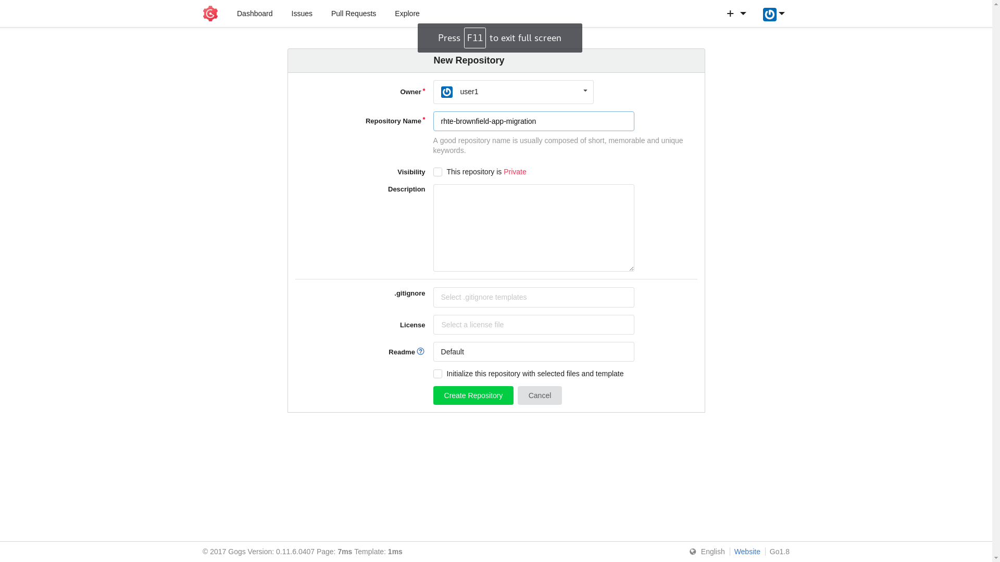

:scrollbar:
:data-uri:
:toc2:
:linkattrs:

== Modern CoolStore Lab

The `monolith-coolstore` application is a good use case for refactoring. It contains three business layers that can be refactored into three domains:

* Inventory service
* Catalog service
* Cart service

In this lab, you refactor the `monolith-coolstore` application into individual microservices, using three different OpenShift runtimes:

* EAP 7.1
* Wildfly Swarm
* Spring Boot
+
NOTE: The Red Hat OpenShift Application Runtimes product showcases these runtimes.

.Goal
Provision a `Gogs` server to help perform S2I builds

.Prerequisites
* Access to an OpenShift environment with the required projects set up

:numbered:

== Review OpenShift Environment

Each new project is configured with default project settings. Among the default resources, the project settings include a value for the `LimitRange` object.

. Examine the limit ranges defined for the project:
+
[source,sh]
----
$ oc describe limits
----
+
.Sample Output
----
Type        Resource  Min   Max   Default Request  Default Limit  Max Limit/Request Ratio
----        --------  ---   ---   ---------------  -------------  -----------------------
Container   memory    10Mi  6Gi   256Mi            1536Mi         -
Container   cpu       -     -     50m              500m           -
Pod         memory    6Mi   12Gi  -                -              -
----

== Verify Application Deployment on OpenShift

In the environment setup lab, you used an OpenShift binary build for deployment. In this lab, you explore other OpenShift deployment techniques. You use an S2I build in the inventory service and the `fabric8-maven-plugin` plug-in to create Docker images and OpenShift/Kubernetes resources.

The base images used `jboss-eap71-openshift` for the inventory service and `redhat-openjdk18-openshift` for the `fabric8-maven-plugin` plug-in.

. Verify that the images are present in the `openshift` namespace:
+
[source,sh]
----
$ oc get is -n openshift
----
+
.Sample Output
----
redhat-openjdk18-openshift            docker-registry.default.svc:5000/openshift/redhat-openjdk18-openshift
...
jboss-eap71-openshift                 docker-registry.default.svc:5000/openshift/jboss-eap71-openshift
----

== Set Up Gogs

link:https://gogs.io/[Gogs^] is a self-hosted Git service similar to GitHub or GitLab. Gogs is required for the S2I build of the inventory service.

. Review the persistent template this lab uses to set up Gogs on OpenShift:
+
[source,sh]
----
cat ~/labs/modern-coolstore/etc/gogs-persistent-template.yaml
----
+
****
*Questions*:

* What versions are used for the database and Docker images?
* What configuration properties are defined?
* What template parameters are defined?
* What limits and resources are defined?
****

NOTE: The lab environment comes pre-provisoned with gogs server. Gogs support multi-tenancy thus instead having each user come up with his own `Gogs` server, the user may use existing lab server. Steps 1 - 5 talk on provisioning your own `Gogs` server, thus candidates may directly move on to <<Gogs User Registration>>.

TIP: The existing `Gogs` URL is `http://amm-gogs-rhte-gogs.apps.$REGION.openshift.opentlc.com/` where $REGION will be provided by the lab instructor.

. Create an OpenShift project for Gogs, using your OPENTLC username for "$USER" as a prefix in the name:
+
[source,sh]
----
export GOGS_PROJECT=$USER-gogs
$ oc new-project $GOGS_PROJECT
----

. Change to the `modern-coolstore` directory and create a new application called `amm-gogs` by using the `gogs-persistent-template.yaml` template:
+
[source,sh]
----
$ cd ~/labs/modern-coolstore/

$ oc new-app -f etc/gogs-persistent-template.yaml -p APPLICATION_NAME=amm-gogs --param=HOSTNAME=amm-gogs-$GOGS_PROJECT.apps.$GUID.openshift.opentlc.com
----

. Review the OpenShift resource objects created:
+
[source,sh]
----
$ oc get pods
----
+
.Sample Output
----
NAME                          READY     STATUS    RESTARTS   AGE
amm-gogs-1-2psgt              1/1       Running   0          6m
amm-gogs-postgresql-1-psswj   1/1       Running   0          6m
----
* Two pods are created--the first for the PostgreSQL database and the second for the Gogs application.

. Display the route for the application and then open it in your browser:
+
[source,sh]
----
$ oc get routes
----

=== Gogs User Registration

. Open the `Gogs` URL in the browser.
. Register a new user in the Gogs application by supplying in the valid details.
. Log in to the Gogs application with the registered user and create a new repository named `rhte-brownfield-app-migration` by clicking on to the `+` sign on `My Repositories` section.
+

== Review Cluster Quota and Limit Resource Computation

. Review the resources defined for the deployment configurations defined in the project:
* PostgreSQL resources:
+
[source,sh]
----
$  oc get dc amm-gogs-postgresql  -o jsonpath='{ .spec.template.spec.containers[0].resources }'
----
+
.Sample Output
----
map[limits:map[memory:512Mi] requests:map[memory:100Mi]]
----
* Gogs resources:
+
[source,sh]
----
$  oc get dc amm-gogs  -o jsonpath='{ .spec.template.spec.containers[0].resources }'
----
+
.Sample Output
----
map[]
----

. Review the cluster quota used so far.
+
****
*Question*:

* Based on above values for `ClusterQuota` and `LimitRange`, deduce how the values of the following fields were calculated:
** `limits.cpu`
** `limits.memory`
** `requests.memory`
** `requests.cpu`
****
