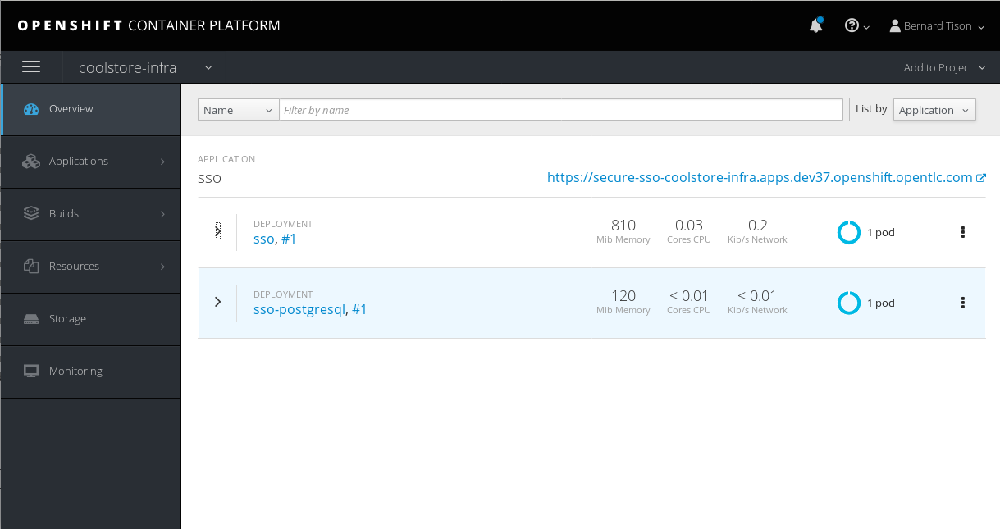
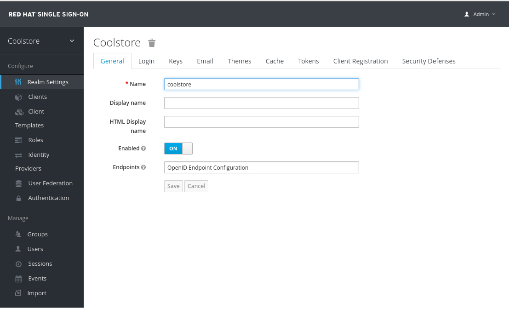
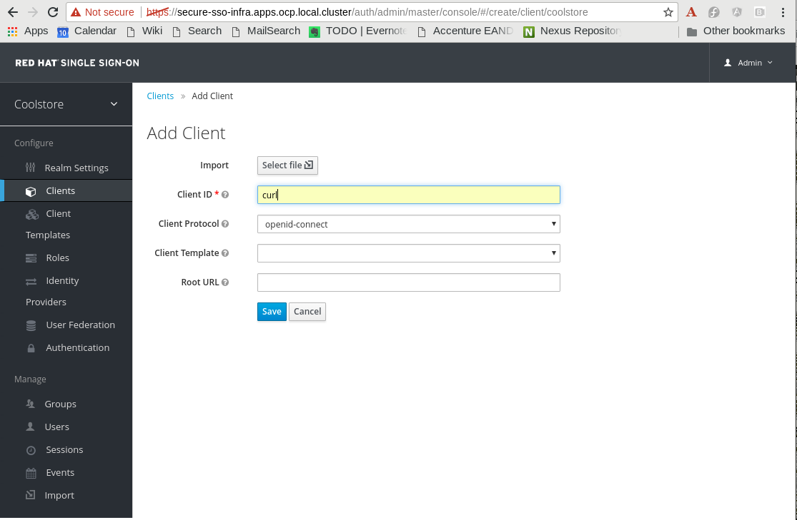
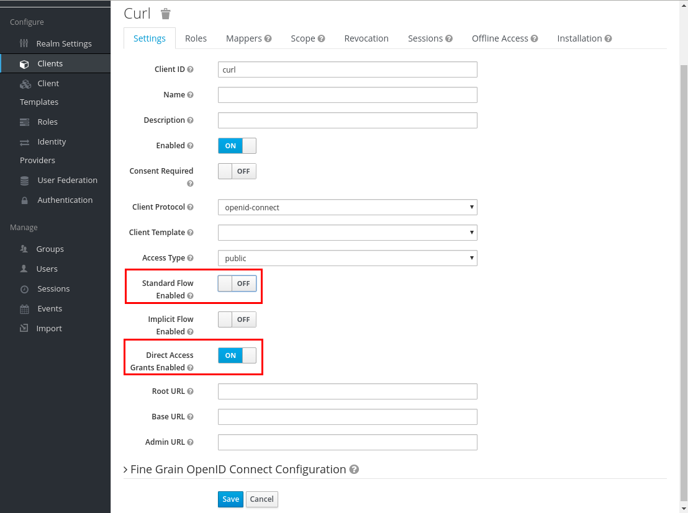
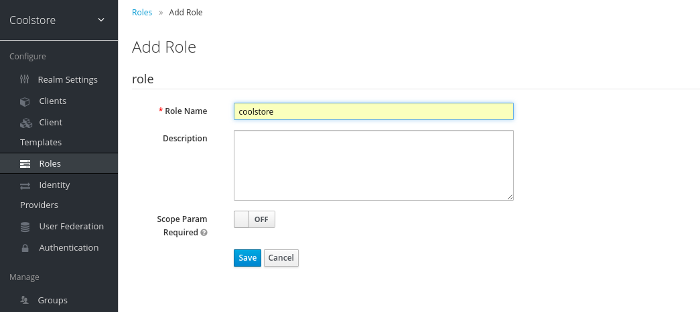
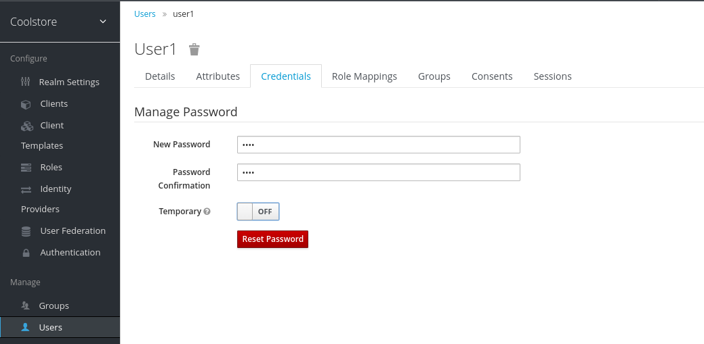
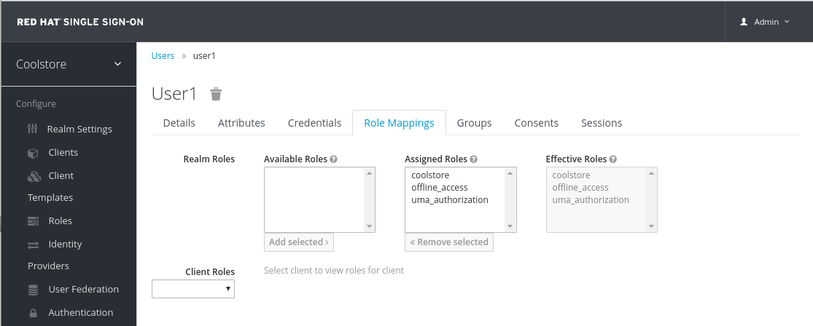

:noaudio:
:scrollbar:
:data-uri:
:toc2:
:linkattrs:

== Microservices Security Lab

In this lab, you secure decomposed coolstore microservices from last module with token-based authentication and authorization, using Red Hat Single Sign-On (Red Hat SSO) as the authentication server.

.Goal
* Enhance the code and configuration of the applications to provide token-based authentication and authorization

.Prerequisites
* Completion of all of the previous labs
* Successful deployment of the catalog, inventory, and cart services
* Access to `jq` command-line json parser.

:numbered:

== Configure, Deploy, and Test Red Hat SSO on OpenShift

Red Hat provides a supported Docker image for Red Hat Single Sign-On version 7.2. The `~/labs/modern-coolstore/etc/rhsso` folder of the lab source code includes a template for Red Hat Single Sign-On 7.2 using PostgreSQL as the database.

=== Configure Red Hat SSO on OpenShift

. Export the name of the `coolstore-rhsso` OpenShift project as an environment variable:
+
[source,text]
----
$ export INFRA_PRJ=<name of your OpenShift coolstore infra project>
----

. Create a secret for the Red Hat SSO deployment using the `rhsso-app-secret.json` template in the `etc/rhsso` folder:
+
[source,text]
----
$ cd ~/labs/modern-coolstore
$ oc create -f etc/rhsso/rhsso-app-secret.json -n $INFRA_PRJ
----
+
.Sample Output
[source,text]
----
serviceaccount "sso-service-account" created
secret "sso-app-secret" created
----
* The template defines a secret that contains the keystore for Red Hat SSO (to provide access over SSL, using the key alias of `jboss` and `mykeystorepassword` as the password) and JGroups (required for clustering, but not used in the lab). The template also defines a `sso-service-account` service account that has access to the secret.
. Give cluster view rights to the `sso-service-account` service account:
+
[source,text]
----
$ oc policy add-role-to-user view system:serviceaccount:$INFRA_PRJ:sso-service-account -n $INFRA_PRJ
----

=== Deploy Red Hat SSO on OpenShift

. Create a deployment from the `sso72-postgresql-persistent.json` template:
+
[source,text]
----
$ oc process -f etc/rhsso/sso72-postgresql-persistent.json -p HTTPS_NAME=jboss -pHTTPS_PASSWORD=mykeystorepass -pSSO_ADMIN_USERNAME=admin -pSSO_ADMIN_PASSWORD=admin -p SSO_REALM=coolstore | oc create -f -
----
+
.Sample Output
[source,text]
----
service "sso" created
service "secure-sso" created
service "sso-postgresql" created
route "sso" created
route "secure-sso" created
deploymentconfig "sso" created
deploymentconfig "sso-postgresql" created
persistentvolumeclaim "sso-postgresql-claim" created
----
* The `sso72-postgresql-persistent.json` template in the `etc/rhsso` folder defines the OpenShift objects for the deployment of the Red Hat SSO server (`BuildConfig`, `DeploymentConfig`, `Service`, and `Route`) and PostgreSQL (`BuildConfig`, `DeploymentConfig`, `Service`, `Persistent Volume Claim`).
* This creates a Red Hat SSO instance, using the `admin:admin` password and `coolstore` realm.
* Note that two services and routes are created for the Red Hat SSO--an unsecured one that exposes the Red Hat SSO endpoints over HTTP, and a secure one that uses HTTPS.
. Follow the deployment on the OpenShift web console.
* When fully deployed, expect the `infra` project to look like this:
+

. In a browser, navigate to the URL of the Red Hat SSO server.
* If you chose the SSL-enabled URL, ignore the safety warning and proceed to the URL.
. Click the *Administration Console* link and log in with `admin/admin` credentials.
* Expect to see the *Realm Settings* screen of the `Coolstore` realm:
+

. On the right side of the page, open the *Clients* tab and click *Create* to create a client.
* You create a client in the realm so that you are able to test the secured microservices--you want to be able to obtain a token based on user credentials directly from the Red Hat SSO server using a Direct Access Grant.
. Enter `curl` as the *Client ID* and click *Save*:
+

. In the *Settings* tab, disable *Standard Flow* and enable *Direct Access Grants*, then click *Save*:
+

. Define the realm roles:
.. On the right side of the page, open the *Roles* tab and click *Add Role* to create a realm role.
.. Enter `coolstore` as the *Role Name* and and click *Save*:
+

. Create a user:
.. On the right side of the page, select the *Users* tab and click *Add User*.
.. Enter `user1` as the username and click *Save*.
. Click the *Credentials* tab to set the password for the user, enter `user` as the password, set *Temporary* to off, and click *Reset Password*:
+

. Select the *Role Mappings* tab to map the `coolstore` role to `user1` and select the `coolstore` role in the *Available Roles* list, then click *Add selected*:
+

=== Test Red Hat SSO Configuration on OpenShift

In this section, you obtain a token for the user using `curl` and you test the Red Hat SSO configuration using the token.

. Open a terminal shell and export the HTTPS URL of the Red Hat SSO server as a environment variable:
+
[source,text]
----
$ export RHSSO_URL=<https url of the RHSSO server>
----
. Use `curl` to obtain a token from the Red Hat SSO server:
+
[source,text]
----
$ curl -X POST "$RHSSO_URL/auth/realms/coolstore/protocol/openid-connect/token" \
 -H "Content-Type: application/x-www-form-urlencoded" \
 -d "username=user1" \
 -d "password=user" \
 -d "grant_type=password" \
 -d "client_id=curl" \
 --insecure | jq
----
+
.Sample Output
[source,json]
----
{
  "access_token": "eyJhbGciOiJSUzI1NiIsInR5cCIgOiAiSldUIiwia2lkIiA6ICJaTVhMTjNtOHl5Z0p5UnZHQTlQaHBlT0pWMFg2dHhfMlZDZndFd1dBVjRnIn0.eyJqdGkiOiIxZjk4MWI3NS1lNmM5LTQ5MmItOTQ1Zi05YWFmYmU3OGVjNWUiLCJleHAiOjE1MzMxMDQ3NTAsIm5iZiI6MCwiaWF0IjoxNTMzMTA0NDUwLCJpc3MiOiJodHRwczovL3NlY3VyZS1zc28tYXBwbGUuMTI3LjAuMC4xLm5pcC5pby9hdXRoL3JlYWxtcy9jb29sc3RvcmUiLCJhdWQiOiJjdXJsIiwic3ViIjoiNmY2MzBmMTMtNTczNy00NmNiLWI5MjUtYmNkNmE0MzMwODNjIiwidHlwIjoiQmVhcmVyIiwiYXpwIjoiY3VybCIsImF1dGhfdGltZSI6MCwic2Vzc2lvbl9zdGF0ZSI6IjliMDlhZjI3LWU4MWYtNGQ5MS04Y2QxLTg5ZjBjYzdhMGJjMSIsImFjciI6IjEiLCJhbGxvd2VkLW9yaWdpbnMiOltdLCJyZWFsbV9hY2Nlc3MiOnsicm9sZXMiOlsidW1hX2F1dGhvcml6YXRpb24iLCJjb29sc3RvcmUiXX0sInJlc291cmNlX2FjY2VzcyI6eyJhY2NvdW50Ijp7InJvbGVzIjpbIm1hbmFnZS1hY2NvdW50IiwibWFuYWdlLWFjY291bnQtbGlua3MiLCJ2aWV3LXByb2ZpbGUiXX19LCJwcmVmZXJyZWRfdXNlcm5hbWUiOiJ1c2VyMSJ9.V0FLUzZrd8jqfDM1CpuX_40CBQrnxmVRkgy51hXT5sIuyh3byQhcuCZeJb81hN3xAQ9x5Zlr4nrUgfTunBiNApu3mkDMcxRnJ1Q0uED_ZkonEdH1FOfv2BbYR1FtODRLF0u9S-ewZ1sfzjwdmu1VFheoYpPh22GZjSlFmxaMLNtH-IOnEL-ZzmOyQxFO1wSjXclTquS0IdfxcipylGw_9bdAEI1ihLbGSf28cTOHjoerCDqDtNZxfisW_rrelRVgdnoKIIvEcXT0dQ4hs390Lh8TCdrrtruZ1Nu3SdEUcsUiGc3xsf8P-Y3K68S86b5l5-sth9_6Yt6SwrlbyLa9uA",
  "expires_in": 300,
  "refresh_expires_in": 1800,
  "refresh_token": "eyJhbGciOiJSUzI1NiIsInR5cCIgOiAiSldUIiwia2lkIiA6ICJaTVhMTjNtOHl5Z0p5UnZHQTlQaHBlT0pWMFg2dHhfMlZDZndFd1dBVjRnIn0.eyJqdGkiOiJhNGJhZTQ2ZC01OWY5LTQwZTctOWM5Yi05N2Y0MjVlZDJjYTMiLCJleHAiOjE1MzMxMDYyNTAsIm5iZiI6MCwiaWF0IjoxNTMzMTA0NDUwLCJpc3MiOiJodHRwczovL3NlY3VyZS1zc28tYXBwbGUuMTI3LjAuMC4xLm5pcC5pby9hdXRoL3JlYWxtcy9jb29sc3RvcmUiLCJhdWQiOiJjdXJsIiwic3ViIjoiNmY2MzBmMTMtNTczNy00NmNiLWI5MjUtYmNkNmE0MzMwODNjIiwidHlwIjoiUmVmcmVzaCIsImF6cCI6ImN1cmwiLCJhdXRoX3RpbWUiOjAsInNlc3Npb25fc3RhdGUiOiI5YjA5YWYyNy1lODFmLTRkOTEtOGNkMS04OWYwY2M3YTBiYzEiLCJyZWFsbV9hY2Nlc3MiOnsicm9sZXMiOlsidW1hX2F1dGhvcml6YXRpb24iLCJjb29sc3RvcmUiXX0sInJlc291cmNlX2FjY2VzcyI6eyJhY2NvdW50Ijp7InJvbGVzIjpbIm1hbmFnZS1hY2NvdW50IiwibWFuYWdlLWFjY291bnQtbGlua3MiLCJ2aWV3LXByb2ZpbGUiXX19fQ.NpWf_xmJjhRUbl8nt43lXzHHn0Z5g_LOHmQPaBSsoRdOvLHggm_DrPyccmosDc1rezILiFvFtYNcv6056HE1Y2stSzzsLj5frh--GZBw1ZiM5dwCwrr4Lf_8rIu9SIwGjl2ADdNETcr0JOGvqxwwIq5ihjeVsU0fV1VNHYPWbiQegEun-g8M3Li0f1movDmPF7pJUi_LyVv1-WObzVbdbs7W6Zi_NbRJkQ_--DAQMw7nsZXNefF1Jn50Wop79kHYwHqtMjFZi5-LU13fW2fS5tCTIbcmpKdUz3DxHmlovouEWP0ofqT_Fl55U7g3z_GVAXyAHTphHNOO7UPv0Scu8w",
  "token_type": "bearer",
  "not-before-policy": 0,
  "session_state": "9b09af27-e81f-4d91-8cd1-89f0cc7a0bc1"
}
----
* The Red Hat SSO server response contains a set of three tokens--an access token, a refresh token, and an ID token. For the secured services, you require the access token.
. Extract the access token in an environment variable:
+
[source,text]
----
export TKN=$(curl -X POST "$RHSSO_URL/auth/realms/coolstore/protocol/openid-connect/token"  \
           -H "Content-Type: application/x-www-form-urlencoded"  \
           -d "username=user1"  \
           -d "password=user"  \
           -d "grant_type=password" \
           -d "client_id=curl" \
           --insecure | jq '.access_token')
----

== Secure Catalog Service WildFly Swarm Application

WildFly Swarm comes with a Red Hat SSO/Keycloak fraction that enables the application for SSO using token-based authentication by integrating the Keycloak adapter for WildFly into the Swarm application.

=== Configure Application to Use Keycloak

There are essentially two ways to configure secure endpoints--through a `web.xml` descriptor or by configuring the secure endpoints in the Swarm configuration file. In this section, you configure the secure endpoints using the second method and then produce a Keycloak configuration file.

. In the POM file of the catalog service project, add the `org.wildfly.swarm:keycloak` dependency.

. In the POM file of the project, add the following line to the `<build>` section:
+
[source,xml]
----
<finalName>${project.artifactId}</finalName>
----

. In the `project-local.yml` configuration file, add the following contents under the `swarm` tag:
+
[source,yaml]
----
  deployment:
    catalog-service.war:
      web:
        login-config:
          auth-method: KEYCLOAK
        security-constraints:
          - url-pattern: /catalog/*
            methods: [GET]
            roles: [coolstore]
----
* This marks the `GET /catalog/*` URL pattern as a secured resource requiring the `coolstore` role.

* Also note that you use `KEYCLOAK` as the login configuration method, which delegates the security handling to the Keycloak adapter that itself is installed by the Keycloak fraction.

. In the `src/test/resources` folder of the project, create a file called `keycloak.json`.
* Keycloak requires a configuration file called `keycloak.json` on the classpath. When deployed on OpenShift, you provide this configuration file with a ConfigMap. For testing, however, you can add this file to the test resources.

. Paste the following contents into the file:
+
[source,json]
----
{
  "realm": "coolstore-test",
  "bearer-only": true,
  "auth-server-url": "https://rhsso:8443/auth",
  "realm-public-key": "",
  "resource": "coolstore-test"
}
----
* `realm` is the name of the realm.
* `resource` is the client ID of the application. Each application has a client ID that is used to identify the application.
* `bearer-only` verifies only bearer tokens if enabled and and does not attempt to authenticate users.
* `auth-server-url` is the base URL of the Keycloak server. This must match the issuer field in the token.
* `realm-public-key` is the realm public key, which is used to verify the signature of the token. It is not to be used in a production setting. If not set, the Keycloak adapter downloads the public key from the Red Hat SSO server.
. In the `RestApiTest` test class, add `keycloak.json` to the web archive in the `createDeployment` method, making sure that the web archive is called `catalog-service.war`.
* Expect the method to look like this:
+
[source,java]
----
    @Deployment
    public static Archive<?> createDeployment() {
        return ShrinkWrap.create(WebArchive.class, "catalog-service.war")
                .addPackages(true, RestApplication.class.getPackage())
                .addAsResource("project-local.yml", "project-local.yml")
                .addAsResource("META-INF/test-persistence.xml",  "META-INF/persistence.xml")
                .addAsResource("META-INF/test-load.sql",  "META-INF/test-load.sql")
                .addAsWebInfResource("keycloak.json","keycloak.json");
    }
----

=== Generate Private and Public Keypair

In this section, you generate a private and public keypair using `openssl`.

. Open a terminal shell.

. Generate an RSA private and public keypair:
+
[source,text]
----
$ openssl genrsa -out keycloak.pem 2048
----
. Extract the public key:
+
[source,text]
----
$ openssl rsa -in keycloak.pem -outform PEM -pubout -out public.pem
----
. Extract the private key:
+
[source,text]
----
$ openssl rsa -in keycloak.pem -outform PEM -out private.pem
----
. Copy the `private.pem` file into the `src/test/resources` folder of the project.
. Open the `public.pem` file in a text editor, concatenate the public key string (the part between `-----BEGIN PUBLIC KEY-----` and `-----END PUBLIC KEY-----`), and paste the concatenated string in the `keycloak.json` file as the value for `realm-public-key`.

=== Run Test and Verify Token-Based Authentication

In this section, you run the `RestApiTest` to verify that token-based authentication works correctly. This initially fails and you fix the test by updating it to generate a valid access token and to pass this token in the requests to the REST endpoint in the tests. For this you can use the Keycloak core libraries.

. Execute the `RestApiTest` test class, using the Maven command line (`mvn clean test`) or in the IDE (*Run As -> JUnit test*).
* Because the REST request in the test does not have an `Authorization` header with a valid access token, expect the `testGetProduct` test method to fail with a 401 HTTP status code.
* Because the health endpoint is an unprotected resource, the `testHealthCheck` test method passes.
. In the project's POM file, add the `org.bouncycastle:bcprov-jdk15on:1.52:1.56.0.redhat-2` dependency with scope `test`.
* BouncyCastle is a set of open source libraries for Java cryptography. Keycloak uses this library for generating keys and signing tokens.
. In the `RestApiTest` class, add a `readPrivateKey` method to read out the `private.pem` private key and return a `java.security.PrivateKey` instance:
+
[source,java]
----
    private PrivateKey readPrivateKey() throws Exception {
        Security.addProvider(new BouncyCastleProvider());
        KeyFactory factory = KeyFactory.getInstance("RSA", "BC");
        InputStream is = Thread.currentThread().getContextClassLoader().getResourceAsStream("private.pem");
        PemReader privateKeyReader = new PemReader(new InputStreamReader(is));
        try {
            PemObject privObject = privateKeyReader.readPemObject();
            PKCS8EncodedKeySpec privKeySpec = new PKCS8EncodedKeySpec(privObject.getContent());
            PrivateKey privateKey = factory.generatePrivate(privKeySpec);
            return privateKey;
        } finally {
            privateKeyReader.close();
        }
    }
----
. In the `RestApiTest` class, add a `createAccessToken` method to create a `org.keycloak.representations.AccessToken` access token and sign it with the private key:
+
[source,java]
----
    private String createAccessToken(String role, int issuedAt) throws Exception {
        AccessToken token = new AccessToken();
        token.type(TokenUtil.TOKEN_TYPE_BEARER);
        token.subject("testuser");
        token.issuedAt(issuedAt);
        token.issuer("https://rhsso:8443/auth/realms/coolstore-test");
        token.expiration(issuedAt + 300);
        token.setAllowedOrigins(new HashSet<>());

        AccessToken.Access access = new AccessToken.Access();
        token.setRealmAccess(access);
        access.addRole(role);

        Algorithm jwsAlgorithm = Algorithm.RS256;
        PrivateKey privateKey = readPrivateKey();
        String encodedToken = new JWSBuilder().type("JWT").jsonContent(token).sign(jwsAlgorithm, privateKey);
        return encodedToken;
    }
----
* Note that the issuer is set to the realm URL. The name of the realm -- `coolstore-test` -- corresponds to the realm name in `keycloak.json`. If they do not match, the token verification fails.
. In the `RestApiTest` class, add methods to generate valid and invalid (expired) tokens:
+
[source,java]
----
    private String getValidAccessToken(String role) throws Exception {
        return createAccessToken(role, (int) (System.currentTimeMillis() / 1000));
    }

    private String getExpiredAccessToken(String role) throws Exception {
        return createAccessToken(role, (int) ((System.currentTimeMillis() / 1000)-600));
    }
----
. In the `testGetProduct` method, add an `Authorization` header to the REST requests in the test by replacing this snippet:
+
[source,java]
----
Response response = target.request(MediaType.APPLICATION_JSON).get();
----
+
with this:
+
[source,java]
----
Response response = target.request(MediaType.APPLICATION_JSON)
    .header("Authorization", "Bearer " + getValidAccessToken("coolstore")).get();
----
* To add a header to the request, you must call the `header()` method on the `ResponseBuilder`.
* In the test, you are using a JAX-RS client to call the REST endpoint.
. Run the tests in the `RestApiTest` test class again.
* This time expect the tests to pass.
. Optionally, create additional test methods that call the endpoints with an expired token or a token that has the wrong role.
* Expect these tests to return a 401 HTTP status code (indicating an expired token) or 403 (indicating the wrong role in the token).

== Deploy and Test Secured WildFly Swarm Application

You deployed the catalog service on OpenShift in previous labs. In this section, you deploy and test the secured version of the catalog service.

=== Deploy Postgresql
. Deploy PostgreSQL using the `postgresql` image from the OpenShift namespace:
+
[source,sh]
----
oc new-app postgresql-persistent -e POSTGRESQL_USER=jboss -e POSTGRESQL_PASSWORD=jboss -e POSTGRESQL_DATABASE=catalogdb  -pDATABASE_SERVICE_NAME=catalog-postgresql
----

=== Configure Application to Use Keycloak

. Add the secure endpoint configuration to the `catalog-service` ConfigMap in the OpenShift catalog service project.
. In the `etc` folder of the project, create a file called `keycloak.json` with the following contents:
+
[source,json]
----
{
  "realm": "coolstore",
  "bearer-only": true,
  "auth-server-url": "",
  "ssl-required": "external",
  "realm-public-key": "",
  "resource": "coolstore"
}
----
. Set the value of `auth-server-url` to the HTTPS URL of the Red Hat SSO server suffixed with `/auth`.
. Paste the Red Hat SSO Coolstore realm public key as the value for `rhsso-public-key`.
* You can find this value by examining the `keycloak.json` file from the catalog service.

=== Mount ConfigMap

In this section, you create a ConfigMap from the `keycloak.json` file. You then mount it as a volume and point WildFly Swarm to the mounted `keycloak.json`.

. Create a ConfigMap called `catalog-service-rhsso` in the catalog service project on OpenShift from the `keycloak.json` file:
+
[source,text]
----
$ export SECURE_CATALOG_PRJ=<OpenShift secured catalog service project name>
$ oc create configmap catalog-service-rhsso --from-file=etc/keycloak.json -n $SECURE_CATALOG_PRJ
----
. Review the `keycloak` deployment properties in `etc/project-defaults.yml`
. Also create the configmap `app-config` from `project-defaults.yml` to define the deployment properties related to database and keycloak.
+
----
$  oc create configmap app-config --from-file=etc/project-defaults.yml -n $SECURE_CATALOG_PRJ
----
. Toward the end of the `deployment.yml` file in the `src/main/fabric8` directory of the source project, add the ConfigMap:
+
[source,yaml]
----
      volumes:
        - configMap:
            name: catalog-service
          name: config
        - configMap:
            name: catalog-service-rhsso
          name: rhsso-config
----
* Remember to maintain the indentation of the file.
. In the same file, add a volume mount for the ConfigMap under the existing volume mount:
+
[source,yaml]
----
          volumeMounts:
            - name: config
              mountPath: /app/config
            - name: rhsso-config
              mountPath: /app/rhsso-config
----
. In the same file, add the system property `swarm.keycloak.json.path` pointing to the mounted `keycloak.json` file to the `JAVA_OPTIONS` environment variable:
+
[source,yaml]
----
            - name: JAVA_OPTIONS
              value: "-Dswarm.project.stage.file=file:///app/config/project-defaults.yml -Dswarm.keycloak.json.path=/app/rhsso-config/keycloak.json"
----

=== Deploy and Test Secured Catalog Service

. Deploy the catalog service with the Fabric8 Maven plug-in:
+
[source,text]
----
$ mvn clean fabric8:deploy -Popenshift -DskipTests=true -Dfabric8.namespace=$SECURE_CATALOG_PRJ
----

. Test the catalog service without an authentication token:
+
[source,text]
----
$ export CATALOG_URL=http://$(oc get route catalog-service -n $SECURE_CATALOG_PRJ -o template --template='{{.spec.host}}')
$ curl -X GET "$CATALOG_URL/catalog/products
----
* Expect to receive `Unauthorized` in the response:
+
.Sample Output
[source,xml]
----
<html><head><title>Error</title></head><body>Unauthorized</body></html>
----
. Obtain a token from the Red Hat SSO server as explained in the paragraph on installing the Red Hat SSO server.
. Test the catalog service with a valid authentication token:
+
[source,text]
----
$ curl -X GET -H "Authorization: Bearer $TKN" "$CATALOG_URL/catalog/products"
----
* Expect to receive the correct catalog data in the response:
+
.Sample Output
[source,json]
----
[
  {
    "itemId": "329299",
    "name": "Redhat",
    "description": "Red Fedora Official Red Hat Fedora",
    "price": 34.99
  },
  {
    "itemId": "329199",
    "name": "catalog",
    "description": "Forge Laptop Sticker JBoss Community Forge Project Sticker",
    "price": 8.5
  },
  {
    "itemId": "165613",
    "name": "catalog",
    "description": "Solid Performance Polo Moir.",
    "price": 17.8
  },
  {
    "itemId": "444456",
    "name": "catalog",
    "description": "Red Fedora Official Red Hat Fedora",
    "price": 34.99
  },
  {
    "itemId": "444435",
    "name": "catalog",
    "description": "Tokyo Official Red Hat Fedora",
    "price": 34.99
  },
  {
    "itemId": "444436",
    "name": "catalog",
    "description": "India Official Red Hat Fedora",
    "price": 34.99
  }
]
----

Congratulations, you reached the end of the lab.
